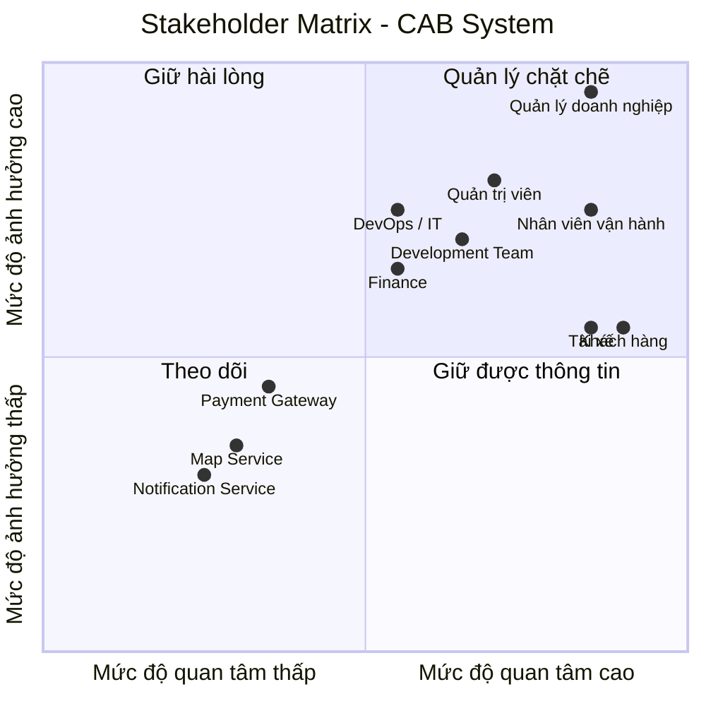

Xây dựng một hệ thống cơ bản MVB 
đứng ở vai trò BA
bước 1: đọc và phân tích yêu cầu của khách hàng ở giai đoạn sơ khởi
### Xây dựng hệ thống cơ bản

**Đóng vai trò:** BA (Business Analyst)

# Bước 1: Phân tích yêu cầu sơ  của khách hàng

Ở giai đoạn sơ khởi (giai đoạn 1), BA cần tập trung vào việc **phân tích và tìm hiểu yêu cầu của khách hàng**.

Mục tiêu chính là hiểu được **Business Context** – tức là **ngữ cảnh của nghiệp vụ**, bao gồm:

- **Khách hàng là ai?**
- **Doanh nghiệp đang giải quyết vấn đề gì?**
- **Mục tiêu kinh doanh (Business Goal) là gì?**
- **Quy trình nghiệp vụ hiện tại (As-Is) đang diễn ra như thế nào?**
- **Những vấn đề hoặc khó khăn đang tồn tại là gì?**
- **Hệ thống cần giải quyết vấn đề nào?**
- **Kết quả mong muốn (To-Be) của khách hàng là gì?**

  # BƯỚC 1: PHÂN TÍCH YÊU CẦU SƠ KHỞI CỦA KHÁCH HÀNG

## 1. Mục tiêu của bước phân tích

Trong giai đoạn sơ khởi, Business Analyst (BA) chưa đi sâu vào việc thiết kế hệ thống hay lựa chọn công nghệ.

Mục tiêu chính của BA là:

- Hiểu khách hàng và lĩnh vực kinh doanh.
- Hiểu vấn đề mà doanh nghiệp đang gặp phải.
- Xác định mục tiêu kinh doanh.
- Hiểu quy trình nghiệp vụ hiện tại (**As-Is**).
- Xác định các vấn đề và khó khăn trong quy trình hiện tại.
- Xác định hệ thống mới cần giải quyết vấn đề gì.
- Xác định trạng thái mong muốn trong tương lai (**To-Be**).

---

# 2. Khách hàng là ai?

Khách hàng là **Công ty ABC**, một doanh nghiệp hoạt động trong lĩnh vực **cung cấp dịch vụ đặt xe trực tuyến**.

Hiện tại, khách hàng có thể đặt xe thông qua:

- Tổng đài.
- Một ứng dụng đặt xe đơn giản.

Các đối tượng chính tham gia vào hoạt động kinh doanh gồm:

| Đối tượng | Vai trò |
|---|---|
| Customer | Người có nhu cầu đặt xe và sử dụng dịch vụ |
| Driver | Người nhận và thực hiện chuyến đi |
| Operation Staff | Nhân viên quản lý và vận hành hệ thống |
| Management | Ban lãnh đạo theo dõi hoạt động và hiệu quả kinh doanh |

---

# 3. Doanh nghiệp đang giải quyết vấn đề gì?

Về bản chất, Công ty ABC đang cung cấp dịch vụ kết nối giữa:

> **Khách hàng có nhu cầu di chuyển và tài xế có khả năng cung cấp dịch vụ vận chuyển.**

Quy trình kinh doanh cốt lõi có thể được mô tả như sau:

### Bước 2: Xác định các Stakeholders

#### 2.1. Danh sách Stakeholders

| Tên Stakeholders | Vai trò |
|---|---|
| **Khách hàng (Customer)** | Người sử dụng hệ thống để đặt xe, theo dõi chuyến đi, thanh toán và đánh giá dịch vụ. |
| **Tài xế (Driver)** | Nhận yêu cầu chuyến xe, xác nhận chuyến, thực hiện chuyến và cập nhật trạng thái chuyến đi. |
| **Nhân viên vận hành (Operator)** | Theo dõi và điều phối hoạt động đặt xe, hỗ trợ xử lý các vấn đề phát sinh trong quá trình vận hành. |
| **Quản trị viên (Admin)** | Quản lý người dùng, tài xế, phân quyền, cấu hình hệ thống và theo dõi hoạt động của hệ thống. |
| **Quản lý doanh nghiệp (Business Manager)** | Định hướng mục tiêu kinh doanh, theo dõi hiệu quả hoạt động và đưa ra các quyết định liên quan đến hệ thống. |
| **Bộ phận kế toán / tài chính (Finance)** | Quản lý doanh thu, giao dịch, đối soát và các vấn đề liên quan đến thanh toán. |
| **Đội ngũ phát triển (Development Team)** | Phân tích, thiết kế, phát triển, tích hợp và bảo trì hệ thống. |
| **Đội ngũ vận hành hệ thống (DevOps / IT Operations)** | Triển khai, giám sát, đảm bảo tính ổn định, khả năng mở rộng và xử lý sự cố hệ thống. |
| **Cổng thanh toán (Payment Gateway)** | Cung cấp dịch vụ xử lý và xác nhận các giao dịch thanh toán. |
| **Dịch vụ bản đồ / định vị (Map & Location Service)** | Cung cấp dữ liệu bản đồ, vị trí, khoảng cách và hỗ trợ tính toán lộ trình. |
| **Dịch vụ thông báo (Notification Service)** | Gửi thông báo đến khách hàng và tài xế thông qua các kênh như SMS, Email hoặc Push Notification. |

#### 2.2. Stakeholder Matrix

Stakeholder Matrix giúp xác định **mức độ ảnh hưởng (Power)** và **mức độ quan tâm (Interest)** của từng stakeholder đối với hệ thống.


#### Bước 3: Xác định Mục tiêu nghiệp vụ (Business Goals)

Từ Business Context và Business Purpose đã phân tích ở Bước 1, BA xác định các mục tiêu nghiệp vụ cụ thể mà hệ thống CAB cần đạt được:

| Mã | Mục tiêu nghiệp vụ (Business Goal) |
|---|---|
| BG01 | Tự động tìm và phân công tài xế phù hợp cho khách hàng |
| BG02 | Hỗ trợ thanh toán (cho phép thanh toán tiền mặt và thanh toán điện tử) |
| BG03 | Cung cấp khả năng theo dõi chuyến đi theo thời gian thực cho khách hàng |
| BG04 | Gửi thông báo tự động cho khách hàng và tài xế xuyên suốt vòng đời chuyến đi |
| BG05 | Cung cấp công cụ quản trị và báo cáo cho nhân viên vận hành |
| BG06 | Đảm bảo hệ thống có khả năng mở rộng (scalable) và hoạt động ổn định khi tải tăng cao |
| BG07 | Bảo vệ dữ liệu và kiểm soát truy cập theo đúng yêu cầu bảo mật |
| BG08 | Xây dựng kiến trúc linh hoạt, dễ mở rộng để bổ sung dịch vụ, phương thức thanh toán, kênh thông báo mới trong tương lai |
| BG09 | Nâng cao chất lượng dịch vụ thông qua cơ chế đánh giá tài xế sau chuyến đi |

**Diễn giải chi tiết:**

- **BG01 – Tự động tìm tài xế:** Khi khách hàng tạo chuyến, hệ thống tự động xác định tài xế phù hợp dựa trên vị trí, trạng thái sẵn sàng và tiêu chí vận hành, có cơ chế tìm tài xế khác nếu tài xế đầu tiên không phản hồi/từ chối, không yêu cầu khách hàng tạo lại yêu cầu.
- **BG02 – Hỗ trợ thanh toán:** Cho phép thanh toán tiền mặt và thanh toán điện tử qua nhà cung cấp thanh toán bên ngoài, không lưu trực tiếp thông tin nhạy cảm của thẻ/tài khoản trong hệ thống CAB, có cơ chế xử lý khi giao dịch điện tử thất bại.
- **BG03 – Theo dõi chuyến đi thời gian thực:** Khách hàng biết được trạng thái tìm tài xế, tài xế nhận chuyến, thời gian dự kiến đến và trạng thái hiện tại của chuyến đi.
- **BG04 – Thông báo:** Khách hàng nhận thông báo khi yêu cầu được tiếp nhận, tài xế nhận chuyến, tài xế đến điểm đón, chuyến hoàn thành, kết quả thanh toán; tài xế nhận thông báo về chuyến mới hoặc thay đổi liên quan.
- **BG05 – Công cụ quản trị & báo cáo:** Nhân viên vận hành quản lý khách hàng, tài xế, phương tiện, chuyến đi; xem báo cáo số lượng chuyến, doanh thu, tỷ lệ hoàn thành/hủy, hiệu quả hoạt động tài xế.
- **BG06 – Khả năng mở rộng & ổn định:** Các thành phần hệ thống scale độc lập khi tải tăng; lỗi ở một chức năng (thanh toán, thông báo) không làm sập toàn bộ hệ thống.
- **BG07 – Bảo mật:** Xác thực khách hàng/tài xế trước khi dùng chức năng yêu cầu tài khoản, kiểm soát quyền truy cập cho thao tác quản trị, bảo vệ dữ liệu cá nhân/vị trí/giao dịch, lưu vết (audit log) các thao tác quan trọng.
- **BG08 – Kiến trúc linh hoạt:** Cho phép bổ sung loại dịch vụ mới, phương thức thanh toán mới, nhà cung cấp thông báo mới hoặc thay đổi thành phần kỹ thuật mà không cần xây lại toàn bộ ứng dụng.
- **BG09 – Đánh giá tài xế:** Sau khi hoàn thành chuyến, khách hàng có thể đánh giá tài xế; dữ liệu đánh giá được dùng để cải thiện chất lượng dịch vụ và làm tiêu chí tham khảo trong hoạt động vận hành (ví dụ: theo dõi hiệu quả tài xế trong báo cáo — liên quan BG05).

#### Bước 4: Xác định Phạm vi dự án (Scope)

Với thời gian triển khai chỉ **7 tuần**, BA cần xác định rõ phạm vi để đội phát triển tập trung xây dựng **MVP (Minimum Viable Product)** — đáp ứng đúng luồng nghiệp vụ cốt lõi mà khách hàng mô tả, đồng thời loại trừ các phần có thể mở rộng sau để tránh trễ tiến độ.

##### 4.1 Trong phạm vi (In-Scope)

**Module Khách hàng (Customer)**
- Đăng ký tài khoản, đăng nhập, cập nhật thông tin cá nhân
- Nhập điểm đón/điểm đến, chọn loại xe, gửi yêu cầu đặt xe
- Theo dõi trạng thái chuyến đi (đang tìm tài xế, tài xế đã nhận, thời gian dự kiến đến, trạng thái hiện tại)
- Xem lịch sử chuyến đi, số tiền phải trả
- Đánh giá tài xế sau khi hoàn thành chuyến

**Module Tài xế (Driver)**
- Đăng ký hoặc được nhân viên vận hành tạo tài khoản
- Cập nhật hồ sơ, thông tin phương tiện, trạng thái hoạt động (sẵn sàng/không sẵn sàng)
- Nhận thông báo yêu cầu chuyến phù hợp, chấp nhận/từ chối chuyến
- Cập nhật trạng thái chuyến: đã đến điểm đón, đã đón khách, đang di chuyển, hoàn thành
- Cập nhật vị trí để phục vụ tìm tài xế gần khách hàng

**Module Tìm & Phân công tài xế (Driver Matching)**
- Xác định tài xế phù hợp dựa trên vị trí, trạng thái sẵn sàng
- Cơ chế tìm tài xế thay thế khi tài xế được đề xuất không phản hồi/từ chối
- Thông báo cho khách hàng khi không tìm được tài xế

**Module Tính cước & Thanh toán (Fare & Payment)**
- Tính số tiền khách hàng phải trả dựa trên loại dịch vụ và thông tin chuyến đi
- Thanh toán tiền mặt
- Thanh toán điện tử (tích hợp với 1 nhà cung cấp thanh toán bên ngoài, không lưu thông tin thẻ nhạy cảm trong hệ thống CAB)
- Thông báo và cho phép xử lý lại khi giao dịch điện tử thất bại

**Module Thông báo (Notification)**
- Thông báo cho khách hàng: yêu cầu được tiếp nhận, tài xế nhận chuyến, tài xế đến điểm đón, chuyến hoàn thành, kết quả thanh toán
- Thông báo cho tài xế: chuyến mới, thay đổi liên quan đến chuyến đang thực hiện
- Kiến trúc cho phép mở rộng thêm kênh thông báo sau này (chỉ cần thiết kế sẵn, chưa cần triển khai nhiều kênh trong 7 tuần)

**Module Quản trị vận hành (Admin/Operations)**
- Quản lý khách hàng, tài xế, phương tiện, chuyến đi
- Xem các chuyến đang diễn ra, kiểm tra trạng thái tài xế
- Hỗ trợ xử lý chuyến bị lỗi, tra cứu lịch sử giao dịch
- Phân quyền cơ bản (nhân viên thường vs. thao tác nhạy cảm)

- Báo cáo cơ bản: số lượng chuyến, doanh thu, tỷ lệ hoàn thành/hủy, hiệu quả tài xế

**Yêu cầu phi chức năng (Non-Functional)**
- Xác thực người dùng (khách hàng, tài xế) trước khi dùng chức năng cần tài khoản
- Kiểm soát quyền truy cập cho thao tác quản trị
- Lưu vết (audit log) các thao tác quan trọng
- Kiến trúc cho phép các thành phần scale độc lập, cô lập lỗi (một module lỗi không kéo sập toàn hệ thống)

##### 4.2 Ngoài phạm vi (Out-of-Scope)

> Các mục dưới đây **không nên triển khai trong giai đoạn 7 tuần này**, do chưa được khách hàng chốt chi tiết hoặc không phải yêu cầu cốt lõi của MVP. BA cần ghi nhận và xác nhận lại với khách hàng để đưa vào roadmap giai đoạn sau.

- Tích hợp **nhiều** nhà cung cấp thanh toán cùng lúc (chỉ tích hợp 1 nhà cung cấp trong phạm vi MVP)
- Tích hợp **nhiều kênh thông báo** (SMS, email, push, in-app...) — chỉ cần 1 kênh chính, kiến trúc chừa sẵn khả năng mở rộng
- Tính năng khuyến mãi, mã giảm giá, chương trình khách hàng thân thiết
- Đặt xe hộ người khác, đặt xe theo lịch (đặt trước)
- Chat trực tiếp giữa khách hàng và tài xế trong ứng dụng
- Bản đồ nội bộ tự phát triển (dự kiến dùng dịch vụ bản đồ bên thứ ba có sẵn, không tự xây engine định vị/routing)
- Ứng dụng dành riêng cho nhiều ngôn ngữ/đa quốc gia (chỉ 1 ngôn ngữ/thị trường ban đầu)
- Chính sách hủy chuyến chi tiết, biểu phí phạt hủy (chưa được khách hàng chốt — cần làm rõ trước, xem mục Open Issues)
- Cách tính cước nâng cao (giờ cao điểm, surge pricing, khuyến mãi theo khu vực) — chỉ áp dụng công thức tính cước cơ bản trong MVP
- Xử lý chi tiết khi mất kết nối mạng (offline mode) — chưa được chốt, cần làm rõ
- Chính sách và thời gian lưu trữ dữ liệu dài hạn (data retention/archiving) — chưa được chốt, cần làm rõ
- Ứng dụng di động native (iOS/Android) đầy đủ — trong 7 tuần ưu tiên nền tảng chính (web hoặc 1 nền tảng di động), việc phát triển đa nền tảng đầy đủ để giai đoạn sau
- Tính năng phân tích nâng cao / AI dự đoán nhu cầu, tối ưu tuyến đường


#### Bước 5: Chuyển đổi Yêu cầu thành Business Requirements (BR)

Sau khi hoàn thành Bước 4 (xác định phạm vi và module), BA cần **gặp lại khách hàng để xác nhận phạm vi (scope confirmation)**. Sau khi khách hàng xác nhận đúng các yêu cầu, BA tiến hành chuyển các yêu cầu trong phạm vi (in-scope) thành các **Business Requirement (BR)** — là các yêu cầu nghiệp vụ cụ thể, làm cơ sở để thiết kế Use Case, chức năng và giải pháp kỹ thuật ở các bước sau.

---

##### Danh sách Business Requirements (BR)

| Mã | Tên Business Requirement | Diễn giải |
|---|---|---|
| BR01 | Đặt chuyến | Khách hàng nhập điểm đón, điểm đến, chọn loại xe và gửi yêu cầu đặt xe đến hệ thống |
| BR02 | Đăng ký & đăng nhập tài khoản | Khách hàng, tài xế có thể đăng ký tài khoản mới hoặc đăng nhập vào hệ thống để sử dụng các chức năng yêu cầu xác thực |
| BR03 | Cập nhật thông tin cá nhân | Khách hàng và tài xế có thể cập nhật thông tin hồ sơ cá nhân của mình sau khi đăng nhập |
| BR04 | Quản lý hồ sơ & phương tiện tài xế | Tài xế cập nhật thông tin phương tiện (loại xe, biển số...) và trạng thái hoạt động của bản thân |
| BR05 | Tìm và đề xuất tài xế phù hợp | Hệ thống tự động xác định tài xế phù hợp gần khách hàng dựa trên vị trí và trạng thái sẵn sàng |
| BR06 | Xử lý khi tài xế từ chối/không phản hồi | Hệ thống tự động chuyển sang tìm tài xế khác khi tài xế được đề xuất từ chối hoặc không phản hồi, không yêu cầu khách hàng đặt lại |
| BR07 | Thông báo không tìm được tài xế | Hệ thống thông báo rõ ràng cho khách hàng khi không tìm được tài xế phù hợp |
| BR08 | Theo dõi trạng thái chuyến đi | Khách hàng theo dõi được trạng thái chuyến theo thời gian thực: đang tìm tài xế, đã nhận chuyến, đến điểm đón, đang di chuyển, hoàn thành |
| BR09 | Cập nhật trạng thái chuyến (phía tài xế) | Tài xế cập nhật các mốc trạng thái trong quá trình thực hiện chuyến: đã đến điểm đón, đã đón khách, đang di chuyển, hoàn thành |
| BR10 | Tính cước chuyến đi | Hệ thống tự động tính số tiền khách hàng phải trả dựa trên loại dịch vụ và thông tin chuyến đi sau khi hoàn thành |
| BR11 | Thanh toán tiền mặt | Khách hàng có thể chọn hình thức thanh toán bằng tiền mặt sau khi hoàn thành chuyến |
| BR12 | Thanh toán điện tử | Khách hàng có thể thanh toán qua cổng thanh toán điện tử tích hợp với nhà cung cấp bên ngoài |
| BR13 | Xử lý giao dịch thanh toán thất bại | Hệ thống thông báo cho khách hàng và cho phép xử lý lại khi giao dịch thanh toán điện tử không thành công |
| BR14 | Thông báo theo vòng đời chuyến đi | Hệ thống gửi thông báo cho khách hàng và tài xế tại các mốc: tiếp nhận yêu cầu, tài xế nhận chuyến, tài xế đến điểm đón, hoàn thành chuyến, kết quả thanh toán |
| BR15 | Xem lịch sử chuyến đi | Khách hàng xem lại danh sách các chuyến đã thực hiện kèm chi tiết và số tiền đã thanh toán |
| BR16 | Đánh giá tài xế | Khách hàng đánh giá tài xế sau khi hoàn thành chuyến đi |
| BR17 | Quản lý khách hàng, tài xế, phương tiện, chuyến đi (Admin) | Nhân viên vận hành có thể xem, tra cứu và quản lý dữ liệu khách hàng, tài xế, phương tiện và chuyến đi trên giao diện quản trị |
| BR18 | Hỗ trợ xử lý chuyến gặp sự cố | Nhân viên vận hành xem các chuyến đang diễn ra và hỗ trợ xử lý khi chuyến gặp lỗi/sự cố |
| BR19 | Phân quyền thao tác quản trị | Hệ thống giới hạn một số chức năng quản trị nhạy cảm, chỉ cho phép người có quyền phù hợp thực hiện |
| BR20 | Báo cáo vận hành | Hệ thống cung cấp báo cáo về số lượng chuyến, doanh thu, tỷ lệ hoàn thành/hủy chuyến và hiệu quả hoạt động của tài xế |
| BR21 | Xác thực người dùng | Hệ thống yêu cầu xác thực khách hàng/tài xế trước khi cho phép sử dụng các chức năng gắn với tài khoản |
| BR22 | Ghi log thao tác quan trọng | Hệ thống ghi lại (audit log) các thao tác quan trọng, đặc biệt là thao tác quản trị, phục vụ tra soát khi có sự cố |

---

##### Ghi chú

- Bảng BR trên được xây dựng **dựa trên các module trong phạm vi (in-scope)** đã xác nhận ở Bước 4; các nội dung thuộc mục **"Ngoài phạm vi"** ở Bước 4 **không** được chuyển thành BR ở giai đoạn này.
- Mỗi BR sẽ là đầu vào để triển khai tiếp ở **Bước 6: xác định Actor và Use Case**, trong đó một BR có thể tương ứng với một hoặc nhiều Use Case cụ thể.
- Trước khi chốt danh sách BR chính thức, BA nên tổ chức buổi **review với khách hàng** để xác nhận: (1) tên gọi và nội dung từng BR có đúng ý khách hàng; (2) không thiếu/thừa BR so với phạm vi đã thống nhất.


#### Bước 6: Xây dựng Business Process (Quy trình nghiệp vụ)

Từ danh sách Business Requirements (BR01–BR37) đã xác nhận với khách hàng ở Bước 5, tiến hành mô hình hóa thành các **Business Process (BP)** — mô tả luồng thực hiện từng bước, bao gồm cả **luồng chính (Main Flow)**, **luồng phụ (Alternative Flow)** và **luồng ngoại lệ (Exception Flow)**. Mỗi BP là cơ sở để thiết kế Use Case chi tiết ở bước sau.

---

##### BP01 – Đặt chuyến (Booking Trip)

**Mục tiêu:** Khách hàng tạo yêu cầu đặt xe và được ghép với tài xế phù hợp.
**BR liên quan:** BR11, BR12, BR13, BR14, BR15, BR16

**Luồng chính (Main Flow):**
1. Khách hàng đăng nhập vào hệ thống.
2. Khách hàng nhập điểm đón và điểm đến.
3. Khách hàng chọn loại xe/dịch vụ.
4. Khách hàng xác nhận gửi yêu cầu đặt xe.
5. Hệ thống tiếp nhận yêu cầu và gửi thông báo xác nhận cho khách hàng.
6. Hệ thống tìm kiếm tài xế phù hợp dựa trên vị trí và trạng thái sẵn sàng (→ BP02).
7. Tài xế chấp nhận chuyến.
8. Hệ thống thông báo cho khách hàng: tài xế đã nhận chuyến, thông tin tài xế, thời gian dự kiến đến.
9. Chuyến đi chuyển sang trạng thái "đang chờ tài xế đến điểm đón" (→ BP03).

**Luồng phụ (Alternative Flow):**
- 7a. Tài xế từ chối hoặc không phản hồi trong thời gian quy định → hệ thống tự động tìm tài xế kế tiếp (lặp lại bước 6–7), khách hàng **không cần** tạo lại yêu cầu.

**Luồng ngoại lệ (Exception Flow):**
- 6a. Không tìm được tài xế phù hợp sau nhiều lần thử → hệ thống thông báo rõ cho khách hàng là không tìm được tài xế, kết thúc quy trình.
- 4a. Khách hàng hủy yêu cầu trước khi có tài xế nhận → hệ thống hủy yêu cầu, không phát sinh chi phí.

---

##### BP02 – Điều phối & Tìm tài xế (Dispatch/Matching)

**Mục tiêu:** Ghép tài xế phù hợp nhất cho một yêu cầu đặt xe.
**BR liên quan:** BR12, BR13, BR14, BR15

**Luồng chính:**
1. Hệ thống nhận yêu cầu đặt xe từ BP01.
2. Hệ thống xác định danh sách tài xế đang ở trạng thái sẵn sàng, gần vị trí khách hàng.
3. Hệ thống chọn tài xế phù hợp nhất theo tiêu chí ưu tiên (khoảng cách, trạng thái...).
4. Hệ thống gửi thông báo đề xuất chuyến đến tài xế được chọn.
5. Tài xế phản hồi (chấp nhận/từ chối) trong thời gian quy định.
6. Nếu chấp nhận → hệ thống cập nhật trạng thái chuyến là "đã có tài xế", kết thúc quy trình, quay lại BP01 bước 8.

**Luồng phụ:**
- 5a. Tài xế từ chối → hệ thống loại tài xế này khỏi danh sách đề xuất cho chuyến hiện tại, quay lại bước 3 với tài xế kế tiếp.
- 5b. Tài xế không phản hồi trong thời gian quy định (timeout) → hệ thống tự động loại và quay lại bước 3.

**Luồng ngoại lệ:**
- 2a. Không còn tài xế nào sẵn sàng trong khu vực → chuyển sang BP01 – Exception (thông báo không tìm được tài xế).

---

##### BP03 – Thực hiện chuyến đi (Trip Execution)

**Mục tiêu:** Theo dõi và cập nhật hành trình chuyến đi từ khi tài xế nhận cho đến khi hoàn thành.
**BR liên quan:** BR16, BR17

**Luồng chính:**
1. Tài xế di chuyển đến điểm đón.
2. Tài xế cập nhật trạng thái "đã đến điểm đón".
3. Hệ thống thông báo cho khách hàng tài xế đã đến.
4. Tài xế cập nhật trạng thái "đã đón khách".
5. Tài xế cập nhật trạng thái "đang di chuyển".
6. Khách hàng theo dõi hành trình theo thời gian thực trong suốt chuyến đi.
7. Tài xế đến điểm trả khách, cập nhật trạng thái "hoàn thành chuyến".
8. Hệ thống chuyển sang quy trình tính cước và thanh toán (→ BP04).

**Luồng phụ:**
- 1a. Khách hàng hủy chuyến sau khi đã có tài xế nhưng trước khi tài xế đến điểm đón → hệ thống cập nhật trạng thái "đã hủy", giải phóng tài xế về trạng thái sẵn sàng (chính sách phí hủy: cần làm rõ thêm với khách hàng — xem Open Questions).

**Luồng ngoại lệ:**
- 4a. Khách hàng không có mặt tại điểm đón → cần quy trình xử lý riêng (chính sách chưa chốt — Open Question), tạm thời chuyển cho nhân viên vận hành xử lý thủ công (→ BP08).
- 5a. Mất kết nối giữa app tài xế và hệ thống trong khi di chuyển → cần cơ chế đồng bộ lại trạng thái khi có kết nối trở lại (chi tiết kỹ thuật xử lý mất kết nối chưa chốt — Open Question).

---

##### BP04 – Tính cước & Thanh toán (Fare & Payment)

**Mục tiêu:** Xác định số tiền khách hàng phải trả và xử lý thanh toán sau khi hoàn thành chuyến.
**BR liên quan:** BR18, BR19, BR20, BR21, BR22

**Luồng chính:**
1. Hệ thống nhận sự kiện "chuyến hoàn thành" từ BP03.
2. Hệ thống tính cước dựa trên loại dịch vụ và thông tin chuyến đi.
3. Hệ thống hiển thị số tiền cần thanh toán cho khách hàng.
4. Khách hàng chọn hình thức thanh toán: tiền mặt hoặc điện tử.

**Nhánh 4a – Thanh toán tiền mặt:**
- 4a.1. Khách hàng trả tiền mặt trực tiếp cho tài xế.
- 4a.2. Tài xế xác nhận đã nhận tiền trên hệ thống.
- 4a.3. Hệ thống cập nhật trạng thái thanh toán "hoàn tất".

**Nhánh 4b – Thanh toán điện tử:**
- 4b.1. Hệ thống gửi yêu cầu thanh toán đến nhà cung cấp thanh toán bên ngoài (không gửi kèm thông tin nhạy cảm của thẻ/tài khoản đến hệ thống CAB).
- 4b.2. Nhà cung cấp thanh toán xử lý và trả kết quả về hệ thống.
- 4b.3. Hệ thống cập nhật trạng thái thanh toán "hoàn tất" và thông báo kết quả cho khách hàng (→ BP05).

**Luồng ngoại lệ:**
- 4b.2a. Giao dịch thanh toán điện tử thất bại → hệ thống thông báo cho khách hàng, cho phép chọn lại phương thức thanh toán hoặc thử lại theo chính sách của doanh nghiệp (chi tiết chính sách retry chưa chốt — Open Question).

---

##### BP05 – Thông báo (Notification)

**Mục tiêu:** Đảm bảo khách hàng và tài xế được cập nhật thông tin kịp thời tại các mốc quan trọng.
**BR liên quan:** BR23, BR24

**Luồng chính (chạy song song/độc lập với các BP khác, được kích hoạt bởi sự kiện):**
1. Hệ thống lắng nghe các sự kiện phát sinh từ các quy trình khác: tiếp nhận yêu cầu (BP01), tài xế nhận chuyến (BP02), tài xế đến điểm đón / hoàn thành chuyến (BP03), kết quả thanh toán (BP04).
2. Khi có sự kiện phát sinh, hệ thống xác định đối tượng cần nhận thông báo (khách hàng và/hoặc tài xế).
3. Hệ thống gửi thông báo qua kênh tương ứng (ví dụ: push notification/app).
4. Ghi nhận trạng thái gửi thông báo (thành công/thất bại).

**Luồng ngoại lệ:**
- 3a. Gửi thông báo thất bại → hệ thống ghi log lỗi, có thể thử gửi lại theo chính sách (không được ảnh hưởng đến các chức năng đặt xe/thanh toán khác — theo BR36).

---

##### BP06 – Đánh giá tài xế (Rating)

**Mục tiêu:** Thu thập phản hồi của khách hàng sau chuyến đi.
**BR liên quan:** BR25

**Luồng chính:**
1. Sau khi thanh toán hoàn tất (BP04), hệ thống hiển thị màn hình đánh giá cho khách hàng.
2. Khách hàng chọn mức đánh giá (ví dụ số sao) và có thể để lại nhận xét.
3. Khách hàng xác nhận gửi đánh giá.
4. Hệ thống lưu đánh giá, cập nhật điểm trung bình của tài xế.

**Luồng phụ:**
- 2a. Khách hàng bỏ qua bước đánh giá → hệ thống không ghi nhận đánh giá cho chuyến này, kết thúc quy trình.

---

##### BP07 – Đăng ký & Xác thực tài khoản (Registration & Authentication)

**Mục tiêu:** Cho phép khách hàng/tài xế tạo tài khoản và đăng nhập an toàn vào hệ thống.
**BR liên quan:** BR01, BR02, BR03, BR04

**Luồng chính:**
1. Người dùng (khách hàng/tài xế) chọn chức năng đăng ký.
2. Người dùng nhập thông tin cá nhân bắt buộc.
3. Hệ thống xác thực thông tin (ví dụ số điện thoại/email) hợp lệ.
4. Hệ thống tạo tài khoản mới.
5. Người dùng đăng nhập bằng tài khoản vừa tạo.
6. Hệ thống xác thực và cấp quyền truy cập tương ứng với vai trò (khách hàng/tài xế/nhân viên vận hành).

**Luồng phụ:**
- 2a. Đối với tài xế: nhân viên vận hành có thể tạo tài khoản thay tài xế (không qua bước tự đăng ký).

**Luồng ngoại lệ:**
- 3a. Thông tin không hợp lệ hoặc đã tồn tại → hệ thống thông báo lỗi, yêu cầu người dùng nhập lại.
- 6a. Sai thông tin đăng nhập → hệ thống từ chối truy cập và thông báo lỗi.

---

##### BP08 – Quản trị & Xử lý sự cố chuyến đi (Admin Operations)

**Mục tiêu:** Hỗ trợ nhân viên vận hành giám sát và xử lý các chuyến đi gặp vấn đề.
**BR liên quan:** BR26, BR27, BR28, BR29, BR30, BR35

**Luồng chính:**
1. Nhân viên vận hành đăng nhập vào giao diện quản trị.
2. Nhân viên xem danh sách các chuyến đang diễn ra và trạng thái tương ứng.
3. Nhân viên phát hiện hoặc được báo cáo một chuyến gặp sự cố (ví dụ khách không có mặt, tài xế mất kết nối...).
4. Nhân viên tra cứu thông tin chi tiết chuyến, khách hàng, tài xế liên quan.
5. Nhân viên thực hiện thao tác xử lý phù hợp (ví dụ: hủy chuyến, ghép lại tài xế, ghi chú sự cố).
6. Hệ thống ghi log thao tác xử lý (audit log).

**Luồng ngoại lệ:**
- 5a. Thao tác thuộc nhóm nhạy cảm (ví dụ hoàn tiền, khóa tài khoản) → hệ thống kiểm tra quyền hạn; nếu nhân viên không đủ quyền, từ chối thao tác và yêu cầu chuyển cấp quản trị cao hơn (theo BR04).

---

##### BP09 – Báo cáo vận hành (Reporting)

**Mục tiêu:** Cung cấp số liệu tổng hợp phục vụ ra quyết định quản lý.
**BR liên quan:** BR31, BR32, BR33

**Luồng chính:**
1. Nhân viên vận hành/quản lý chọn loại báo cáo cần xem (số lượng chuyến & doanh thu, tỷ lệ hoàn thành/hủy, hiệu quả tài xế).
2. Nhân viên chọn khoảng thời gian cần thống kê.
3. Hệ thống tổng hợp dữ liệu từ các chuyến đi, thanh toán, đánh giá tương ứng trong khoảng thời gian đã chọn.
4. Hệ thống hiển thị báo cáo dưới dạng bảng/biểu đồ.

**Luồng ngoại lệ:**
- 3a. Không có dữ liệu trong khoảng thời gian được chọn → hệ thống hiển thị thông báo "không có dữ liệu", không báo lỗi hệ thống.

---

##### Ghi chú tổng hợp

- Toàn bộ 9 Business Process (BP01–BP09) trên bao phủ đầy đủ các nhóm BR đã liệt kê ở Bước 5, tương ứng với các module đã xác định ở Bước 4.
- Các bước có đánh dấu **"chưa chốt" / "Open Question"** (ví dụ: chính sách hủy chuyến, xử lý khách không có mặt, xử lý mất kết nối mạng, chính sách retry thanh toán) cần được BA làm rõ với khách hàng **trước khi chuyển sang thiết kế Use Case chi tiết và đặc tả chức năng (Bước 7)**.
- Các BP được thiết kế tuân theo nguyên tắc **tách rời và không phụ thuộc chặt (loose coupling)** giữa các phân hệ (ví dụ: lỗi ở BP05 - Thông báo không được làm gián đoạn BP01 - Đặt chuyến), đúng theo yêu cầu BG06/BR36 về khả năng vận hành ổn định.

#### Bước 7: Phân rã Business Process thành Functional Requirements (FR)

Từ 9 Business Process (BP01–BP09) đã xây dựng ở Bước 6, tiến hành phân rã từng bước xử lý trong quy trình thành các **Functional Requirement (FR)** — là các yêu cầu chức năng chi tiết ở mức có thể chuyển giao cho đội phát triển thiết kế màn hình, luồng xử lý và logic hệ thống.

Nguyên tắc phân rã: mỗi FR mô tả **một hành động/logic xử lý cụ thể**, có thể có điều kiện áp dụng (nếu có tham số/tuỳ chọn thì mới thực hiện, nếu không có thì bỏ qua) — như ví dụ FR04 (rating tài xế) chỉ áp dụng khi khách hàng có yêu cầu.

---

##### FR nhóm BP01 – Đặt chuyến (Booking Trip)

| Mã | Tên FR | Diễn giải |
|---|---|---|
| FR01 | Nhập điểm đón | Khách hàng nhập hoặc chọn từ danh sách địa điểm đã lưu làm điểm đón |
| FR02 | Nhập điểm đến | Khách hàng nhập hoặc chọn từ danh sách địa điểm đã lưu làm điểm đến |
| FR03 | Chọn loại xe/dịch vụ | Khách hàng chọn loại xe mong muốn (ví dụ: 4 chỗ, 7 chỗ, xe máy...) |
| FR04 | Ước tính giá tạm tính | Hệ thống hiển thị mức giá ước tính dựa trên điểm đón, điểm đến và loại xe trước khi khách hàng xác nhận đặt |
| FR05 | Xác nhận gửi yêu cầu đặt xe | Khách hàng xác nhận và hệ thống ghi nhận yêu cầu đặt xe vào hệ thống |
| FR06 | Kiểm tra hợp lệ của yêu cầu | Hệ thống kiểm tra điểm đón/điểm đến hợp lệ (không rỗng, nằm trong khu vực phục vụ) trước khi xử lý tiếp |
| FR07 | Gửi xác nhận tiếp nhận yêu cầu | Hệ thống phản hồi cho khách hàng biết yêu cầu đã được tiếp nhận và đang tìm tài xế |
| FR08 | Cho phép hủy yêu cầu trước khi có tài xế | Khách hàng có thể hủy yêu cầu trong lúc hệ thống đang tìm tài xế |

---

##### FR nhóm BP02 – Điều phối & Tìm tài xế (Dispatch/Matching)

| Mã | Tên FR | Diễn giải |
|---|---|---|
| FR09 | Xác định vị trí khách hàng | Hệ thống lấy tọa độ vị trí hiện tại (điểm đón) của khách hàng làm gốc tìm kiếm |
| FR10 | Xác định bán kính tìm kiếm | Hệ thống xác định bán kính xung quanh điểm đón để giới hạn phạm vi tìm tài xế |
| FR11 | Lọc tài xế đang online trong bán kính | Hệ thống lọc ra danh sách tài xế đang ở trạng thái sẵn sàng (online) nằm trong bán kính đã xác định |
| FR12 | Lọc theo loại xe khách hàng yêu cầu | Hệ thống lọc tiếp danh sách tài xế theo đúng loại xe/dịch vụ mà khách hàng đã chọn ở FR03 |
| FR13 | Lọc theo yêu cầu rating cao (nếu có) | Nếu khách hàng có chọn tuỳ chọn "ưu tiên tài xế đánh giá cao", hệ thống lọc thêm theo điểm đánh giá trung bình của tài xế; nếu khách hàng không chọn thì bỏ qua bước lọc này |
| FR14 | Sắp xếp danh sách tài xế theo độ ưu tiên | Hệ thống sắp xếp danh sách tài xế đã lọc theo tiêu chí ưu tiên (gần nhất, rating nếu có yêu cầu...) |
| FR15 | Gửi đề xuất chuyến đến tài xế đầu danh sách | Hệ thống gửi thông báo đề xuất chuyến cho tài xế có thứ tự ưu tiên cao nhất |
| FR16 | Đặt thời gian chờ phản hồi (timeout) | Hệ thống đếm thời gian giới hạn để tài xế phản hồi (chấp nhận/từ chối) |
| FR17 | Xử lý khi tài xế chấp nhận | Hệ thống ghi nhận tài xế đã nhận chuyến, cập nhật trạng thái chuyến, loại tài xế này khỏi hàng đợi tìm kiếm |
| FR18 | Xử lý khi tài xế từ chối | Hệ thống loại tài xế khỏi danh sách đề xuất cho chuyến hiện tại, quay lại FR15 với tài xế kế tiếp trong danh sách |
| FR19 | Xử lý khi tài xế không phản hồi (hết timeout) | Hệ thống tự động coi như từ chối, loại tài xế khỏi danh sách đề xuất, quay lại FR15 với tài xế kế tiếp |
| FR20 | Kiểm tra danh sách tài xế còn lại | Hệ thống kiểm tra nếu danh sách tài xế phù hợp đã hết mà chưa có ai nhận chuyến |
| FR21 | Thông báo không tìm được tài xế | Nếu FR20 xác định không còn tài xế phù hợp, hệ thống gửi thông báo cho khách hàng và kết thúc quy trình tìm tài xế |

---

##### FR nhóm BP03 – Thực hiện chuyến đi (Trip Execution)

| Mã | Tên FR | Diễn giải |
|---|---|---|
| FR22 | Hiển thị thông tin tài xế cho khách hàng | Sau khi có tài xế nhận, hệ thống hiển thị tên, ảnh, biển số xe, số điện thoại tài xế cho khách hàng |
| FR23 | Cập nhật vị trí tài xế theo thời gian thực | Hệ thống liên tục nhận và cập nhật vị trí tài xế trong lúc di chuyển đến điểm đón và trong chuyến |
| FR24 | Ước tính thời gian tài xế đến (ETA) | Hệ thống tính và hiển thị thời gian dự kiến tài xế đến điểm đón dựa trên vị trí hiện tại |
| FR25 | Cập nhật trạng thái "đã đến điểm đón" | Tài xế xác nhận đã đến điểm đón; hệ thống cập nhật trạng thái chuyến tương ứng |
| FR26 | Cập nhật trạng thái "đã đón khách" | Tài xế xác nhận đã đón khách; hệ thống cập nhật trạng thái chuyến |
| FR27 | Cập nhật trạng thái "đang di chuyển" | Tài xế cập nhật trạng thái đang trong hành trình đến điểm đến |
| FR28 | Khách hàng theo dõi hành trình trên bản đồ | Khách hàng xem vị trí tài xế theo thời gian thực trên giao diện app trong suốt chuyến đi |
| FR29 | Cập nhật trạng thái "hoàn thành chuyến" | Tài xế xác nhận đã đến điểm đến; hệ thống cập nhật trạng thái chuyến là hoàn thành và chuyển sang quy trình tính cước |
| FR30 | Cho phép hủy chuyến sau khi có tài xế | Khách hàng có thể hủy chuyến sau khi đã có tài xế nhận nhưng trước khi tài xế đến điểm đón |
| FR31 | Giải phóng tài xế khi chuyến bị hủy | Khi chuyến bị hủy, hệ thống chuyển trạng thái tài xế liên quan về lại "sẵn sàng nhận chuyến" |

---

##### FR nhóm BP04 – Tính cước & Thanh toán (Fare & Payment)

| Mã | Tên FR | Diễn giải |
|---|---|---|
| FR32 | Tính quãng đường/thời gian thực tế của chuyến | Hệ thống tính toán quãng đường và thời gian di chuyển thực tế từ dữ liệu vị trí đã ghi nhận |
| FR33 | Tính cước theo loại dịch vụ | Hệ thống áp dụng công thức tính cước tương ứng với loại xe/dịch vụ đã chọn |
| FR34 | Hiển thị chi tiết hóa đơn cho khách hàng | Hệ thống hiển thị số tiền cần thanh toán kèm chi tiết (quãng đường, thời gian, loại xe...) |
| FR35 | Chọn hình thức thanh toán | Khách hàng chọn thanh toán bằng tiền mặt hoặc thanh toán điện tử |
| FR36 | Xác nhận thanh toán tiền mặt | Tài xế xác nhận đã nhận đủ tiền mặt từ khách hàng trên hệ thống |
| FR37 | Khởi tạo giao dịch thanh toán điện tử | Hệ thống gửi yêu cầu thanh toán đến nhà cung cấp thanh toán bên ngoài, không truyền thông tin nhạy cảm của thẻ về hệ thống CAB |
| FR38 | Nhận và xử lý kết quả thanh toán điện tử | Hệ thống nhận phản hồi từ nhà cung cấp thanh toán và cập nhật trạng thái giao dịch |
| FR39 | Thông báo giao dịch thất bại | Nếu thanh toán điện tử thất bại, hệ thống thông báo cho khách hàng và đề nghị chọn lại phương thức hoặc thử lại |
| FR40 | Cập nhật trạng thái thanh toán hoàn tất | Hệ thống đánh dấu chuyến đi đã thanh toán xong (dù bằng tiền mặt hay điện tử) |

---

##### FR nhóm BP05 – Thông báo (Notification)

| Mã | Tên FR | Diễn giải |
|---|---|---|
| FR41 | Lắng nghe sự kiện hệ thống | Hệ thống thông báo lắng nghe các sự kiện phát sinh từ các phân hệ khác (đặt xe, điều phối, chuyến đi, thanh toán) |
| FR42 | Xác định đối tượng nhận thông báo | Hệ thống xác định thông báo cần gửi cho khách hàng, tài xế hay cả hai theo từng loại sự kiện |
| FR43 | Soạn nội dung thông báo theo mẫu | Hệ thống tạo nội dung thông báo dựa trên loại sự kiện (mẫu tiếp nhận yêu cầu, mẫu tài xế nhận chuyến...) |
| FR44 | Gửi thông báo qua kênh tương ứng | Hệ thống gửi thông báo qua kênh đã cấu hình (ví dụ push notification trong app) |
| FR45 | Ghi nhận trạng thái gửi thông báo | Hệ thống ghi lại thông báo đã gửi thành công hay thất bại để phục vụ theo dõi/gửi lại |

---

##### FR nhóm BP06 – Đánh giá tài xế (Rating)

| Mã | Tên FR | Diễn giải |
|---|---|---|
| FR46 | Hiển thị màn hình đánh giá sau chuyến | Sau khi thanh toán hoàn tất, hệ thống hiển thị giao diện đánh giá cho khách hàng |
| FR47 | Chọn mức đánh giá (số sao) | Khách hàng chọn mức đánh giá cho tài xế |
| FR48 | Nhập nhận xét (tuỳ chọn) | Khách hàng có thể nhập thêm nhận xét bằng văn bản; nếu không nhập thì bỏ qua |
| FR49 | Lưu đánh giá vào hệ thống | Hệ thống lưu đánh giá và liên kết với chuyến đi, tài xế tương ứng |
| FR50 | Cập nhật điểm đánh giá trung bình của tài xế | Hệ thống tính lại điểm đánh giá trung bình của tài xế sau khi có đánh giá mới |

---

##### FR nhóm BP07 – Đăng ký & Xác thực tài khoản (Registration & Authentication)

| Mã | Tên FR | Diễn giải |
|---|---|---|
| FR51 | Nhập thông tin đăng ký | Người dùng nhập thông tin cá nhân bắt buộc để tạo tài khoản (họ tên, số điện thoại/email, mật khẩu...) |
| FR52 | Kiểm tra tính hợp lệ và trùng lặp | Hệ thống kiểm tra định dạng thông tin và kiểm tra tài khoản đã tồn tại hay chưa |
| FR53 | Xác thực thông tin đăng ký (OTP/email) | Hệ thống gửi mã xác thực để xác nhận số điện thoại/email của người dùng |
| FR54 | Tạo tài khoản mới | Hệ thống khởi tạo tài khoản sau khi xác thực thành công |
| FR55 | Tạo tài khoản tài xế bởi nhân viên vận hành | Nhân viên vận hành có thể tạo tài khoản thay cho tài xế (không qua bước tự đăng ký) |
| FR56 | Đăng nhập bằng tài khoản | Người dùng nhập thông tin đăng nhập để truy cập hệ thống |
| FR57 | Xác thực phiên đăng nhập | Hệ thống kiểm tra thông tin đăng nhập và cấp quyền truy cập tương ứng với vai trò người dùng |
| FR58 | Phân quyền theo vai trò | Hệ thống giới hạn chức năng hiển thị/thao tác theo vai trò: khách hàng, tài xế, nhân viên vận hành, quản trị cấp cao |

---

##### FR nhóm BP08 – Quản trị & Xử lý sự cố chuyến đi (Admin Operations)

| Mã | Tên FR | Diễn giải |
|---|---|---|
| FR59 | Xem danh sách chuyến đang diễn ra | Nhân viên vận hành xem danh sách các chuyến đang ở trạng thái hoạt động, kèm trạng thái hiện tại |
| FR60 | Tìm kiếm/tra cứu khách hàng, tài xế, chuyến đi | Nhân viên vận hành tìm kiếm thông tin theo tên, số điện thoại, mã chuyến... |
| FR61 | Xem chi tiết một chuyến đi cụ thể | Nhân viên vận hành xem đầy đủ thông tin của một chuyến (khách hàng, tài xế, trạng thái, lộ trình, thanh toán) |
| FR62 | Can thiệp xử lý sự cố chuyến đi | Nhân viên vận hành thực hiện thao tác xử lý (hủy chuyến, ghép lại tài xế, ghi chú...) |
| FR63 | Kiểm tra quyền hạn trước thao tác nhạy cảm | Hệ thống kiểm tra vai trò của nhân viên trước khi cho phép thực hiện thao tác nhạy cảm (hoàn tiền, khóa tài khoản...) |
| FR64 | Ghi log thao tác quản trị | Hệ thống ghi lại người thực hiện, thời gian và nội dung thao tác quản trị vào nhật ký hệ thống |

---

##### FR nhóm BP09 – Báo cáo vận hành (Reporting)

| Mã | Tên FR | Diễn giải |
|---|---|---|
| FR65 | Chọn loại báo cáo | Người dùng (nhân viên/quản lý) chọn loại báo cáo muốn xem: số chuyến & doanh thu, tỷ lệ hoàn thành/hủy, hiệu quả tài xế |
| FR66 | Chọn khoảng thời gian thống kê | Người dùng chọn khoảng thời gian (theo ngày, tuần, tháng...) để lọc dữ liệu báo cáo |
| FR67 | Tổng hợp dữ liệu từ các phân hệ liên quan | Hệ thống truy xuất và tổng hợp dữ liệu từ các bảng chuyến đi, thanh toán, đánh giá tương ứng |
| FR68 | Hiển thị báo cáo dạng bảng/biểu đồ | Hệ thống trình bày kết quả tổng hợp dưới dạng bảng số liệu và/hoặc biểu đồ trực quan |
| FR69 | Xử lý trường hợp không có dữ liệu | Nếu không có dữ liệu trong khoảng thời gian đã chọn, hệ thống hiển thị thông báo phù hợp thay vì báo lỗi |

---

##### Ghi chú

- Danh sách FR01–FR69 ở trên là bản phân rã đầy đủ từ 9 Business Process (BP01–BP09) đã xây dựng ở Bước 6, bám sát nguyên tắc trong ví dụ minh họa: mỗi FR là một hành động/logic xử lý cụ thể, có FR mang tính điều kiện (chỉ thực hiện khi có tham số/tuỳ chọn tương ứng — ví dụ FR13 chỉ áp dụng khi khách hàng có yêu cầu ưu tiên tài xế rating cao).
- Các FR này sẽ là đầu vào trực tiếp để:
  - Thiết kế **Use Case chi tiết** (đặc tả actor, tiền điều kiện, hậu điều kiện, luồng sự kiện) ở bước tiếp theo.
  - Thiết kế **wireframe/màn hình** tương ứng cho từng nhóm chức năng.
  - Làm cơ sở ước lượng khối lượng công việc (effort estimation) cho đội phát triển trong 7 tuần triển khai.
- Một số FR liên quan đến các "Open Question" đã nêu ở Bước 6 (ví dụ FR30/FR31 – chính sách hủy chuyến, FR39 – chính sách retry thanh toán) **cần được xác nhận chi tiết với khách hàng trước khi đặc tả Use Case**, để tránh phải chỉnh sửa nhiều lần ở giai đoạn sau.

#### Bước 8: Business Rules (Quy tắc nghiệp vụ) và Exception Handling (Xử lý ngoại lệ)

Từ các Functional Requirement (FR01–FR69) đã phân rã ở Bước 7, tiến hành xác định **Business Rules (quy tắc nghiệp vụ ràng buộc hệ thống)** và **Exception (các tình huống ngoại lệ phát sinh trong thực tế)** kèm cách xử lý tương ứng. Đây là cơ sở quan trọng để đội phát triển thiết kế logic xử lý chính xác, tránh sai sót khi vận hành thực tế.

Quy ước ký hiệu:
- **RULE-xx**: Business Rule (quy tắc nghiệp vụ bắt buộc phải tuân theo)
- **EX-xx**: Exception (tình huống ngoại lệ) kèm cách xử lý

---

##### 8.1. Nhóm: Đặt chuyến & Tìm tài xế (liên quan BP01, BP02)

**Business Rules**

| Mã | Quy tắc nghiệp vụ | Diễn giải |
|---|---|---|
| RULE-01 | Chỉ tài xế ở trạng thái "sẵn sàng" mới được nhận chuyến | Hệ thống chỉ gửi đề xuất chuyến cho tài xế đang ở trạng thái online/sẵn sàng, không gửi cho tài xế đang bận hoặc ngoại tuyến |
| RULE-02 | Tài xế phải nằm trong bán kính tìm kiếm quy định | Chỉ những tài xế có vị trí nằm trong bán kính cấu hình xung quanh điểm đón mới được đưa vào danh sách đề xuất |
| RULE-03 | Tài xế phải đúng loại xe khách hàng yêu cầu | Hệ thống chỉ đề xuất tài xế có loại phương tiện khớp với loại xe khách hàng đã chọn |
| RULE-04 | Một tài xế chỉ được đề xuất cho một chuyến tại một thời điểm | Trong lúc tài xế đang được đề xuất/xử lý cho một chuyến, hệ thống không gửi đề xuất chuyến khác cho tài xế đó cho tới khi có phản hồi |
| RULE-05 | Thời gian phản hồi của tài xế bị giới hạn (timeout) | Tài xế phải chấp nhận/từ chối trong khoảng thời gian quy định (giá trị cụ thể **cần xác nhận với khách hàng** — Open Question) |
| RULE-06 | Khách hàng không cần tạo lại yêu cầu khi tài xế từ chối | Khi tài xế được đề xuất từ chối/không phản hồi, hệ thống tự tìm tài xế kế tiếp mà không yêu cầu khách hàng thao tác lại |
| RULE-07 | Giới hạn số lần tìm tài xế / thời gian tìm tối đa | Hệ thống cần có giới hạn tổng thời gian hoặc số lượt thử tìm tài xế trước khi kết luận "không tìm được tài xế" (giá trị cụ thể **cần xác nhận** — Open Question) |

**Exceptions**

| Mã | Tình huống ngoại lệ | Cách xử lý |
|---|---|---|
| EX-01 | Khách hàng chờ tìm tài xế quá lâu | Hệ thống đặt ngưỡng thời gian tìm kiếm tối đa (theo RULE-07); nếu vượt ngưỡng mà chưa tìm được tài xế, hệ thống dừng tìm kiếm và thông báo rõ cho khách hàng, đồng thời gợi ý thử lại sau |
| EX-02 | Tài xế được đề xuất bấm chấp nhận nhưng đã quá thời hạn phản hồi | Hệ thống từ chối thao tác chấp nhận trễ hạn (đã tự động chuyển sang tài xế khác ở RULE-05/RULE-06), thông báo cho tài xế biết chuyến đã được ghép cho tài xế khác |
| EX-03 | Không còn tài xế nào phù hợp trong bán kính tìm kiếm | Hệ thống có thể mở rộng dần bán kính tìm kiếm theo bước tăng dần (nếu được cấu hình); nếu vẫn không có, thực hiện theo EX-01 |
| EX-04 | Hai tài xế cùng bấm chấp nhận gần như đồng thời (trường hợp lỗi đồng bộ) | Hệ thống chỉ ghi nhận tài xế đầu tiên theo timestamp xử lý tại server; tài xế còn lại nhận thông báo "chuyến đã được nhận bởi tài xế khác" |
| EX-05 | Tài xế đang được đề xuất bỗng chuyển trạng thái ngoại tuyến (mất kết nối/tắt app) | Hệ thống coi như không phản hồi, áp dụng RULE-05/RULE-06 để chuyển sang tài xế kế tiếp |

---

##### 8.2. Nhóm: Thực hiện chuyến đi (liên quan BP03)

**Business Rules**

| Mã | Quy tắc nghiệp vụ | Diễn giải |
|---|---|---|
| RULE-08 | Trạng thái chuyến đi phải thay đổi tuần tự | Chuyến đi chỉ được chuyển trạng thái theo đúng thứ tự: đã nhận → đến điểm đón → đã đón khách → đang di chuyển → hoàn thành; không được nhảy cóc trạng thái |
| RULE-09 | Chỉ tài xế được gán cho chuyến mới được cập nhật trạng thái chuyến đó | Hệ thống kiểm tra tài xế thực hiện thao tác cập nhật đúng là tài xế đang được gán cho chuyến |
| RULE-10 | Khách hàng chỉ được hủy chuyến trước khi tài xế đến điểm đón | Sau khi tài xế đã đến điểm đón/đón khách, khách hàng không thể tự hủy chuyến qua app (phải liên hệ hỗ trợ) |

**Exceptions**

| Mã | Tình huống ngoại lệ | Cách xử lý |
|---|---|---|
| EX-06 | Khách hàng không có mặt tại điểm đón sau khi tài xế đã đến | Hệ thống cho phép tài xế chờ trong một khoảng thời gian quy định (giá trị **cần xác nhận** — Open Question); nếu hết thời gian, tài xế có thể báo "khách không có mặt" và chuyển cho nhân viên vận hành xử lý (BP08) |
| EX-07 | Tài xế mất kết nối mạng trong khi đang thực hiện chuyến | Ứng dụng tài xế lưu tạm trạng thái cục bộ; khi có kết nối trở lại, đồng bộ lại trạng thái mới nhất với hệ thống (cơ chế đồng bộ chi tiết **cần xác nhận kỹ thuật** — Open Question) |
| EX-08 | Khách hàng mất kết nối trong khi theo dõi chuyến | Hệ thống vẫn tiếp tục xử lý chuyến bình thường ở phía tài xế; khi khách hàng có kết nối lại, app tự đồng bộ lại trạng thái chuyến hiện tại |
| EX-09 | Tài xế hủy chuyến giữa chừng (sau khi đã nhận) | Hệ thống ghi nhận lý do hủy, chuyển chuyến trở lại quy trình tìm tài xế khác (BP02) nếu khách hàng vẫn muốn tiếp tục, đồng thời có thể ảnh hưởng đến điểm đánh giá/uy tín của tài xế (chính sách phạt **cần xác nhận** — Open Question) |

---

##### 8.3. Nhóm: Tính cước & Thanh toán (liên quan BP04)

**Business Rules**

| Mã | Quy tắc nghiệp vụ | Diễn giải |
|---|---|---|
| RULE-11 | Cước phí chỉ được tính sau khi chuyến ở trạng thái "hoàn thành" | Hệ thống không tính cước cho chuyến chưa hoàn thành hoặc đã hủy |
| RULE-12 | Không lưu trực tiếp thông tin nhạy cảm thanh toán trong hệ thống CAB | Mọi thông tin thẻ/tài khoản thanh toán được xử lý và lưu trữ tại nhà cung cấp thanh toán bên ngoài |
| RULE-13 | Một chuyến chỉ có một trạng thái thanh toán tại một thời điểm | Trạng thái thanh toán (chưa thanh toán/đang xử lý/hoàn tất/thất bại) không được tồn tại song song hai giá trị mâu thuẫn |

**Exceptions**

| Mã | Tình huống ngoại lệ | Cách xử lý |
|---|---|---|
| EX-10 | Giao dịch thanh toán điện tử thất bại | Hệ thống thông báo ngay cho khách hàng, giữ nguyên trạng thái "chưa thanh toán", cho phép khách hàng chọn lại phương thức thanh toán hoặc thử lại (chính sách số lần thử lại tối đa **cần xác nhận** — Open Question) |
| EX-11 | Kết nối đến nhà cung cấp thanh toán bị gián đoạn (timeout) | Hệ thống không tự động coi là thất bại ngay; thực hiện truy vấn xác nhận lại trạng thái giao dịch với nhà cung cấp trước khi cập nhật, tránh trường hợp trừ tiền nhưng hệ thống ghi nhận sai |
| EX-12 | Khách hàng chọn tiền mặt nhưng không đủ tiền hoặc tranh chấp số tiền với tài xế | Chuyển cho nhân viên vận hành xử lý (BP08); chính sách xử lý cụ thể **cần xác nhận với khách hàng** — Open Question |
| EX-13 | Giao dịch báo thành công từ nhà cung cấp nhưng hệ thống CAB không nhận được callback | Hệ thống cần cơ chế đối soát định kỳ (reconciliation) với nhà cung cấp thanh toán để tránh sai lệch trạng thái (chi tiết kỹ thuật **cần làm rõ** — Open Question) |

---

##### 8.4. Nhóm: Thông báo (liên quan BP05)

**Business Rules**

| Mã | Quy tắc nghiệp vụ | Diễn giải |
|---|---|---|
| RULE-14 | Lỗi thông báo không được làm gián đoạn quy trình chính | Việc gửi thông báo thất bại không được ảnh hưởng đến luồng đặt xe, điều phối hay thanh toán |
| RULE-15 | Mỗi sự kiện chỉ gửi một thông báo tương ứng, tránh trùng lặp | Hệ thống không gửi lặp lại nhiều thông báo cho cùng một sự kiện đã xử lý |

**Exceptions**

| Mã | Tình huống ngoại lệ | Cách xử lý |
|---|---|---|
| EX-14 | Gửi thông báo thất bại (lỗi kênh gửi) | Hệ thống ghi log lỗi, có thể thử gửi lại theo cơ chế retry giới hạn số lần, không chặn các bước xử lý nghiệp vụ khác (theo RULE-14) |
| EX-15 | Người dùng không nhận được thông báo do tắt quyền thông báo trên thiết bị | Hệ thống vẫn cập nhật trạng thái trong app để người dùng có thể xem lại khi mở ứng dụng, không coi đây là lỗi hệ thống |

---

##### 8.5. Nhóm: Đánh giá tài xế (liên quan BP06)

**Business Rules**

| Mã | Quy tắc nghiệp vụ | Diễn giải |
|---|---|---|
| RULE-16 | Chỉ được đánh giá sau khi chuyến đã thanh toán hoàn tất | Khách hàng không thể gửi đánh giá cho chuyến chưa hoàn thành thanh toán |
| RULE-17 | Mỗi chuyến chỉ được đánh giá một lần | Hệ thống không cho phép khách hàng gửi nhiều đánh giá cho cùng một chuyến |

**Exceptions**

| Mã | Tình huống ngoại lệ | Cách xử lý |
|---|---|---|
| EX-16 | Khách hàng không đánh giá (bỏ qua) | Hệ thống không ép buộc, chuyến vẫn được lưu vào lịch sử bình thường mà không có điểm đánh giá |

---

##### 8.6. Nhóm: Tài khoản & Xác thực (liên quan BP07)

**Business Rules**

| Mã | Quy tắc nghiệp vụ | Diễn giải |
|---|---|---|
| RULE-18 | Số điện thoại/email chỉ được đăng ký cho một tài khoản duy nhất | Hệ thống từ chối đăng ký nếu thông tin định danh đã tồn tại |
| RULE-19 | Tài khoản phải được xác thực trước khi sử dụng chức năng chính | Người dùng chưa xác thực OTP/email chỉ được dùng chức năng giới hạn (nếu có), không được đặt xe/nhận chuyến |
| RULE-20 | Phân quyền theo vai trò là bắt buộc cho mọi thao tác | Mỗi API/chức năng phải kiểm tra vai trò người dùng trước khi cho phép thực hiện |

**Exceptions**

| Mã | Tình huống ngoại lệ | Cách xử lý |
|---|---|---|
| EX-17 | Người dùng nhập sai thông tin đăng nhập nhiều lần | Hệ thống tạm khóa đăng nhập trong một khoảng thời gian sau số lần thử sai vượt ngưỡng (giá trị ngưỡng **cần xác nhận** — Open Question) |
| EX-18 | Mã OTP hết hạn hoặc nhập sai | Hệ thống cho phép gửi lại mã mới, giới hạn số lần gửi lại trong khoảng thời gian nhất định |
| EX-19 | Người dùng cố truy cập chức năng ngoài quyền hạn | Hệ thống từ chối thao tác, trả về thông báo không đủ quyền, ghi log hành vi bất thường nếu lặp lại nhiều lần |

---

##### 8.7. Nhóm: Quản trị & Vận hành (liên quan BP08)

**Business Rules**

| Mã | Quy tắc nghiệp vụ | Diễn giải |
|---|---|---|
| RULE-21 | Thao tác nhạy cảm chỉ dành cho nhân viên có quyền quản trị cao hơn | Ví dụ: hoàn tiền, khóa tài khoản, chỉnh sửa dữ liệu giao dịch chỉ admin cấp cao mới thực hiện được |
| RULE-22 | Mọi thao tác quản trị quan trọng đều phải được ghi log | Không có thao tác quản trị nhạy cảm nào được thực hiện mà không lưu vết

#### Bước 9: Xây dựng Data Model & Sơ đồ ERD

Từ các Business Requirement, Functional Requirement và Business Rules đã xác định (Bước 5–8), tiến hành xác định các **thực thể (Entity)**, **thuộc tính (Attribute)** và **mối quan hệ (Relationship)** giữa chúng để xây dựng **mô hình dữ liệu ở mức khái niệm/logic (Conceptual/Logical Data Model)**, phù hợp cho giai đoạn MVP.

---

##### 9.1. Danh sách thực thể chính (Entities)

| STT | Entity | Mô tả | Nguồn gốc (BR/FR liên quan) |
|---|---|---|---|
| 1 | **Account** | Tài khoản chung cho mọi vai trò (khách hàng, tài xế, nhân viên vận hành) | BR01–BR04, FR51–FR58 |
| 2 | **Customer** | Thông tin mở rộng riêng cho khách hàng | BR05–BR07, FR01–FR08 |
| 3 | **Driver** | Thông tin mở rộng riêng cho tài xế (trạng thái, vị trí, rating) | BR08–BR10, FR09–FR21 |
| 4 | **OperatorStaff** | Nhân viên vận hành / quản trị | BR26–BR30, FR59–FR64 |
| 5 | **Vehicle** | Phương tiện của tài xế | BR08, FR03, FR12 |
| 6 | **VehicleType** | Loại xe/dịch vụ (4 chỗ, 7 chỗ, xe máy...) kèm cấu hình giá | BR11, FR03, FR33 |
| 7 | **SavedLocation** | Địa điểm khách hàng lưu sẵn (điểm đón/đến thường dùng) | BR06 |
| 8 | **Trip** | Chuyến đi — thực thể trung tâm của hệ thống | BR11–BR17, FR01–FR31 |
| 9 | **DispatchAttempt** | Ghi nhận từng lượt đề xuất chuyến cho một tài xế (phục vụ RULE-05, RULE-06, EX-01/EX-02) | FR15–FR21, RULE-04–07 |
| 10 | **TripStatusLog** | Nhật ký thay đổi trạng thái chuyến đi | RULE-08, FR22–FR29 |
| 11 | **Payment** | Thông tin thanh toán của chuyến đi | BR18–BR22, FR32–FR40 |
| 12 | **Rating** | Đánh giá của khách hàng dành cho tài xế | BR25, FR46–FR50 |
| 13 | **Notification** | Thông báo gửi cho khách hàng/tài xế | BR23–BR24, FR41–FR45 |
| 14 | **AuditLog** | Nhật ký ghi vết các thao tác quan trọng (đặc biệt thao tác quản trị) | BR35, RULE-22, FR64 |

---

##### 9.2. Thuộc tính chi tiết từng thực thể

**Account**
| Thuộc tính | Kiểu dữ liệu | Ghi chú |
|---|---|---|
| account_id (PK) | UUID | |
| full_name | string | |
| phone_number | string | Duy nhất (RULE-18) |
| email | string | Duy nhất (RULE-18) |
| password_hash | string | |
| role | enum(customer, driver, operator, admin) | |
| status | enum(active, locked) | Phục vụ EX-17 |
| created_at | datetime | |

**Customer**
| Thuộc tính | Kiểu dữ liệu | Ghi chú |
|---|---|---|
| customer_id (PK, FK → Account) | UUID | Quan hệ 1-1 với Account |
| rating_avg | decimal | Điểm trung bình khách hàng nhận từ tài xế (nếu có, mở rộng sau) |

**Driver**
| Thuộc tính | Kiểu dữ liệu | Ghi chú |
|---|---|---|
| driver_id (PK, FK → Account) | UUID | Quan hệ 1-1 với Account |
| status | enum(online, offline, busy) | RULE-01 |
| current_lat / current_lng | decimal | FR09, FR23 |
| rating_avg | decimal | FR50 |
| license_number | string | |

**Vehicle**
| Thuộc tính | Kiểu dữ liệu | Ghi chú |
|---|---|---|
| vehicle_id (PK) | UUID | |
| driver_id (FK) | UUID | |
| vehicle_type_id (FK) | UUID | |
| plate_number | string | |
| brand_model | string | |
| status | enum(active, inactive) | |

**VehicleType**
| Thuộc tính | Kiểu dữ liệu | Ghi chú |
|---|---|---|
| type_id (PK) | UUID | |
| type_name | string | ví dụ: 4 chỗ, 7 chỗ, xe máy |
| base_fare | decimal | FR33 |
| price_per_km | decimal | FR33 |
| price_per_minute | decimal | FR33 |

**SavedLocation**
| Thuộc tính | Kiểu dữ liệu | Ghi chú |
|---|---|---|
| location_id (PK) | UUID | |
| customer_id (FK) | UUID | |
| label | string | ví dụ: Nhà, Công ty |
| address | string | |
| lat / lng | decimal | |

**Trip**
| Thuộc tính | Kiểu dữ liệu | Ghi chú |
|---|---|---|
| trip_id (PK) | UUID | |
| customer_id (FK) | UUID | |
| driver_id (FK, nullable) | UUID | Chỉ có giá trị sau khi ghép tài xế |
| vehicle_type_id (FK) | UUID | |
| pickup_address / pickup_lat / pickup_lng | string/decimal | FR01 |
| dropoff_address / dropoff_lat / dropoff_lng | string/decimal | FR02 |
| prefer_high_rating | boolean | FR13 |
| status | enum(searching, matched, arrived, picked_up, in_progress, completed, cancelled, no_driver_found) | RULE-08 |
| requested_at / matched_at / started_at / completed_at | datetime | |
| distance_km / duration_minutes | decimal | FR32 |
| fare_amount | decimal | FR33 |
| cancel_reason | string, nullable | RULE-10, EX-09 |

**DispatchAttempt**
| Thuộc tính | Kiểu dữ liệu | Ghi chú |
|---|---|---|
| attempt_id (PK) | UUID | |
| trip_id (FK) | UUID | |
| driver_id (FK) | UUID | |
| proposed_at | datetime | FR15 |
| responded_at | datetime, nullable | |
| response | enum(accepted, rejected, timeout) | RULE-05/06, EX-02 |

**TripStatusLog**
| Thuộc tính | Kiểu dữ liệu | Ghi chú |
|---|---|---|
| log_id (PK) | UUID | |
| trip_id (FK) | UUID | |
| status | string | |
| changed_by | enum(customer, driver, system) | |
| changed_at | datetime | |

**Payment**
| Thuộc tính | Kiểu dữ liệu | Ghi chú |
|---|---|---|
| payment_id (PK) | UUID | |
| trip_id (FK, unique) | UUID | Quan hệ 1-1 với Trip |
| amount | decimal | |
| method | enum(cash, electronic) | BR19/BR20 |
| status | enum(pending, success, failed) | RULE-13 |
| provider_transaction_id | string, nullable | BR21 – không lưu thông tin thẻ, chỉ lưu mã giao dịch |
| paid_at | datetime, nullable | |

**Rating**
| Thuộc tính | Kiểu dữ liệu | Ghi chú |
|---|---|---|
| rating_id (PK) | UUID | |
| trip_id (FK, unique) | UUID | RULE-17: mỗi chuyến chỉ đánh giá 1 lần |
| customer_id (FK) | UUID | |
| driver_id (FK) | UUID | |
| stars | integer | FR47 |
| comment | string, nullable | FR48 |
| created_at | datetime | |

**Notification**
| Thuộc tính | Kiểu dữ liệu | Ghi chú |
|---|---|---|
| notification_id (PK) | UUID | |
| account_id (FK) | UUID | Người nhận |
| trip_id (FK, nullable) | UUID | |
| type | string | ví dụ: trip_requested, driver_matched, trip_completed, payment_result |
| content | string | |
| status | enum(sent, failed) | FR45 |
| sent_at | datetime | |

**AuditLog**
| Thuộc tính | Kiểu dữ liệu | Ghi chú |
|---|---|---|
| log_id (PK) | UUID | |
| actor_account_id (FK) | UUID | Người thực hiện thao tác |
| action | string | |
| target_entity | string | Tên bảng bị tác động |
| target_id | UUID | |
| detail | text, nullable | |
| timestamp | datetime | |

---

##### 9.3. Sơ đồ ERD (Mermaid — GitHub tự động render)

```mermaid
erDiagram
    ACCOUNT ||--o| CUSTOMER : "is a"
    ACCOUNT ||--o| DRIVER : "is a"
    ACCOUNT ||--o| OPERATOR_STAFF : "is a"

    CUSTOMER ||--o{ SAVED_LOCATION : "has"
    CUSTOMER ||--o{ TRIP : "requests"

    DRIVER ||--o{ VEHICLE : "drives"
    DRIVER ||--o{ TRIP : "serves"
    DRIVER ||--o{ DISPATCH_ATTEMPT : "receives"

    VEHICLE_TYPE ||--o{ VEHICLE : "categorizes"
    VEHICLE_TYPE ||--o{ TRIP : "selected as"

    TRIP ||--o{ DISPATCH_ATTEMPT : "has"
    TRIP ||--o{ TRIP_STATUS_LOG : "has"
    TRIP ||--o| PAYMENT : "has"
    TRIP ||--o| RATING : "has"
    TRIP ||--o{ NOTIFICATION : "triggers"

    ACCOUNT ||--o{ NOTIFICATION : "receives"
    ACCOUNT ||--o{ AUDIT_LOG : "performs"

    ACCOUNT {
        string account_id PK
        string full_name
        string phone_number
        string email
        string password_hash
        string role
        string status
        datetime created_at
    }

    CUSTOMER {
        string customer_id PK_FK
        decimal rating_avg
    }

    DRIVER {
        string driver_id PK_FK
        string status
        decimal current_lat
        decimal current_lng
        decimal rating_avg
        string license_number
    }

    OPERATOR_STAFF {
        string staff_id PK_FK
        string admin_level
    }

    VEHICLE {
        string vehicle_id PK
        string driver_id FK
        string vehicle_type_id FK
        string plate_number
        string brand_model
        string status
    }

    VEHICLE_TYPE {
        string type_id PK
        string type_name
        decimal base_fare
        decimal price_per_km
        decimal price_per_minute
    }

    SAVED_LOCATION {
        string location_id PK
        string customer_id FK
        string label
        string address
        decimal lat
        decimal lng
    }

    TRIP {
        string trip_id PK
        string customer_id FK
        string driver_id FK
        string vehicle_type_id FK
        string pickup_address
        decimal pickup_lat
        decimal pickup_lng
        string dropoff_address
        decimal dropoff_lat
        decimal dropoff_lng
        boolean prefer_high_rating
        string status
        datetime requested_at
        datetime matched_at
        datetime started_at
        datetime completed_at
        decimal distance_km
        decimal duration_minutes
        decimal fare_amount
        string cancel_reason
    }

    DISPATCH_ATTEMPT {
        string attempt_id PK
        string trip_id FK
        string driver_id FK
        datetime proposed_at
        datetime responded_at
        string response
    }

    TRIP_STATUS_LOG {
        string log_id PK
        string trip_id FK
        string status
        string changed_by
        datetime changed_at
    }

    PAYMENT {
        string payment_id PK
        string trip_id FK
        decimal amount
        string method
        string status
        string provider_transaction_id
        datetime paid_at
    }

    RATING {
        string rating_id PK
        string trip_id FK
        string customer_id FK
        string driver_id FK
        int stars
        string comment
        datetime created_at
    }

    NOTIFICATION {
        string notification_id PK
        string account_id FK
        string trip_id FK
        string type
        string content
        string status
        datetime sent_at
    }

    AUDIT_LOG {
        string log_id PK
        string actor_account_id FK
        string action
        string target_entity
        string target_id
        string detail
        datetime timestamp
    }
```
---

##### 9.4. Ghi chú thiết kế

- **Account** đóng vai trò bảng gốc, dùng chung xác thực cho cả 3 vai trò; **Customer / Driver / OperatorStaff** là bảng mở rộng theo quan hệ 1-1, giúp tách biệt dữ liệu đặc thù từng vai trò mà vẫn tránh trùng lặp thông tin đăng nhập (đúng theo RULE-18 → RULE-20).
- **DispatchAttempt** là thực thể quan trọng để hiện thực hóa toàn bộ logic ở BP02 (RULE-04 → RULE-07, EX-01, EX-02): mỗi lần hệ thống đề xuất chuyến cho một tài xế đều được ghi lại, làm cơ sở xử lý timeout/từ chối và chuyển sang tài xế kế tiếp mà không cần tạo lại Trip mới.
- **TripStatusLog** tách riêng khỏi Trip để lưu lại toàn bộ lịch sử thay đổi trạng thái (phục vụ RULE-08, đối soát khi có khiếu nại, và một phần cho AuditLog).
- **Payment.provider_transaction_id** chỉ lưu mã tham chiếu giao dịch, **không lưu thông tin thẻ/tài khoản thanh toán** — đúng theo RULE-12/BR21.
- Quan hệ **Trip – Payment** và **Trip – Rating** là 1-1 (mỗi chuyến chỉ có một bản ghi thanh toán và một đánh giá), đúng theo RULE-13 và RULE-17.
- Mô hình hiện ở mức MVP, **chưa bao gồm** các bảng cho: khuyến mãi/mã giảm giá, đa nhà cung cấp thanh toán, đa kênh thông báo, lịch sử vị trí tài xế theo dòng thời gian chi tiết (location tracking history) — các phần này thuộc nhóm "Ngoài phạm vi" đã xác định ở Bước 4, có thể bổ sung sau mà không phá vỡ cấu trúc hiện tại (đáp ứng BG08/BR37 về kiến trúc mở rộng).

#### Bước 10: Xác định Non-Functional Requirement (NFR)

Sau khi hoàn tất Data Model & ERD (Bước 9), tiến hành xác định các **Non-Functional Requirement (NFR)** — các yêu cầu về chất lượng, hiệu năng, bảo mật, khả năng vận hành của hệ thống, không mô tả "hệ thống làm gì" mà mô tả "hệ thống phải đạt mức độ như thế nào".

**Nguyên tắc thiết kế NFR cho giai đoạn MVP (7 tuần):**
- Đặt ra mức yêu cầu **thực tế, đo lường được, vừa đủ** với quy mô MVP — không đặt chỉ số quá cao kiểu hệ thống lớn (ví dụ không yêu cầu phản hồi dưới 1ms, không bắt buộc kiến trúc microservices đầy đủ ngay từ đầu).
- Vẫn phải **tôn trọng các nguyên tắc nền tảng** khách hàng đã nêu ở tài liệu gốc: hệ thống không được sập toàn bộ khi một chức năng (thanh toán, thông báo) gặp lỗi, và kiến trúc phải **có khả năng mở rộng sau này** dù MVP chưa cần triển khai đầy đủ microservices.

---

##### 10.1. Hiệu năng (Performance)

| Mã | NFR | Diễn giải / Mức yêu cầu đề xuất cho MVP |
|---|---|---|
| NFR01 | Thời gian phản hồi cho thao tác đặt xe | Yêu cầu đặt xe được hệ thống tiếp nhận và phản hồi xác nhận trong khoảng **≤ 2–3 giây** ở điều kiện tải bình thường (không cần dưới 1ms) |
| NFR02 | Thời gian tìm và đề xuất tài xế | Từ lúc yêu cầu được tiếp nhận đến khi gửi đề xuất cho tài xế đầu tiên trong khoảng **vài giây**, không cần realtime tức thời tuyệt đối ở giai đoạn MVP |
| NFR03 | Cập nhật vị trí tài xế | Vị trí tài xế được cập nhật với tần suất hợp lý (ví dụ mỗi 5–10 giây), đủ để ước tính ETA mà không gây quá tải hệ thống |
| NFR04 | Thời gian tải trang/màn hình chính | Các màn hình chính (trang chủ, theo dõi chuyến, lịch sử) tải trong khoảng **≤ 3 giây** với kết nối mạng bình thường |

---

##### 10.2. Khả năng chịu tải & Mở rộng (Scalability)

| Mã | NFR | Diễn giải / Mức yêu cầu đề xuất cho MVP |
|---|---|---|
| NFR05 | Số lượng người dùng đồng thời (MVP) | Hệ thống đáp ứng tốt ở quy mô vừa phải phù hợp giai đoạn ra mắt (ví dụ vài trăm đến vài nghìn phiên hoạt động đồng thời — con số cụ thể **cần thống nhất với khách hàng** dựa trên quy mô thị trường mục tiêu) |
| NFR06 | Kiến trúc theo hướng module hóa, không nhất thiết microservices ngay từ đầu | Ở giai đoạn MVP, hệ thống có thể triển khai dạng **modular monolith** (một ứng dụng nhưng phân tách rõ ràng theo module: đặt xe, điều phối, thanh toán, thông báo...), miễn là các module **tách biệt về logic và dữ liệu**, dễ dàng tách thành microservices riêng trong tương lai khi cần scale (đáp ứng BG08/BR37) |
| NFR07 | Khả năng mở rộng độc lập ở các điểm nghẽn tiềm năng | Các phần dễ chịu tải cao (tìm tài xế, theo dõi vị trí realtime) cần được thiết kế để có thể tách ra chạy độc lập/scale riêng khi lượng người dùng tăng, mà không cần viết lại toàn bộ hệ thống |

---

##### 10.3. Độ tin cậy & Khả năng chịu lỗi (Reliability & Fault Tolerance)

| Mã | NFR | Diễn giải / Mức yêu cầu đề xuất cho MVP |
|---|---|---|
| NFR08 | Cách ly lỗi giữa các chức năng | Lỗi ở phân hệ thanh toán hoặc thông báo **không được làm gián đoạn** chức năng đặt xe/điều phối — đây là yêu cầu bắt buộc dù ở mức MVP (theo RULE-14, BG06) |
| NFR09 | Tỷ lệ hoạt động ổn định (Uptime) | Hệ thống hoạt động ổn định trong giờ cao điểm với mục tiêu uptime ở mức hợp lý cho MVP (ví dụ ~99%, chưa cần đạt chuẩn "5 số 9" của hệ thống lớn) |
| NFR10 | Cơ chế thử lại cho tác vụ không thành công | Các tác vụ như gửi thông báo, gọi cổng thanh toán cần có cơ chế retry giới hạn số lần khi thất bại tạm thời, tránh yêu cầu người dùng thao tác lại từ đầu |
| NFR11 | Toàn vẹn dữ liệu giao dịch | Dữ liệu về chuyến đi và thanh toán không được mất hoặc sai lệch ngay cả khi có lỗi tạm thời (ví dụ mất kết nối giữa các bước xử lý) |

---

##### 10.4. Bảo mật (Security)

| Mã | NFR | Diễn giải / Mức yêu cầu đề xuất cho MVP |
|---|---|---|
| NFR12 | Mã hóa dữ liệu nhạy cảm | Mật khẩu, thông tin cá nhân cần được mã hóa/hash khi lưu trữ; dữ liệu truyền tải qua kênh mã hóa (HTTPS) |
| NFR13 | Không lưu trữ thông tin thẻ/tài khoản thanh toán | Áp dụng đúng RULE-12/BR21 — hệ thống CAB chỉ lưu mã tham chiếu giao dịch, không lưu số thẻ hay thông tin nhạy cảm khác |
| NFR14 | Kiểm soát truy cập theo vai trò (RBAC) | Mọi API/chức năng đều kiểm tra vai trò và quyền hạn người dùng trước khi cho phép truy cập (theo RULE-20, RULE-21) |
| NFR15 | Bảo vệ chống truy cập trái phép | Áp dụng giới hạn số lần đăng nhập sai (theo EX-17), xác thực OTP khi đăng ký/đăng nhập ở các thao tác nhạy cảm |

---

##### 10.5. Khả năng bảo trì & Mở rộng chức năng (Maintainability & Extensibility)

| Mã | NFR | Diễn giải / Mức yêu cầu đề xuất cho MVP |
|---|---|---|
| NFR16 | Dễ dàng bổ sung phương thức thanh toán mới | Kiến trúc module thanh toán cần được thiết kế tách biệt (ví dụ theo interface/adapter pattern) để thêm nhà cung cấp thanh toán mới mà không ảnh hưởng các module khác (BG08) |
| NFR17 | Dễ dàng bổ sung kênh thông báo mới | Module thông báo thiết kế theo hướng plug-in kênh gửi (ví dụ thêm SMS, email sau này) mà không cần sửa logic nghiệp vụ chính |
| NFR18 | Dễ dàng bổ sung loại dịch vụ/loại xe mới | Việc thêm loại xe/dịch vụ mới chỉ cần cấu hình dữ liệu (VehicleType), không cần thay đổi code lõi |
| NFR19 | Triển khai từng phần, ít ảnh hưởng module khác | Có thể triển khai (deploy) một module cập nhật mà không cần dừng toàn bộ hệ thống hoặc ảnh hưởng các module không liên quan |

---

##### 10.6. Khả năng sử dụng (Usability)

| Mã | NFR | Diễn giải / Mức yêu cầu đề xuất cho MVP |
|---|---|---|
| NFR20 | Giao diện đơn giản, dễ thao tác | Các luồng chính (đặt xe, theo dõi chuyến, thanh toán) cần tối giản số bước thao tác, phù hợp người dùng phổ thông |
| NFR21 | Thông báo lỗi rõ ràng, dễ hiểu | Khi có lỗi (không tìm được tài xế, thanh toán thất bại...) hệ thống hiển thị thông báo rõ ràng, không dùng mã lỗi kỹ thuật khó hiểu cho người dùng cuối |

---

##### 10.7. Khả năng giám sát & Truy vết (Observability & Auditability)

| Mã | NFR | Diễn giải / Mức yêu cầu đề xuất cho MVP |
|---|---|---|
| NFR22 | Ghi log đầy đủ các thao tác quan trọng | Đáp ứng RULE-22/BR35 — ghi log thao tác quản trị nhạy cảm, phục vụ tra soát sự cố |
| NFR23 | Giám sát cơ bản tình trạng hệ thống | Có cơ chế theo dõi cơ bản tình trạng hoạt động của các module chính (đặt xe, thanh toán, thông báo) để phát hiện sớm sự cố, không cần hệ thống giám sát phức tạp ở giai đoạn MVP |

---

##### 10.8. Ghi chú tổng hợp

- Danh sách NFR trên được thiết kế theo tinh thần **"đủ dùng cho MVP trong 7 tuần"**, tránh over-engineering (ví dụ không bắt buộc kiến trúc microservices đầy đủ, không đặt SLA thời gian phản hồi cực thấp như hệ thống lớn).
- Tuy nhiên, các nguyên tắc mang tính **nền tảng bắt buộc** (cách ly lỗi giữa các module – NFR08, không lưu thông tin thẻ – NFR13, kiến trúc dễ mở rộng – NFR06/NFR16–19) **vẫn phải tuân thủ ngay từ đầu**, vì đây là yêu cầu tường minh của khách hàng trong tài liệu gốc và khó/tốn kém để bổ sung về sau nếu không thiết kế đúng từ đầu.
- Các chỉ số cụ thể còn để ở dạng đề xuất (ví dụ số người dùng đồng thời NFR05, mức uptime NFR09) — cần **xác nhận lại với khách hàng** dựa trên quy mô thị trường thực tế và ngân sách hạ tầng, nên được đưa vào danh sách Open Questions.
- NFR sẽ là đầu vào cho đội kỹ thuật lựa chọn **kiến trúc triển khai cụ thể** (ví dụ modular monolith cho MVP, có lộ trình tách microservices sau khi hệ thống tăng trưởng) ở giai đoạn thiết kế giải pháp kỹ thuật (Solution Design), nằm ngoài phạm vi tài liệu phân tích nghiệp vụ của BA.
