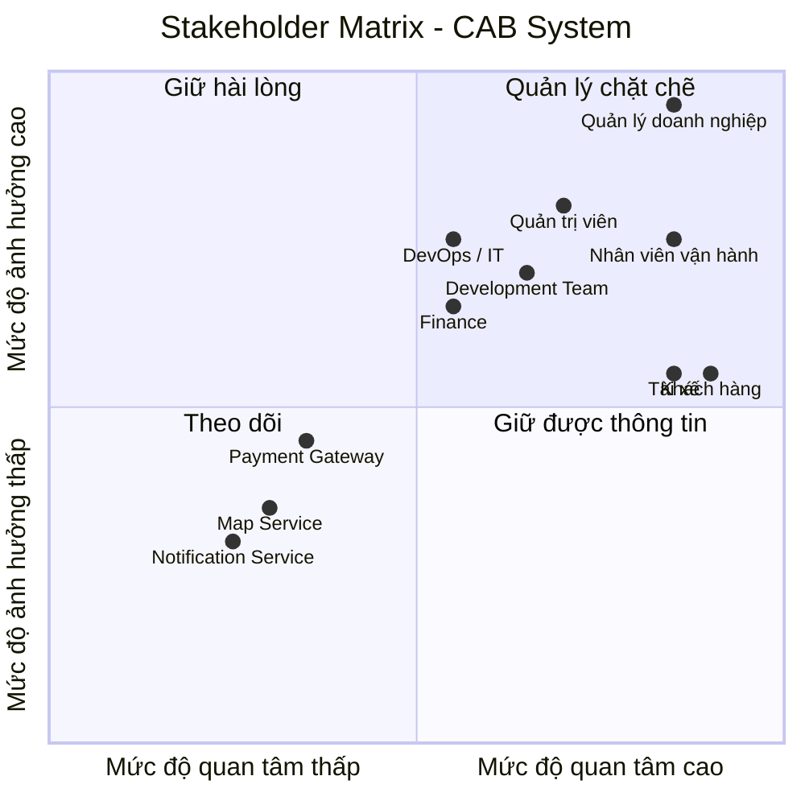

Xây dựng một hệ thống cơ bản MVB 
đứng ở vai trò BA
bước 1: đọc và phân tích yêu cầu của khách hàng ở giai đoạn sơ khởi
### Xây dựng hệ thống cơ bản

**Đóng vai trò:** BA (Business Analyst)

# Bước 1: Phân tích yêu cầu sơ  của khách hàng

Ở giai đoạn sơ khởi (giai đoạn 1), BA cần tập trung vào việc **phân tích và tìm hiểu yêu cầu của khách hàng**.

Mục tiêu chính là hiểu được **Business Context** – tức là **ngữ cảnh của nghiệp vụ**, bao gồm:

- **Khách hàng là ai?**
- **Doanh nghiệp đang giải quyết vấn đề gì?**
- **Mục tiêu kinh doanh (Business Goal) là gì?**
- **Quy trình nghiệp vụ hiện tại (As-Is) đang diễn ra như thế nào?**
- **Những vấn đề hoặc khó khăn đang tồn tại là gì?**
- **Hệ thống cần giải quyết vấn đề nào?**
- **Kết quả mong muốn (To-Be) của khách hàng là gì?**

  ....
  # BƯỚC 1: PHÂN TÍCH YÊU CẦU SƠ KHỞI CỦA KHÁCH HÀNG

## 1. Mục tiêu của bước phân tích

Trong giai đoạn sơ khởi, Business Analyst (BA) chưa đi sâu vào việc thiết kế hệ thống hay lựa chọn công nghệ.

Mục tiêu chính của BA là:

- Hiểu khách hàng và lĩnh vực kinh doanh.
- Hiểu vấn đề mà doanh nghiệp đang gặp phải.
- Xác định mục tiêu kinh doanh.
- Hiểu quy trình nghiệp vụ hiện tại (**As-Is**).
- Xác định các vấn đề và khó khăn trong quy trình hiện tại.
- Xác định hệ thống mới cần giải quyết vấn đề gì.
- Xác định trạng thái mong muốn trong tương lai (**To-Be**).

---

# 2. Khách hàng là ai?

Khách hàng là **Công ty ABC**, một doanh nghiệp hoạt động trong lĩnh vực **cung cấp dịch vụ đặt xe trực tuyến**.

Hiện tại, khách hàng có thể đặt xe thông qua:

- Tổng đài.
- Một ứng dụng đặt xe đơn giản.

Các đối tượng chính tham gia vào hoạt động kinh doanh gồm:

| Đối tượng | Vai trò |
|---|---|
| Customer | Người có nhu cầu đặt xe và sử dụng dịch vụ |
| Driver | Người nhận và thực hiện chuyến đi |
| Operation Staff | Nhân viên quản lý và vận hành hệ thống |
| Management | Ban lãnh đạo theo dõi hoạt động và hiệu quả kinh doanh |

---

# 3. Doanh nghiệp đang giải quyết vấn đề gì?

Về bản chất, Công ty ABC đang cung cấp dịch vụ kết nối giữa:

> **Khách hàng có nhu cầu di chuyển và tài xế có khả năng cung cấp dịch vụ vận chuyển.**

Quy trình kinh doanh cốt lõi có thể được mô tả như sau:

### Bước 2: Xác định các Stakeholders

#### 2.1. Danh sách Stakeholders

| Tên Stakeholders | Vai trò |
|---|---|
| **Khách hàng (Customer)** | Người sử dụng hệ thống để đặt xe, theo dõi chuyến đi, thanh toán và đánh giá dịch vụ. |
| **Tài xế (Driver)** | Nhận yêu cầu chuyến xe, xác nhận chuyến, thực hiện chuyến và cập nhật trạng thái chuyến đi. |
| **Nhân viên vận hành (Operator)** | Theo dõi và điều phối hoạt động đặt xe, hỗ trợ xử lý các vấn đề phát sinh trong quá trình vận hành. |
| **Quản trị viên (Admin)** | Quản lý người dùng, tài xế, phân quyền, cấu hình hệ thống và theo dõi hoạt động của hệ thống. |
| **Quản lý doanh nghiệp (Business Manager)** | Định hướng mục tiêu kinh doanh, theo dõi hiệu quả hoạt động và đưa ra các quyết định liên quan đến hệ thống. |
| **Bộ phận kế toán / tài chính (Finance)** | Quản lý doanh thu, giao dịch, đối soát và các vấn đề liên quan đến thanh toán. |
| **Đội ngũ phát triển (Development Team)** | Phân tích, thiết kế, phát triển, tích hợp và bảo trì hệ thống. |
| **Đội ngũ vận hành hệ thống (DevOps / IT Operations)** | Triển khai, giám sát, đảm bảo tính ổn định, khả năng mở rộng và xử lý sự cố hệ thống. |
| **Cổng thanh toán (Payment Gateway)** | Cung cấp dịch vụ xử lý và xác nhận các giao dịch thanh toán. |
| **Dịch vụ bản đồ / định vị (Map & Location Service)** | Cung cấp dữ liệu bản đồ, vị trí, khoảng cách và hỗ trợ tính toán lộ trình. |
| **Dịch vụ thông báo (Notification Service)** | Gửi thông báo đến khách hàng và tài xế thông qua các kênh như SMS, Email hoặc Push Notification. |

#### 2.2. Stakeholder Matrix

Stakeholder Matrix giúp xác định **mức độ ảnh hưởng (Power)** và **mức độ quan tâm (Interest)** của từng stakeholder đối với hệ thống.

#### Bước 3: Xác định Mục tiêu nghiệp vụ (Business Goals)

Từ Business Context và Business Purpose đã phân tích ở Bước 1, BA xác định các mục tiêu nghiệp vụ cụ thể mà hệ thống CAB cần đạt được:

| Mã | Mục tiêu nghiệp vụ (Business Goal) |
|---|---|
| BG01 | Tự động tìm và phân công tài xế phù hợp cho khách hàng |
| BG02 | Hỗ trợ thanh toán (cho phép thanh toán tiền mặt và thanh toán điện tử) |
| BG03 | Cung cấp khả năng theo dõi chuyến đi theo thời gian thực cho khách hàng |
| BG04 | Gửi thông báo tự động cho khách hàng và tài xế xuyên suốt vòng đời chuyến đi |
| BG05 | Cung cấp công cụ quản trị và báo cáo cho nhân viên vận hành |
| BG06 | Đảm bảo hệ thống có khả năng mở rộng (scalable) và hoạt động ổn định khi tải tăng cao |
| BG07 | Bảo vệ dữ liệu và kiểm soát truy cập theo đúng yêu cầu bảo mật |
| BG08 | Xây dựng kiến trúc linh hoạt, dễ mở rộng để bổ sung dịch vụ, phương thức thanh toán, kênh thông báo mới trong tương lai |
| BG09 | Nâng cao chất lượng dịch vụ thông qua cơ chế đánh giá tài xế sau chuyến đi |

**Diễn giải chi tiết:**

- **BG01 – Tự động tìm tài xế:** Khi khách hàng tạo chuyến, hệ thống tự động xác định tài xế phù hợp dựa trên vị trí, trạng thái sẵn sàng và tiêu chí vận hành, có cơ chế tìm tài xế khác nếu tài xế đầu tiên không phản hồi/từ chối, không yêu cầu khách hàng tạo lại yêu cầu.
- **BG02 – Hỗ trợ thanh toán:** Cho phép thanh toán tiền mặt và thanh toán điện tử qua nhà cung cấp thanh toán bên ngoài, không lưu trực tiếp thông tin nhạy cảm của thẻ/tài khoản trong hệ thống CAB, có cơ chế xử lý khi giao dịch điện tử thất bại.
- **BG03 – Theo dõi chuyến đi thời gian thực:** Khách hàng biết được trạng thái tìm tài xế, tài xế nhận chuyến, thời gian dự kiến đến và trạng thái hiện tại của chuyến đi.
- **BG04 – Thông báo:** Khách hàng nhận thông báo khi yêu cầu được tiếp nhận, tài xế nhận chuyến, tài xế đến điểm đón, chuyến hoàn thành, kết quả thanh toán; tài xế nhận thông báo về chuyến mới hoặc thay đổi liên quan.
- **BG05 – Công cụ quản trị & báo cáo:** Nhân viên vận hành quản lý khách hàng, tài xế, phương tiện, chuyến đi; xem báo cáo số lượng chuyến, doanh thu, tỷ lệ hoàn thành/hủy, hiệu quả hoạt động tài xế.
- **BG06 – Khả năng mở rộng & ổn định:** Các thành phần hệ thống scale độc lập khi tải tăng; lỗi ở một chức năng (thanh toán, thông báo) không làm sập toàn bộ hệ thống.
- **BG07 – Bảo mật:** Xác thực khách hàng/tài xế trước khi dùng chức năng yêu cầu tài khoản, kiểm soát quyền truy cập cho thao tác quản trị, bảo vệ dữ liệu cá nhân/vị trí/giao dịch, lưu vết (audit log) các thao tác quan trọng.
- **BG08 – Kiến trúc linh hoạt:** Cho phép bổ sung loại dịch vụ mới, phương thức thanh toán mới, nhà cung cấp thông báo mới hoặc thay đổi thành phần kỹ thuật mà không cần xây lại toàn bộ ứng dụng.
- **BG09 – Đánh giá tài xế:** Sau khi hoàn thành chuyến, khách hàng có thể đánh giá tài xế; dữ liệu đánh giá được dùng để cải thiện chất lượng dịch vụ và làm tiêu chí tham khảo trong hoạt động vận hành (ví dụ: theo dõi hiệu quả tài xế trong báo cáo — liên quan BG05).
