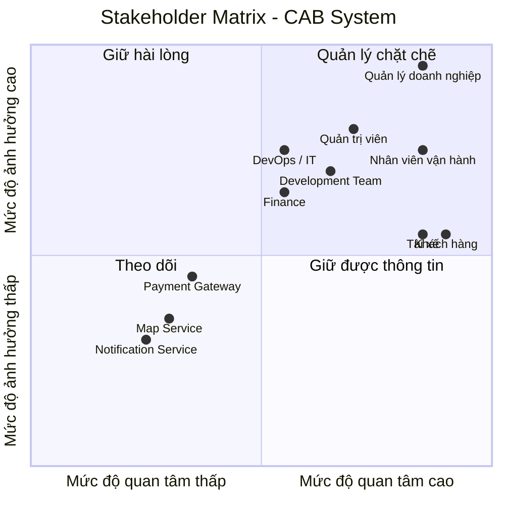

Xây dựng một hệ thống cơ bản MVB 
đứng ở vai trò BA
bước 1: đọc và phân tích yêu cầu của khách hàng ở giai đoạn sơ khởi
### Xây dựng hệ thống cơ bản

**Đóng vai trò:** BA (Business Analyst)

# Bước 1: Phân tích yêu cầu sơ  của khách hàng

Ở giai đoạn sơ khởi (giai đoạn 1), BA cần tập trung vào việc **phân tích và tìm hiểu yêu cầu của khách hàng**.

Mục tiêu chính là hiểu được **Business Context** – tức là **ngữ cảnh của nghiệp vụ**, bao gồm:

- **Khách hàng là ai?**
- **Doanh nghiệp đang giải quyết vấn đề gì?**
- **Mục tiêu kinh doanh (Business Goal) là gì?**
- **Quy trình nghiệp vụ hiện tại (As-Is) đang diễn ra như thế nào?**
- **Những vấn đề hoặc khó khăn đang tồn tại là gì?**
- **Hệ thống cần giải quyết vấn đề nào?**
- **Kết quả mong muốn (To-Be) của khách hàng là gì?**

  ....
  # BƯỚC 1: PHÂN TÍCH YÊU CẦU SƠ KHỞI CỦA KHÁCH HÀNG

## 1. Mục tiêu của bước phân tích

Trong giai đoạn sơ khởi, Business Analyst (BA) chưa đi sâu vào việc thiết kế hệ thống hay lựa chọn công nghệ.

Mục tiêu chính của BA là:

- Hiểu khách hàng và lĩnh vực kinh doanh.
- Hiểu vấn đề mà doanh nghiệp đang gặp phải.
- Xác định mục tiêu kinh doanh.
- Hiểu quy trình nghiệp vụ hiện tại (**As-Is**).
- Xác định các vấn đề và khó khăn trong quy trình hiện tại.
- Xác định hệ thống mới cần giải quyết vấn đề gì.
- Xác định trạng thái mong muốn trong tương lai (**To-Be**).

---

# 2. Khách hàng là ai?

Khách hàng là **Công ty ABC**, một doanh nghiệp hoạt động trong lĩnh vực **cung cấp dịch vụ đặt xe trực tuyến**.

Hiện tại, khách hàng có thể đặt xe thông qua:

- Tổng đài.
- Một ứng dụng đặt xe đơn giản.

Các đối tượng chính tham gia vào hoạt động kinh doanh gồm:

| Đối tượng | Vai trò |
|---|---|
| Customer | Người có nhu cầu đặt xe và sử dụng dịch vụ |
| Driver | Người nhận và thực hiện chuyến đi |
| Operation Staff | Nhân viên quản lý và vận hành hệ thống |
| Management | Ban lãnh đạo theo dõi hoạt động và hiệu quả kinh doanh |

---

# 3. Doanh nghiệp đang giải quyết vấn đề gì?

Về bản chất, Công ty ABC đang cung cấp dịch vụ kết nối giữa:

> **Khách hàng có nhu cầu di chuyển và tài xế có khả năng cung cấp dịch vụ vận chuyển.**

Quy trình kinh doanh cốt lõi có thể được mô tả như sau:

### Bước 2: Xác định các Stakeholders

#### 2.1. Danh sách Stakeholders

| Tên Stakeholders | Vai trò |
|---|---|
| **Khách hàng (Customer)** | Người sử dụng hệ thống để đặt xe, theo dõi chuyến đi, thanh toán và đánh giá dịch vụ. |
| **Tài xế (Driver)** | Nhận yêu cầu chuyến xe, xác nhận chuyến, thực hiện chuyến và cập nhật trạng thái chuyến đi. |
| **Nhân viên vận hành (Operator)** | Theo dõi và điều phối hoạt động đặt xe, hỗ trợ xử lý các vấn đề phát sinh trong quá trình vận hành. |
| **Quản trị viên (Admin)** | Quản lý người dùng, tài xế, phân quyền, cấu hình hệ thống và theo dõi hoạt động của hệ thống. |
| **Quản lý doanh nghiệp (Business Manager)** | Định hướng mục tiêu kinh doanh, theo dõi hiệu quả hoạt động và đưa ra các quyết định liên quan đến hệ thống. |
| **Bộ phận kế toán / tài chính (Finance)** | Quản lý doanh thu, giao dịch, đối soát và các vấn đề liên quan đến thanh toán. |
| **Đội ngũ phát triển (Development Team)** | Phân tích, thiết kế, phát triển, tích hợp và bảo trì hệ thống. |
| **Đội ngũ vận hành hệ thống (DevOps / IT Operations)** | Triển khai, giám sát, đảm bảo tính ổn định, khả năng mở rộng và xử lý sự cố hệ thống. |
| **Cổng thanh toán (Payment Gateway)** | Cung cấp dịch vụ xử lý và xác nhận các giao dịch thanh toán. |
| **Dịch vụ bản đồ / định vị (Map & Location Service)** | Cung cấp dữ liệu bản đồ, vị trí, khoảng cách và hỗ trợ tính toán lộ trình. |
| **Dịch vụ thông báo (Notification Service)** | Gửi thông báo đến khách hàng và tài xế thông qua các kênh như SMS, Email hoặc Push Notification. |

#### 2.2. Stakeholder Matrix

Stakeholder Matrix giúp xác định **mức độ ảnh hưởng (Power)** và **mức độ quan tâm (Interest)** của từng stakeholder đối với hệ thống.

#### Bước 3: Xác định Mục tiêu nghiệp vụ (Business Goals)

Từ Business Context và Business Purpose đã phân tích ở Bước 1, BA xác định các mục tiêu nghiệp vụ cụ thể mà hệ thống CAB cần đạt được:

| Mã | Mục tiêu nghiệp vụ (Business Goal) |
|---|---|
| BG01 | Tự động tìm và phân công tài xế phù hợp cho khách hàng |
| BG02 | Hỗ trợ thanh toán (cho phép thanh toán tiền mặt và thanh toán điện tử) |
| BG03 | Cung cấp khả năng theo dõi chuyến đi theo thời gian thực cho khách hàng |
| BG04 | Gửi thông báo tự động cho khách hàng và tài xế xuyên suốt vòng đời chuyến đi |
| BG05 | Cung cấp công cụ quản trị và báo cáo cho nhân viên vận hành |
| BG06 | Đảm bảo hệ thống có khả năng mở rộng (scalable) và hoạt động ổn định khi tải tăng cao |
| BG07 | Bảo vệ dữ liệu và kiểm soát truy cập theo đúng yêu cầu bảo mật |
| BG08 | Xây dựng kiến trúc linh hoạt, dễ mở rộng để bổ sung dịch vụ, phương thức thanh toán, kênh thông báo mới trong tương lai |
| BG09 | Nâng cao chất lượng dịch vụ thông qua cơ chế đánh giá tài xế sau chuyến đi |

**Diễn giải chi tiết:**

- **BG01 – Tự động tìm tài xế:** Khi khách hàng tạo chuyến, hệ thống tự động xác định tài xế phù hợp dựa trên vị trí, trạng thái sẵn sàng và tiêu chí vận hành, có cơ chế tìm tài xế khác nếu tài xế đầu tiên không phản hồi/từ chối, không yêu cầu khách hàng tạo lại yêu cầu.
- **BG02 – Hỗ trợ thanh toán:** Cho phép thanh toán tiền mặt và thanh toán điện tử qua nhà cung cấp thanh toán bên ngoài, không lưu trực tiếp thông tin nhạy cảm của thẻ/tài khoản trong hệ thống CAB, có cơ chế xử lý khi giao dịch điện tử thất bại.
- **BG03 – Theo dõi chuyến đi thời gian thực:** Khách hàng biết được trạng thái tìm tài xế, tài xế nhận chuyến, thời gian dự kiến đến và trạng thái hiện tại của chuyến đi.
- **BG04 – Thông báo:** Khách hàng nhận thông báo khi yêu cầu được tiếp nhận, tài xế nhận chuyến, tài xế đến điểm đón, chuyến hoàn thành, kết quả thanh toán; tài xế nhận thông báo về chuyến mới hoặc thay đổi liên quan.
- **BG05 – Công cụ quản trị & báo cáo:** Nhân viên vận hành quản lý khách hàng, tài xế, phương tiện, chuyến đi; xem báo cáo số lượng chuyến, doanh thu, tỷ lệ hoàn thành/hủy, hiệu quả hoạt động tài xế.
- **BG06 – Khả năng mở rộng & ổn định:** Các thành phần hệ thống scale độc lập khi tải tăng; lỗi ở một chức năng (thanh toán, thông báo) không làm sập toàn bộ hệ thống.
- **BG07 – Bảo mật:** Xác thực khách hàng/tài xế trước khi dùng chức năng yêu cầu tài khoản, kiểm soát quyền truy cập cho thao tác quản trị, bảo vệ dữ liệu cá nhân/vị trí/giao dịch, lưu vết (audit log) các thao tác quan trọng.
- **BG08 – Kiến trúc linh hoạt:** Cho phép bổ sung loại dịch vụ mới, phương thức thanh toán mới, nhà cung cấp thông báo mới hoặc thay đổi thành phần kỹ thuật mà không cần xây lại toàn bộ ứng dụng.
- **BG09 – Đánh giá tài xế:** Sau khi hoàn thành chuyến, khách hàng có thể đánh giá tài xế; dữ liệu đánh giá được dùng để cải thiện chất lượng dịch vụ và làm tiêu chí tham khảo trong hoạt động vận hành (ví dụ: theo dõi hiệu quả tài xế trong báo cáo — liên quan BG05).

#### Bước 4: Xác định Phạm vi dự án (Scope)

Với thời gian triển khai chỉ **7 tuần**, BA cần xác định rõ phạm vi để đội phát triển tập trung xây dựng **MVP (Minimum Viable Product)** — đáp ứng đúng luồng nghiệp vụ cốt lõi mà khách hàng mô tả, đồng thời loại trừ các phần có thể mở rộng sau để tránh trễ tiến độ.

##### 4.1 Trong phạm vi (In-Scope)

**Module Khách hàng (Customer)**
- Đăng ký tài khoản, đăng nhập, cập nhật thông tin cá nhân
- Nhập điểm đón/điểm đến, chọn loại xe, gửi yêu cầu đặt xe
- Theo dõi trạng thái chuyến đi (đang tìm tài xế, tài xế đã nhận, thời gian dự kiến đến, trạng thái hiện tại)
- Xem lịch sử chuyến đi, số tiền phải trả
- Đánh giá tài xế sau khi hoàn thành chuyến

**Module Tài xế (Driver)**
- Đăng ký hoặc được nhân viên vận hành tạo tài khoản
- Cập nhật hồ sơ, thông tin phương tiện, trạng thái hoạt động (sẵn sàng/không sẵn sàng)
- Nhận thông báo yêu cầu chuyến phù hợp, chấp nhận/từ chối chuyến
- Cập nhật trạng thái chuyến: đã đến điểm đón, đã đón khách, đang di chuyển, hoàn thành
- Cập nhật vị trí để phục vụ tìm tài xế gần khách hàng

**Module Tìm & Phân công tài xế (Driver Matching)**
- Xác định tài xế phù hợp dựa trên vị trí, trạng thái sẵn sàng
- Cơ chế tìm tài xế thay thế khi tài xế được đề xuất không phản hồi/từ chối
- Thông báo cho khách hàng khi không tìm được tài xế

**Module Tính cước & Thanh toán (Fare & Payment)**
- Tính số tiền khách hàng phải trả dựa trên loại dịch vụ và thông tin chuyến đi
- Thanh toán tiền mặt
- Thanh toán điện tử (tích hợp với 1 nhà cung cấp thanh toán bên ngoài, không lưu thông tin thẻ nhạy cảm trong hệ thống CAB)
- Thông báo và cho phép xử lý lại khi giao dịch điện tử thất bại

**Module Thông báo (Notification)**
- Thông báo cho khách hàng: yêu cầu được tiếp nhận, tài xế nhận chuyến, tài xế đến điểm đón, chuyến hoàn thành, kết quả thanh toán
- Thông báo cho tài xế: chuyến mới, thay đổi liên quan đến chuyến đang thực hiện
- Kiến trúc cho phép mở rộng thêm kênh thông báo sau này (chỉ cần thiết kế sẵn, chưa cần triển khai nhiều kênh trong 7 tuần)

**Module Quản trị vận hành (Admin/Operations)**
- Quản lý khách hàng, tài xế, phương tiện, chuyến đi
- Xem các chuyến đang diễn ra, kiểm tra trạng thái tài xế
- Hỗ trợ xử lý chuyến bị lỗi, tra cứu lịch sử giao dịch
- Phân quyền cơ bản (nhân viên thường vs. thao tác nhạy cảm)

- Báo cáo cơ bản: số lượng chuyến, doanh thu, tỷ lệ hoàn thành/hủy, hiệu quả tài xế

**Yêu cầu phi chức năng (Non-Functional)**
- Xác thực người dùng (khách hàng, tài xế) trước khi dùng chức năng cần tài khoản
- Kiểm soát quyền truy cập cho thao tác quản trị
- Lưu vết (audit log) các thao tác quan trọng
- Kiến trúc cho phép các thành phần scale độc lập, cô lập lỗi (một module lỗi không kéo sập toàn hệ thống)

##### 4.2 Ngoài phạm vi (Out-of-Scope)

> Các mục dưới đây **không nên triển khai trong giai đoạn 7 tuần này**, do chưa được khách hàng chốt chi tiết hoặc không phải yêu cầu cốt lõi của MVP. BA cần ghi nhận và xác nhận lại với khách hàng để đưa vào roadmap giai đoạn sau.

- Tích hợp **nhiều** nhà cung cấp thanh toán cùng lúc (chỉ tích hợp 1 nhà cung cấp trong phạm vi MVP)
- Tích hợp **nhiều kênh thông báo** (SMS, email, push, in-app...) — chỉ cần 1 kênh chính, kiến trúc chừa sẵn khả năng mở rộng
- Tính năng khuyến mãi, mã giảm giá, chương trình khách hàng thân thiết
- Đặt xe hộ người khác, đặt xe theo lịch (đặt trước)
- Chat trực tiếp giữa khách hàng và tài xế trong ứng dụng
- Bản đồ nội bộ tự phát triển (dự kiến dùng dịch vụ bản đồ bên thứ ba có sẵn, không tự xây engine định vị/routing)
- Ứng dụng dành riêng cho nhiều ngôn ngữ/đa quốc gia (chỉ 1 ngôn ngữ/thị trường ban đầu)
- Chính sách hủy chuyến chi tiết, biểu phí phạt hủy (chưa được khách hàng chốt — cần làm rõ trước, xem mục Open Issues)
- Cách tính cước nâng cao (giờ cao điểm, surge pricing, khuyến mãi theo khu vực) — chỉ áp dụng công thức tính cước cơ bản trong MVP
- Xử lý chi tiết khi mất kết nối mạng (offline mode) — chưa được chốt, cần làm rõ
- Chính sách và thời gian lưu trữ dữ liệu dài hạn (data retention/archiving) — chưa được chốt, cần làm rõ
- Ứng dụng di động native (iOS/Android) đầy đủ — trong 7 tuần ưu tiên nền tảng chính (web hoặc 1 nền tảng di động), việc phát triển đa nền tảng đầy đủ để giai đoạn sau
- Tính năng phân tích nâng cao / AI dự đoán nhu cầu, tối ưu tuyến đường

.....

#### Bước 5: Chuyển đổi Yêu cầu thành Business Requirements (BR)

Sau khi hoàn thành Bước 4 (xác định phạm vi và module), BA cần **gặp lại khách hàng để xác nhận phạm vi (scope confirmation)**. Sau khi khách hàng xác nhận đúng các yêu cầu, BA tiến hành chuyển các yêu cầu trong phạm vi (in-scope) thành các **Business Requirement (BR)** — là các yêu cầu nghiệp vụ cụ thể, làm cơ sở để thiết kế Use Case, chức năng và giải pháp kỹ thuật ở các bước sau.

---

##### Danh sách Business Requirements (BR)

| Mã | Tên Business Requirement | Diễn giải |
|---|---|---|
| BR01 | Đặt chuyến | Khách hàng nhập điểm đón, điểm đến, chọn loại xe và gửi yêu cầu đặt xe đến hệ thống |
| BR02 | Đăng ký & đăng nhập tài khoản | Khách hàng, tài xế có thể đăng ký tài khoản mới hoặc đăng nhập vào hệ thống để sử dụng các chức năng yêu cầu xác thực |
| BR03 | Cập nhật thông tin cá nhân | Khách hàng và tài xế có thể cập nhật thông tin hồ sơ cá nhân của mình sau khi đăng nhập |
| BR04 | Quản lý hồ sơ & phương tiện tài xế | Tài xế cập nhật thông tin phương tiện (loại xe, biển số...) và trạng thái hoạt động của bản thân |
| BR05 | Tìm và đề xuất tài xế phù hợp | Hệ thống tự động xác định tài xế phù hợp gần khách hàng dựa trên vị trí và trạng thái sẵn sàng |
| BR06 | Xử lý khi tài xế từ chối/không phản hồi | Hệ thống tự động chuyển sang tìm tài xế khác khi tài xế được đề xuất từ chối hoặc không phản hồi, không yêu cầu khách hàng đặt lại |
| BR07 | Thông báo không tìm được tài xế | Hệ thống thông báo rõ ràng cho khách hàng khi không tìm được tài xế phù hợp |
| BR08 | Theo dõi trạng thái chuyến đi | Khách hàng theo dõi được trạng thái chuyến theo thời gian thực: đang tìm tài xế, đã nhận chuyến, đến điểm đón, đang di chuyển, hoàn thành |
| BR09 | Cập nhật trạng thái chuyến (phía tài xế) | Tài xế cập nhật các mốc trạng thái trong quá trình thực hiện chuyến: đã đến điểm đón, đã đón khách, đang di chuyển, hoàn thành |
| BR10 | Tính cước chuyến đi | Hệ thống tự động tính số tiền khách hàng phải trả dựa trên loại dịch vụ và thông tin chuyến đi sau khi hoàn thành |
| BR11 | Thanh toán tiền mặt | Khách hàng có thể chọn hình thức thanh toán bằng tiền mặt sau khi hoàn thành chuyến |
| BR12 | Thanh toán điện tử | Khách hàng có thể thanh toán qua cổng thanh toán điện tử tích hợp với nhà cung cấp bên ngoài |
| BR13 | Xử lý giao dịch thanh toán thất bại | Hệ thống thông báo cho khách hàng và cho phép xử lý lại khi giao dịch thanh toán điện tử không thành công |
| BR14 | Thông báo theo vòng đời chuyến đi | Hệ thống gửi thông báo cho khách hàng và tài xế tại các mốc: tiếp nhận yêu cầu, tài xế nhận chuyến, tài xế đến điểm đón, hoàn thành chuyến, kết quả thanh toán |
| BR15 | Xem lịch sử chuyến đi | Khách hàng xem lại danh sách các chuyến đã thực hiện kèm chi tiết và số tiền đã thanh toán |
| BR16 | Đánh giá tài xế | Khách hàng đánh giá tài xế sau khi hoàn thành chuyến đi |
| BR17 | Quản lý khách hàng, tài xế, phương tiện, chuyến đi (Admin) | Nhân viên vận hành có thể xem, tra cứu và quản lý dữ liệu khách hàng, tài xế, phương tiện và chuyến đi trên giao diện quản trị |
| BR18 | Hỗ trợ xử lý chuyến gặp sự cố | Nhân viên vận hành xem các chuyến đang diễn ra và hỗ trợ xử lý khi chuyến gặp lỗi/sự cố |
| BR19 | Phân quyền thao tác quản trị | Hệ thống giới hạn một số chức năng quản trị nhạy cảm, chỉ cho phép người có quyền phù hợp thực hiện |
| BR20 | Báo cáo vận hành | Hệ thống cung cấp báo cáo về số lượng chuyến, doanh thu, tỷ lệ hoàn thành/hủy chuyến và hiệu quả hoạt động của tài xế |
| BR21 | Xác thực người dùng | Hệ thống yêu cầu xác thực khách hàng/tài xế trước khi cho phép sử dụng các chức năng gắn với tài khoản |
| BR22 | Ghi log thao tác quan trọng | Hệ thống ghi lại (audit log) các thao tác quan trọng, đặc biệt là thao tác quản trị, phục vụ tra soát khi có sự cố |

---

##### Ghi chú

- Bảng BR trên được xây dựng **dựa trên các module trong phạm vi (in-scope)** đã xác nhận ở Bước 4; các nội dung thuộc mục **"Ngoài phạm vi"** ở Bước 4 **không** được chuyển thành BR ở giai đoạn này.
- Mỗi BR sẽ là đầu vào để triển khai tiếp ở **Bước 6: xác định Actor và Use Case**, trong đó một BR có thể tương ứng với một hoặc nhiều Use Case cụ thể.
- Trước khi chốt danh sách BR chính thức, BA nên tổ chức buổi **review với khách hàng** để xác nhận: (1) tên gọi và nội dung từng BR có đúng ý khách hàng; (2) không thiếu/thừa BR so với phạm vi đã thống nhất.

......

#### Bước 6: Xây dựng Business Process (Quy trình nghiệp vụ)

Từ danh sách Business Requirements (BR01–BR37) đã xác nhận với khách hàng ở Bước 5, tiến hành mô hình hóa thành các **Business Process (BP)** — mô tả luồng thực hiện từng bước, bao gồm cả **luồng chính (Main Flow)**, **luồng phụ (Alternative Flow)** và **luồng ngoại lệ (Exception Flow)**. Mỗi BP là cơ sở để thiết kế Use Case chi tiết ở bước sau.

---

##### BP01 – Đặt chuyến (Booking Trip)

**Mục tiêu:** Khách hàng tạo yêu cầu đặt xe và được ghép với tài xế phù hợp.
**BR liên quan:** BR11, BR12, BR13, BR14, BR15, BR16

**Luồng chính (Main Flow):**
1. Khách hàng đăng nhập vào hệ thống.
2. Khách hàng nhập điểm đón và điểm đến.
3. Khách hàng chọn loại xe/dịch vụ.
4. Khách hàng xác nhận gửi yêu cầu đặt xe.
5. Hệ thống tiếp nhận yêu cầu và gửi thông báo xác nhận cho khách hàng.
6. Hệ thống tìm kiếm tài xế phù hợp dựa trên vị trí và trạng thái sẵn sàng (→ BP02).
7. Tài xế chấp nhận chuyến.
8. Hệ thống thông báo cho khách hàng: tài xế đã nhận chuyến, thông tin tài xế, thời gian dự kiến đến.
9. Chuyến đi chuyển sang trạng thái "đang chờ tài xế đến điểm đón" (→ BP03).

**Luồng phụ (Alternative Flow):**
- 7a. Tài xế từ chối hoặc không phản hồi trong thời gian quy định → hệ thống tự động tìm tài xế kế tiếp (lặp lại bước 6–7), khách hàng **không cần** tạo lại yêu cầu.

**Luồng ngoại lệ (Exception Flow):**
- 6a. Không tìm được tài xế phù hợp sau nhiều lần thử → hệ thống thông báo rõ cho khách hàng là không tìm được tài xế, kết thúc quy trình.
- 4a. Khách hàng hủy yêu cầu trước khi có tài xế nhận → hệ thống hủy yêu cầu, không phát sinh chi phí.

---

##### BP02 – Điều phối & Tìm tài xế (Dispatch/Matching)

**Mục tiêu:** Ghép tài xế phù hợp nhất cho một yêu cầu đặt xe.
**BR liên quan:** BR12, BR13, BR14, BR15

**Luồng chính:**
1. Hệ thống nhận yêu cầu đặt xe từ BP01.
2. Hệ thống xác định danh sách tài xế đang ở trạng thái sẵn sàng, gần vị trí khách hàng.
3. Hệ thống chọn tài xế phù hợp nhất theo tiêu chí ưu tiên (khoảng cách, trạng thái...).
4. Hệ thống gửi thông báo đề xuất chuyến đến tài xế được chọn.
5. Tài xế phản hồi (chấp nhận/từ chối) trong thời gian quy định.
6. Nếu chấp nhận → hệ thống cập nhật trạng thái chuyến là "đã có tài xế", kết thúc quy trình, quay lại BP01 bước 8.

**Luồng phụ:**
- 5a. Tài xế từ chối → hệ thống loại tài xế này khỏi danh sách đề xuất cho chuyến hiện tại, quay lại bước 3 với tài xế kế tiếp.
- 5b. Tài xế không phản hồi trong thời gian quy định (timeout) → hệ thống tự động loại và quay lại bước 3.

**Luồng ngoại lệ:**
- 2a. Không còn tài xế nào sẵn sàng trong khu vực → chuyển sang BP01 – Exception (thông báo không tìm được tài xế).

---

##### BP03 – Thực hiện chuyến đi (Trip Execution)

**Mục tiêu:** Theo dõi và cập nhật hành trình chuyến đi từ khi tài xế nhận cho đến khi hoàn thành.
**BR liên quan:** BR16, BR17

**Luồng chính:**
1. Tài xế di chuyển đến điểm đón.
2. Tài xế cập nhật trạng thái "đã đến điểm đón".
3. Hệ thống thông báo cho khách hàng tài xế đã đến.
4. Tài xế cập nhật trạng thái "đã đón khách".
5. Tài xế cập nhật trạng thái "đang di chuyển".
6. Khách hàng theo dõi hành trình theo thời gian thực trong suốt chuyến đi.
7. Tài xế đến điểm trả khách, cập nhật trạng thái "hoàn thành chuyến".
8. Hệ thống chuyển sang quy trình tính cước và thanh toán (→ BP04).

**Luồng phụ:**
- 1a. Khách hàng hủy chuyến sau khi đã có tài xế nhưng trước khi tài xế đến điểm đón → hệ thống cập nhật trạng thái "đã hủy", giải phóng tài xế về trạng thái sẵn sàng (chính sách phí hủy: cần làm rõ thêm với khách hàng — xem Open Questions).

**Luồng ngoại lệ:**
- 4a. Khách hàng không có mặt tại điểm đón → cần quy trình xử lý riêng (chính sách chưa chốt — Open Question), tạm thời chuyển cho nhân viên vận hành xử lý thủ công (→ BP08).
- 5a. Mất kết nối giữa app tài xế và hệ thống trong khi di chuyển → cần cơ chế đồng bộ lại trạng thái khi có kết nối trở lại (chi tiết kỹ thuật xử lý mất kết nối chưa chốt — Open Question).

---

##### BP04 – Tính cước & Thanh toán (Fare & Payment)

**Mục tiêu:** Xác định số tiền khách hàng phải trả và xử lý thanh toán sau khi hoàn thành chuyến.
**BR liên quan:** BR18, BR19, BR20, BR21, BR22

**Luồng chính:**
1. Hệ thống nhận sự kiện "chuyến hoàn thành" từ BP03.
2. Hệ thống tính cước dựa trên loại dịch vụ và thông tin chuyến đi.
3. Hệ thống hiển thị số tiền cần thanh toán cho khách hàng.
4. Khách hàng chọn hình thức thanh toán: tiền mặt hoặc điện tử.

**Nhánh 4a – Thanh toán tiền mặt:**
- 4a.1. Khách hàng trả tiền mặt trực tiếp cho tài xế.
- 4a.2. Tài xế xác nhận đã nhận tiền trên hệ thống.
- 4a.3. Hệ thống cập nhật trạng thái thanh toán "hoàn tất".

**Nhánh 4b – Thanh toán điện tử:**
- 4b.1. Hệ thống gửi yêu cầu thanh toán đến nhà cung cấp thanh toán bên ngoài (không gửi kèm thông tin nhạy cảm của thẻ/tài khoản đến hệ thống CAB).
- 4b.2. Nhà cung cấp thanh toán xử lý và trả kết quả về hệ thống.
- 4b.3. Hệ thống cập nhật trạng thái thanh toán "hoàn tất" và thông báo kết quả cho khách hàng (→ BP05).

**Luồng ngoại lệ:**
- 4b.2a. Giao dịch thanh toán điện tử thất bại → hệ thống thông báo cho khách hàng, cho phép chọn lại phương thức thanh toán hoặc thử lại theo chính sách của doanh nghiệp (chi tiết chính sách retry chưa chốt — Open Question).

---

##### BP05 – Thông báo (Notification)

**Mục tiêu:** Đảm bảo khách hàng và tài xế được cập nhật thông tin kịp thời tại các mốc quan trọng.
**BR liên quan:** BR23, BR24

**Luồng chính (chạy song song/độc lập với các BP khác, được kích hoạt bởi sự kiện):**
1. Hệ thống lắng nghe các sự kiện phát sinh từ các quy trình khác: tiếp nhận yêu cầu (BP01), tài xế nhận chuyến (BP02), tài xế đến điểm đón / hoàn thành chuyến (BP03), kết quả thanh toán (BP04).
2. Khi có sự kiện phát sinh, hệ thống xác định đối tượng cần nhận thông báo (khách hàng và/hoặc tài xế).
3. Hệ thống gửi thông báo qua kênh tương ứng (ví dụ: push notification/app).
4. Ghi nhận trạng thái gửi thông báo (thành công/thất bại).

**Luồng ngoại lệ:**
- 3a. Gửi thông báo thất bại → hệ thống ghi log lỗi, có thể thử gửi lại theo chính sách (không được ảnh hưởng đến các chức năng đặt xe/thanh toán khác — theo BR36).

---

##### BP06 – Đánh giá tài xế (Rating)

**Mục tiêu:** Thu thập phản hồi của khách hàng sau chuyến đi.
**BR liên quan:** BR25

**Luồng chính:**
1. Sau khi thanh toán hoàn tất (BP04), hệ thống hiển thị màn hình đánh giá cho khách hàng.
2. Khách hàng chọn mức đánh giá (ví dụ số sao) và có thể để lại nhận xét.
3. Khách hàng xác nhận gửi đánh giá.
4. Hệ thống lưu đánh giá, cập nhật điểm trung bình của tài xế.

**Luồng phụ:**
- 2a. Khách hàng bỏ qua bước đánh giá → hệ thống không ghi nhận đánh giá cho chuyến này, kết thúc quy trình.

---

##### BP07 – Đăng ký & Xác thực tài khoản (Registration & Authentication)

**Mục tiêu:** Cho phép khách hàng/tài xế tạo tài khoản và đăng nhập an toàn vào hệ thống.
**BR liên quan:** BR01, BR02, BR03, BR04

**Luồng chính:**
1. Người dùng (khách hàng/tài xế) chọn chức năng đăng ký.
2. Người dùng nhập thông tin cá nhân bắt buộc.
3. Hệ thống xác thực thông tin (ví dụ số điện thoại/email) hợp lệ.
4. Hệ thống tạo tài khoản mới.
5. Người dùng đăng nhập bằng tài khoản vừa tạo.
6. Hệ thống xác thực và cấp quyền truy cập tương ứng với vai trò (khách hàng/tài xế/nhân viên vận hành).

**Luồng phụ:**
- 2a. Đối với tài xế: nhân viên vận hành có thể tạo tài khoản thay tài xế (không qua bước tự đăng ký).

**Luồng ngoại lệ:**
- 3a. Thông tin không hợp lệ hoặc đã tồn tại → hệ thống thông báo lỗi, yêu cầu người dùng nhập lại.
- 6a. Sai thông tin đăng nhập → hệ thống từ chối truy cập và thông báo lỗi.

---

##### BP08 – Quản trị & Xử lý sự cố chuyến đi (Admin Operations)

**Mục tiêu:** Hỗ trợ nhân viên vận hành giám sát và xử lý các chuyến đi gặp vấn đề.
**BR liên quan:** BR26, BR27, BR28, BR29, BR30, BR35

**Luồng chính:**
1. Nhân viên vận hành đăng nhập vào giao diện quản trị.
2. Nhân viên xem danh sách các chuyến đang diễn ra và trạng thái tương ứng.
3. Nhân viên phát hiện hoặc được báo cáo một chuyến gặp sự cố (ví dụ khách không có mặt, tài xế mất kết nối...).
4. Nhân viên tra cứu thông tin chi tiết chuyến, khách hàng, tài xế liên quan.
5. Nhân viên thực hiện thao tác xử lý phù hợp (ví dụ: hủy chuyến, ghép lại tài xế, ghi chú sự cố).
6. Hệ thống ghi log thao tác xử lý (audit log).

**Luồng ngoại lệ:**
- 5a. Thao tác thuộc nhóm nhạy cảm (ví dụ hoàn tiền, khóa tài khoản) → hệ thống kiểm tra quyền hạn; nếu nhân viên không đủ quyền, từ chối thao tác và yêu cầu chuyển cấp quản trị cao hơn (theo BR04).

---

##### BP09 – Báo cáo vận hành (Reporting)

**Mục tiêu:** Cung cấp số liệu tổng hợp phục vụ ra quyết định quản lý.
**BR liên quan:** BR31, BR32, BR33

**Luồng chính:**
1. Nhân viên vận hành/quản lý chọn loại báo cáo cần xem (số lượng chuyến & doanh thu, tỷ lệ hoàn thành/hủy, hiệu quả tài xế).
2. Nhân viên chọn khoảng thời gian cần thống kê.
3. Hệ thống tổng hợp dữ liệu từ các chuyến đi, thanh toán, đánh giá tương ứng trong khoảng thời gian đã chọn.
4. Hệ thống hiển thị báo cáo dưới dạng bảng/biểu đồ.

**Luồng ngoại lệ:**
- 3a. Không có dữ liệu trong khoảng thời gian được chọn → hệ thống hiển thị thông báo "không có dữ liệu", không báo lỗi hệ thống.

---

##### Ghi chú tổng hợp

- Toàn bộ 9 Business Process (BP01–BP09) trên bao phủ đầy đủ các nhóm BR đã liệt kê ở Bước 5, tương ứng với các module đã xác định ở Bước 4.
- Các bước có đánh dấu **"chưa chốt" / "Open Question"** (ví dụ: chính sách hủy chuyến, xử lý khách không có mặt, xử lý mất kết nối mạng, chính sách retry thanh toán) cần được BA làm rõ với khách hàng **trước khi chuyển sang thiết kế Use Case chi tiết và đặc tả chức năng (Bước 7)**.
- Các BP được thiết kế tuân theo nguyên tắc **tách rời và không phụ thuộc chặt (loose coupling)** giữa các phân hệ (ví dụ: lỗi ở BP05 - Thông báo không được làm gián đoạn BP01 - Đặt chuyến), đúng theo yêu cầu BG06/BR36 về khả năng vận hành ổn định.
