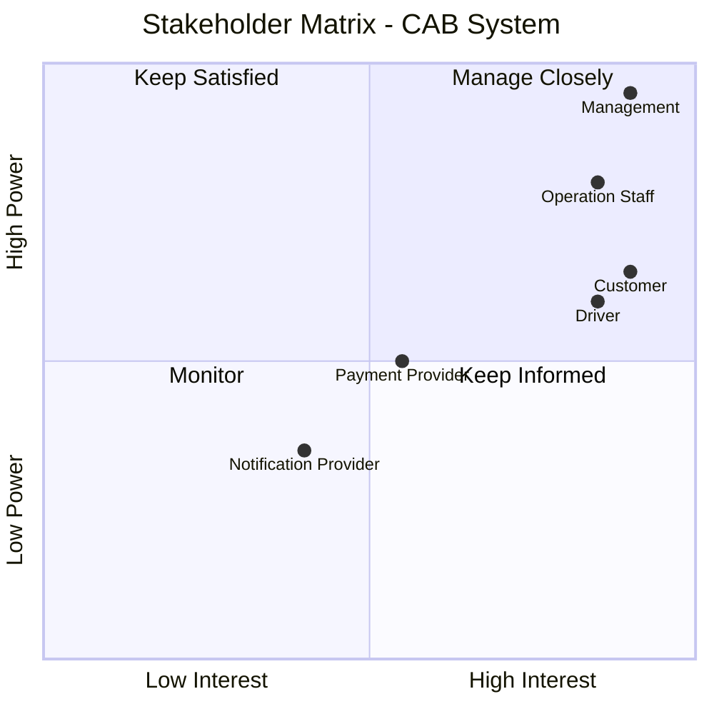

# Bước 1: Phân tích yêu cầu sơ khởi của khách hàng

## 1.1. Business Context

### Thông tin dự án

- **Khách hàng:** Công ty ABC.
- **Lĩnh vực:** Cung cấp dịch vụ đặt xe trực tuyến.
- **Dự án:** CAB System – Nền tảng đặt xe.
- **Thời gian xây dựng và triển khai:** 7 tuần.
- **Mục tiêu tổng quát:** Xây dựng nền tảng đặt xe có khả năng phục vụ số lượng lớn khách hàng và tài xế, đồng thời dễ mở rộng trong tương lai.

### Hệ thống hiện tại

Khách hàng hiện có thể đặt xe bằng:
- Liên hệ tổng đài.
- Sử dụng một ứng dụng đặt xe đơn giản.

Việc phân công tài xế hiện vẫn chủ yếu được thực hiện thủ công và các thông tin về chuyến đi, thanh toán, vận hành chưa được quản lý hiệu quả trên một hệ thống tập trung.

### Nhóm người dùng chính

Hệ thống có 3 nhóm người dùng chính:

| Nhóm người dùng | Nhu cầu chính |
|---|---|
| Khách hàng | Đặt xe, theo dõi chuyến đi, thanh toán, xem lịch sử và đánh giá tài xế |
| Tài xế | Nhận/từ chối chuyến, cập nhật vị trí và trạng thái chuyến đi |
| Nhân viên vận hành | Quản lý khách hàng, tài xế, phương tiện, chuyến đi và hỗ trợ xử lý sự cố |

### Quy trình nghiệp vụ chính

Quy trình chính của CAB System được xác định sơ bộ:

**Đặt xe → Tìm tài xế → Phân công tài xế → Thực hiện chuyến → Hoàn thành chuyến → Tính cước → Thanh toán → Đánh giá**

Ngoài ra, hệ thống cần hỗ trợ:
- Theo dõi trạng thái chuyến đi.
- Thông báo cho khách hàng và tài xế.
- Quản lý hoạt động vận hành.
- Báo cáo hoạt động kinh doanh.

---

## 1.2. Business Problem

Từ yêu cầu của khách hàng, các vấn đề nghiệp vụ chính được xác định:

### BP01 – Phân công tài xế còn thủ công
Việc phân công tài xế chủ yếu được thực hiện thủ công, gây khó khăn khi số lượng yêu cầu đặt xe tăng.

### BP02 – Khó theo dõi trạng thái chuyến đi
Khách hàng khó biết trạng thái yêu cầu đặt xe, tài xế đã nhận chuyến, thời gian tài xế đến và trạng thái hiện tại của chuyến.

### BP03 – Quản lý thanh toán chưa tập trung
Thông tin thanh toán chưa được quản lý tập trung, gây khó khăn cho việc theo dõi giao dịch và doanh thu.

### BP04 – Khó khăn trong công tác vận hành
Nhân viên vận hành gặp khó khăn trong việc theo dõi tài xế, chuyến đi, xử lý sự cố và tra cứu lịch sử giao dịch.

### BP05 – Khả năng mở rộng còn hạn chế
Hệ thống hiện tại khó đáp ứng khi số lượng khách hàng, tài xế và yêu cầu đặt xe tăng cao.

### BP06 – Khả năng phát triển hệ thống còn hạn chế
Doanh nghiệp cần bổ sung dịch vụ, phương thức thanh toán và kênh thông báo mới trong tương lai mà không phải xây dựng lại toàn bộ hệ thống.

---

## 1.3. Các vấn đề BA cần làm rõ

Một số vấn đề nghiệp vụ khách hàng chưa xác định cụ thể:

- Cách tính cước chuyến đi.
- Tiêu chí ưu tiên và lựa chọn tài xế.
- Thời gian tài xế phải phản hồi yêu cầu chuyến.
- Chính sách hủy chuyến.
- Cách xử lý khi mất kết nối mạng.
- Cách xử lý thanh toán thất bại.
- Thời gian lưu trữ dữ liệu.

Các vấn đề này cần được BA xác nhận với stakeholder trước khi chuyển thành yêu cầu chi tiết.

---

## 1.4. Kết luận

**Business Context:** Công ty ABC cần xây dựng CAB System để quản lý toàn bộ quy trình đặt xe từ khi khách hàng tạo yêu cầu đến khi chuyến đi hoàn thành, thanh toán và đánh giá.

**Business Problem:** Hệ thống hiện tại còn phụ thuộc vào phân công tài xế thủ công, khó theo dõi chuyến đi, quản lý thanh toán chưa tập trung, vận hành khó khăn và khả năng mở rộng còn hạn chế.

# Bước 2: Xác định Stakeholders

## 2.1. Danh sách Stakeholders

Dựa trên Business Context và Business Problem, các stakeholder chính của CAB System được xác định như sau:

| Stakeholder | Vai trò |
|---|---|
| **Khách hàng (Customer)** | Đặt xe, theo dõi chuyến đi, thanh toán, xem lịch sử chuyến và đánh giá tài xế. |
| **Tài xế (Driver)** | Nhận hoặc từ chối chuyến, cập nhật vị trí, trạng thái hoạt động và thực hiện chuyến đi. |
| **Nhân viên vận hành (Operation Staff)** | Quản lý khách hàng, tài xế, phương tiện, chuyến đi và hỗ trợ xử lý các trường hợp gặp sự cố. |
| **Ban lãnh đạo (Management)** | Đưa ra yêu cầu, theo dõi báo cáo và đánh giá hiệu quả hoạt động của hệ thống. |
| **Nhà cung cấp thanh toán (Payment Provider)** | Xử lý các giao dịch thanh toán điện tử của khách hàng. |
| **Nhà cung cấp thông báo (Notification Provider)** | Hỗ trợ gửi thông báo đến khách hàng và tài xế qua các kênh thông báo. |

---

## 2.2. Stakeholder Matrix

Stakeholder Matrix giúp xác định **mức độ ảnh hưởng (Power)** và **mức độ quan tâm (Interest)** của các stakeholder đối với CAB System.

### Phân nhóm Stakeholders

- **Manage Closely:** Ban lãnh đạo, Nhân viên vận hành.
- **Keep Informed:** Khách hàng, Tài xế.
- **Monitor / Keep Satisfied:** Nhà cung cấp thanh toán và Nhà cung cấp thông báo tùy theo mức độ tích hợp và phụ thuộc của hệ thống.

# Bước 3: Xác định Business Goal

Business Goal được xác định dựa trên các vấn đề nghiệp vụ của hệ thống hiện tại và kỳ vọng của Công ty ABC.

### BG01 – Tự động tìm và phân công tài xế
- **Mục tiêu:** Giảm thời gian tìm tài xế và hạn chế việc phân công tài xế thủ công.
- **Kết quả mong muốn:** Hệ thống có thể tự động tìm tài xế phù hợp và gần khách hàng.

### BG02 – Hỗ trợ thanh toán
- **Mục tiêu:** Tạo sự thuận tiện cho khách hàng khi thanh toán và quản lý giao dịch tập trung.
- **Kết quả mong muốn:** Cho phép thanh toán bằng tiền mặt và thanh toán điện tử.

### BG03 – Theo dõi trạng thái chuyến đi
- **Mục tiêu:** Giúp khách hàng dễ dàng theo dõi quá trình thực hiện chuyến đi.
- **Kết quả mong muốn:** Khách hàng biết được trạng thái tìm tài xế, tài xế nhận chuyến, thời gian dự kiến đến và trạng thái chuyến đi.

### BG04 – Nâng cao hiệu quả vận hành
- **Mục tiêu:** Giúp nhân viên vận hành quản lý và theo dõi hoạt động tập trung.
- **Kết quả mong muốn:** Nhân viên có thể theo dõi tài xế, chuyến đi và hỗ trợ xử lý các trường hợp gặp sự cố.

### BG05 – Mở rộng khả năng phục vụ
- **Mục tiêu:** Đáp ứng số lượng khách hàng, tài xế và yêu cầu đặt xe tăng cao.
- **Kết quả mong muốn:** Hệ thống có khả năng mở rộng các thành phần khi nhu cầu sử dụng tăng.

### BG06 – Hỗ trợ quản lý và ra quyết định
- **Mục tiêu:** Giúp ban lãnh đạo theo dõi hiệu quả hoạt động kinh doanh.
- **Kết quả mong muốn:** Cung cấp các báo cáo về số lượng chuyến, doanh thu, tỷ lệ hoàn thành, tỷ lệ hủy và hiệu quả tài xế.

### BG07 – Đảm bảo an toàn thông tin
- **Mục tiêu:** Bảo vệ dữ liệu người dùng và các hoạt động quan trọng của hệ thống.
- **Kết quả mong muốn:** Kiểm soát quyền truy cập, bảo vệ dữ liệu và lưu vết các thao tác quan trọng.

### BG08 – Hỗ trợ phát triển hệ thống trong tương lai
- **Mục tiêu:** Giảm ảnh hưởng khi doanh nghiệp bổ sung hoặc thay đổi chức năng.
- **Kết quả mong muốn:** Có thể bổ sung loại dịch vụ, phương thức thanh toán và kênh thông báo mới mà không phải xây dựng lại toàn bộ hệ thống.

# Bước 4: Xác định phạm vi yêu cầu

## 4.1. In Scope – Phạm vi cần thực hiện

Dưới góc độ MVB, CAB System cần tập trung vào các module cơ bản để hỗ trợ đầy đủ quy trình đặt xe.

| Module | Phạm vi chính |
|---|---|
| **Quản lý khách hàng** | Đăng ký, đăng nhập, cập nhật thông tin cá nhân, xem lịch sử chuyến đi. |
| **Quản lý tài xế** | Quản lý hồ sơ tài xế, trạng thái hoạt động, thông tin phương tiện. |
| **Quản lý đặt xe** | Nhập điểm đón, điểm đến, chọn loại xe và tạo yêu cầu đặt xe. |
| **Tìm và phân công tài xế** | Tự động tìm tài xế phù hợp, xử lý trường hợp tài xế từ chối hoặc không phản hồi. |
| **Quản lý chuyến đi** | Theo dõi và cập nhật trạng thái chuyến đi từ lúc nhận chuyến đến khi hoàn thành. |
| **Tính cước và thanh toán** | Tính số tiền chuyến đi, hỗ trợ thanh toán tiền mặt và thanh toán điện tử. |
| **Thông báo** | Thông báo các trạng thái quan trọng của chuyến đi cho khách hàng và tài xế. |
| **Đánh giá tài xế** | Cho phép khách hàng đánh giá tài xế sau khi chuyến đi hoàn thành. |
| **Quản lý vận hành** | Quản lý khách hàng, tài xế, phương tiện, chuyến đi và hỗ trợ xử lý sự cố cơ bản. |
| **Báo cáo cơ bản** | Thống kê số lượng chuyến, doanh thu, tỷ lệ hoàn thành và tỷ lệ hủy chuyến. |

---

## 4.2. Out of Scope – Ngoài phạm vi MVB

Trong phiên bản MVB, chưa thực hiện các chức năng sau:

- Nhiều loại dịch vụ xe nâng cao ngoài các loại xe cơ bản.
- Chương trình khuyến mãi, voucher và loyalty.
- Ví điện tử riêng của CAB System.
- Nhiều nhà cung cấp thanh toán cùng lúc.
- Nhiều kênh thông báo nâng cao.
- Thuật toán AI/ML để dự đoán nhu cầu hoặc tối ưu phân công tài xế.
- Hệ thống định giá động theo thời gian thực.
- Báo cáo và phân tích nâng cao.
- Hệ thống quản lý khiếu nại, chăm sóc khách hàng chuyên sâu.
- Các chức năng mở rộng chưa cần thiết cho quy trình đặt xe cơ bản.

---

## 4.3. Phạm vi MVB cốt lõi

MVB tập trung vào quy trình chính:

**Khách hàng đặt xe → Hệ thống tìm tài xế → Tài xế nhận chuyến → Thực hiện chuyến → Hoàn thành → Tính cước → Thanh toán → Đánh giá**
