# Bước 1: Phân tích yêu cầu sơ khởi của khách hàng

## 1.1. Business Context

### Thông tin dự án

- **Khách hàng:** Công ty ABC.
- **Lĩnh vực:** Cung cấp dịch vụ đặt xe trực tuyến.
- **Dự án:** CAB System – Nền tảng đặt xe.
- **Thời gian xây dựng và triển khai:** 7 tuần.
- **Mục tiêu tổng quát:** Xây dựng nền tảng đặt xe có khả năng phục vụ số lượng lớn khách hàng và tài xế, đồng thời dễ mở rộng trong tương lai.

### Hệ thống hiện tại

Khách hàng hiện có thể đặt xe bằng:
- Liên hệ tổng đài.
- Sử dụng một ứng dụng đặt xe đơn giản.

Việc phân công tài xế hiện vẫn chủ yếu được thực hiện thủ công và các thông tin về chuyến đi, thanh toán, vận hành chưa được quản lý hiệu quả trên một hệ thống tập trung.

### Nhóm người dùng chính

Hệ thống có 3 nhóm người dùng chính:

| Nhóm người dùng | Nhu cầu chính |
|---|---|
| Khách hàng | Đặt xe, theo dõi chuyến đi, thanh toán, xem lịch sử và đánh giá tài xế |
| Tài xế | Nhận/từ chối chuyến, cập nhật vị trí và trạng thái chuyến đi |
| Nhân viên vận hành | Quản lý khách hàng, tài xế, phương tiện, chuyến đi và hỗ trợ xử lý sự cố |

### Quy trình nghiệp vụ chính

Quy trình chính của CAB System được xác định sơ bộ:

**Đặt xe → Tìm tài xế → Phân công tài xế → Thực hiện chuyến → Hoàn thành chuyến → Tính cước → Thanh toán → Đánh giá**

Ngoài ra, hệ thống cần hỗ trợ:
- Theo dõi trạng thái chuyến đi.
- Thông báo cho khách hàng và tài xế.
- Quản lý hoạt động vận hành.
- Báo cáo hoạt động kinh doanh.

---

## 1.2. Business Problem

Từ yêu cầu của khách hàng, các vấn đề nghiệp vụ chính được xác định:

### BP01 – Phân công tài xế còn thủ công
Việc phân công tài xế chủ yếu được thực hiện thủ công, gây khó khăn khi số lượng yêu cầu đặt xe tăng.

### BP02 – Khó theo dõi trạng thái chuyến đi
Khách hàng khó biết trạng thái yêu cầu đặt xe, tài xế đã nhận chuyến, thời gian tài xế đến và trạng thái hiện tại của chuyến.

### BP03 – Quản lý thanh toán chưa tập trung
Thông tin thanh toán chưa được quản lý tập trung, gây khó khăn cho việc theo dõi giao dịch và doanh thu.

### BP04 – Khó khăn trong công tác vận hành
Nhân viên vận hành gặp khó khăn trong việc theo dõi tài xế, chuyến đi, xử lý sự cố và tra cứu lịch sử giao dịch.

### BP05 – Khả năng mở rộng còn hạn chế
Hệ thống hiện tại khó đáp ứng khi số lượng khách hàng, tài xế và yêu cầu đặt xe tăng cao.

### BP06 – Khả năng phát triển hệ thống còn hạn chế
Doanh nghiệp cần bổ sung dịch vụ, phương thức thanh toán và kênh thông báo mới trong tương lai mà không phải xây dựng lại toàn bộ hệ thống.

---

## 1.3. Các vấn đề BA cần làm rõ

Một số vấn đề nghiệp vụ khách hàng chưa xác định cụ thể:

- Cách tính cước chuyến đi.
- Tiêu chí ưu tiên và lựa chọn tài xế.
- Thời gian tài xế phải phản hồi yêu cầu chuyến.
- Chính sách hủy chuyến.
- Cách xử lý khi mất kết nối mạng.
- Cách xử lý thanh toán thất bại.
- Thời gian lưu trữ dữ liệu.

Các vấn đề này cần được BA xác nhận với stakeholder trước khi chuyển thành yêu cầu chi tiết.

---

## 1.4. Kết luận

**Business Context:** Công ty ABC cần xây dựng CAB System để quản lý toàn bộ quy trình đặt xe từ khi khách hàng tạo yêu cầu đến khi chuyến đi hoàn thành, thanh toán và đánh giá.

**Business Problem:** Hệ thống hiện tại còn phụ thuộc vào phân công tài xế thủ công, khó theo dõi chuyến đi, quản lý thanh toán chưa tập trung, vận hành khó khăn và khả năng mở rộng còn hạn chế.

# Bước 2: Xác định Stakeholders

## 2.1. Danh sách Stakeholders

Dựa trên Business Context và Business Problem, các stakeholder chính của CAB System được xác định như sau:

| Stakeholder | Vai trò |
|---|---|
| **Khách hàng (Customer)** | Đặt xe, theo dõi chuyến đi, thanh toán, xem lịch sử chuyến và đánh giá tài xế. |
| **Tài xế (Driver)** | Nhận hoặc từ chối chuyến, cập nhật vị trí, trạng thái hoạt động và thực hiện chuyến đi. |
| **Nhân viên vận hành (Operation Staff)** | Quản lý khách hàng, tài xế, phương tiện, chuyến đi và hỗ trợ xử lý các trường hợp gặp sự cố. |
| **Ban lãnh đạo (Management)** | Đưa ra yêu cầu, theo dõi báo cáo và đánh giá hiệu quả hoạt động của hệ thống. |
| **Nhà cung cấp thanh toán (Payment Provider)** | Xử lý các giao dịch thanh toán điện tử của khách hàng. |
| **Nhà cung cấp thông báo (Notification Provider)** | Hỗ trợ gửi thông báo đến khách hàng và tài xế qua các kênh thông báo. |

---

## 2.2. Stakeholder Matrix

Stakeholder Matrix giúp xác định **mức độ ảnh hưởng (Power)** và **mức độ quan tâm (Interest)** của các stakeholder đối với CAB System.

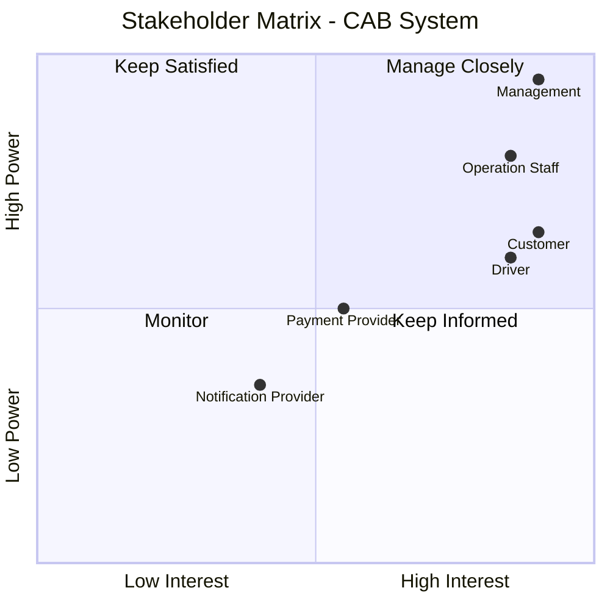

### Phân nhóm Stakeholders

- **Manage Closely:** Ban lãnh đạo, Nhân viên vận hành.
- **Keep Informed:** Khách hàng, Tài xế.
- **Monitor / Keep Satisfied:** Nhà cung cấp thanh toán và Nhà cung cấp thông báo tùy theo mức độ tích hợp và phụ thuộc của hệ thống.

# Bước 3: Xác định Business Goal

Business Goal được xác định dựa trên các vấn đề nghiệp vụ của hệ thống hiện tại và kỳ vọng của Công ty ABC.

### BG01 – Tự động tìm và phân công tài xế
- **Mục tiêu:** Giảm thời gian tìm tài xế và hạn chế việc phân công tài xế thủ công.
- **Kết quả mong muốn:** Hệ thống có thể tự động tìm tài xế phù hợp và gần khách hàng.

### BG02 – Hỗ trợ thanh toán
- **Mục tiêu:** Tạo sự thuận tiện cho khách hàng khi thanh toán và quản lý giao dịch tập trung.
- **Kết quả mong muốn:** Cho phép thanh toán bằng tiền mặt và thanh toán điện tử.

### BG03 – Theo dõi trạng thái chuyến đi
- **Mục tiêu:** Giúp khách hàng dễ dàng theo dõi quá trình thực hiện chuyến đi.
- **Kết quả mong muốn:** Khách hàng biết được trạng thái tìm tài xế, tài xế nhận chuyến, thời gian dự kiến đến và trạng thái chuyến đi.

### BG04 – Nâng cao hiệu quả vận hành
- **Mục tiêu:** Giúp nhân viên vận hành quản lý và theo dõi hoạt động tập trung.
- **Kết quả mong muốn:** Nhân viên có thể theo dõi tài xế, chuyến đi và hỗ trợ xử lý các trường hợp gặp sự cố.

### BG05 – Mở rộng khả năng phục vụ
- **Mục tiêu:** Đáp ứng số lượng khách hàng, tài xế và yêu cầu đặt xe tăng cao.
- **Kết quả mong muốn:** Hệ thống có khả năng mở rộng các thành phần khi nhu cầu sử dụng tăng.

### BG06 – Hỗ trợ quản lý và ra quyết định
- **Mục tiêu:** Giúp ban lãnh đạo theo dõi hiệu quả hoạt động kinh doanh.
- **Kết quả mong muốn:** Cung cấp các báo cáo về số lượng chuyến, doanh thu, tỷ lệ hoàn thành, tỷ lệ hủy và hiệu quả tài xế.

### BG07 – Đảm bảo an toàn thông tin
- **Mục tiêu:** Bảo vệ dữ liệu người dùng và các hoạt động quan trọng của hệ thống.
- **Kết quả mong muốn:** Kiểm soát quyền truy cập, bảo vệ dữ liệu và lưu vết các thao tác quan trọng.

### BG08 – Hỗ trợ phát triển hệ thống trong tương lai
- **Mục tiêu:** Giảm ảnh hưởng khi doanh nghiệp bổ sung hoặc thay đổi chức năng.
- **Kết quả mong muốn:** Có thể bổ sung loại dịch vụ, phương thức thanh toán và kênh thông báo mới mà không phải xây dựng lại toàn bộ hệ thống.

# Bước 4: Xác định phạm vi yêu cầu

## 4.1. In Scope – Phạm vi cần thực hiện

Dưới góc độ MVB, CAB System cần tập trung vào các module cơ bản để hỗ trợ đầy đủ quy trình đặt xe.

| Module | Phạm vi chính |
|---|---|
| **Quản lý khách hàng** | Đăng ký, đăng nhập, cập nhật thông tin cá nhân, xem lịch sử chuyến đi. |
| **Quản lý tài xế** | Quản lý hồ sơ tài xế, trạng thái hoạt động, thông tin phương tiện. |
| **Quản lý đặt xe** | Nhập điểm đón, điểm đến, chọn loại xe và tạo yêu cầu đặt xe. |
| **Tìm và phân công tài xế** | Tự động tìm tài xế phù hợp, xử lý trường hợp tài xế từ chối hoặc không phản hồi. |
| **Quản lý chuyến đi** | Theo dõi và cập nhật trạng thái chuyến đi từ lúc nhận chuyến đến khi hoàn thành. |
| **Tính cước và thanh toán** | Tính số tiền chuyến đi, hỗ trợ thanh toán tiền mặt và thanh toán điện tử. |
| **Thông báo** | Thông báo các trạng thái quan trọng của chuyến đi cho khách hàng và tài xế. |
| **Đánh giá tài xế** | Cho phép khách hàng đánh giá tài xế sau khi chuyến đi hoàn thành. |
| **Quản lý vận hành** | Quản lý khách hàng, tài xế, phương tiện, chuyến đi và hỗ trợ xử lý sự cố cơ bản. |
| **Báo cáo cơ bản** | Thống kê số lượng chuyến, doanh thu, tỷ lệ hoàn thành và tỷ lệ hủy chuyến. |

---

## 4.2. Out of Scope – Ngoài phạm vi MVB

Trong phiên bản MVB, chưa thực hiện các chức năng sau:

- Nhiều loại dịch vụ xe nâng cao ngoài các loại xe cơ bản.
- Chương trình khuyến mãi, voucher và loyalty.
- Ví điện tử riêng của CAB System.
- Nhiều nhà cung cấp thanh toán cùng lúc.
- Nhiều kênh thông báo nâng cao.
- Thuật toán AI/ML để dự đoán nhu cầu hoặc tối ưu phân công tài xế.
- Hệ thống định giá động theo thời gian thực.
- Báo cáo và phân tích nâng cao.
- Hệ thống quản lý khiếu nại, chăm sóc khách hàng chuyên sâu.
- Các chức năng mở rộng chưa cần thiết cho quy trình đặt xe cơ bản.

---

## 4.3. Phạm vi MVB cốt lõi

MVB tập trung vào quy trình chính:

**Khách hàng đặt xe → Hệ thống tìm tài xế → Tài xế nhận chuyến → Thực hiện chuyến → Hoàn thành → Tính cước → Thanh toán → Đánh giá**

# Bước 5: Xác định Business Requirement

Sau khi xác định phạm vi hệ thống và xác nhận lại với khách hàng, các yêu cầu trong phạm vi MVB được chuyển thành **Business Requirement (BR)**.

## 5.1. Danh sách Business Requirement

| Mã BR | Tên Business Requirement | Diễn giải |
|---|---|---|
| **BR01** | Quản lý khách hàng | Hệ thống cho phép khách hàng đăng ký tài khoản, đăng nhập, cập nhật thông tin cá nhân và xem lịch sử chuyến đi. |
| **BR02** | Quản lý tài xế | Hệ thống cho phép tạo tài khoản tài xế, cập nhật hồ sơ, thông tin phương tiện và trạng thái hoạt động. |
| **BR03** | Đặt chuyến | Khách hàng có thể nhập điểm đón, điểm đến, lựa chọn loại xe và gửi yêu cầu đặt chuyến. |
| **BR04** | Tìm và phân công tài xế | Hệ thống tự động tìm tài xế phù hợp dựa trên vị trí, trạng thái sẵn sàng và các tiêu chí vận hành để phân công chuyến. |
| **BR05** | Xử lý yêu cầu nhận chuyến | Tài xế có thể chấp nhận hoặc từ chối chuyến. Nếu tài xế từ chối hoặc không phản hồi, hệ thống tiếp tục tìm tài xế khác mà khách hàng không cần tạo lại yêu cầu. |
| **BR06** | Quản lý chuyến đi | Hệ thống quản lý quá trình thực hiện chuyến và cho phép tài xế cập nhật các trạng thái: đã đến điểm đón, đã đón khách, đang di chuyển và hoàn thành chuyến. |
| **BR07** | Theo dõi chuyến đi | Khách hàng có thể theo dõi trạng thái tìm tài xế, thông tin tài xế nhận chuyến, thời gian dự kiến tài xế đến và trạng thái hiện tại của chuyến. |
| **BR08** | Tính cước | Sau khi chuyến hoàn thành, hệ thống xác định số tiền khách hàng phải trả dựa trên loại dịch vụ và thông tin chuyến đi. |
| **BR09** | Thanh toán | Hệ thống hỗ trợ thanh toán bằng tiền mặt và thanh toán điện tử, đồng thời ghi nhận kết quả thanh toán của chuyến đi. |
| **BR10** | Thông báo | Hệ thống gửi thông báo cho khách hàng và tài xế về các sự kiện quan trọng liên quan đến yêu cầu đặt xe, chuyến đi và thanh toán. |
| **BR11** | Quản lý lịch sử chuyến đi | Hệ thống lưu trữ và cho phép tra cứu lịch sử chuyến đi và các thông tin giao dịch liên quan. |
| **BR12** | Đánh giá tài xế | Khách hàng có thể đánh giá tài xế sau khi chuyến đi hoàn thành. |
| **BR13** | Quản lý vận hành | Nhân viên vận hành có thể quản lý khách hàng, tài xế, phương tiện, theo dõi chuyến đi và hỗ trợ xử lý các chuyến gặp sự cố. |
| **BR14** | Phân quyền quản trị | Hệ thống kiểm soát quyền truy cập đối với các chức năng quản trị để hạn chế nhân viên thực hiện các thao tác nhạy cảm không được phép. |
| **BR15** | Báo cáo hoạt động | Hệ thống cung cấp báo cáo về số lượng chuyến, doanh thu, tỷ lệ hoàn thành, tỷ lệ hủy và hiệu quả hoạt động của tài xế. |

---

## 5.2. Mối quan hệ giữa Business Goal và Business Requirement

| Business Goal | Business Requirement liên quan |
|---|---|
| **BG01 – Tự động tìm và phân công tài xế** | BR03, BR04, BR05 |
| **BG02 – Hỗ trợ thanh toán** | BR08, BR09 |
| **BG03 – Theo dõi trạng thái chuyến đi** | BR06, BR07, BR10 |
| **BG04 – Nâng cao hiệu quả vận hành** | BR02, BR11, BR13, BR14 |
| **BG05 – Mở rộng khả năng phục vụ** | Các BR của hệ thống cần được thiết kế để hỗ trợ khả năng mở rộng |
| **BG06 – Hỗ trợ quản lý và ra quyết định** | BR11, BR15 |
| **BG07 – Đảm bảo an toàn thông tin** | BR01, BR02, BR14 |
| **BG08 – Hỗ trợ phát triển hệ thống trong tương lai** | Các BR cần được thiết kế theo hướng dễ mở rộng và thay đổi |

---

## 5.3. Quy trình nghiệp vụ chính

Các Business Requirement trên hỗ trợ quy trình nghiệp vụ cốt lõi của CAB System:

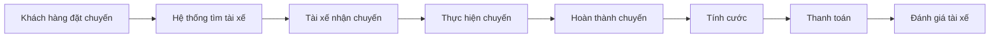

---

## 5.4. Kết luận

Các Business Requirement trên xác định những yêu cầu nghiệp vụ chính mà **CAB System phiên bản MVB** cần đáp ứng.

Các yêu cầu tập trung vào quy trình chính:

**Quản lý khách hàng → Đặt chuyến → Tìm và phân công tài xế → Thực hiện chuyến → Theo dõi chuyến → Tính cước → Thanh toán → Đánh giá**

Ngoài ra, hệ thống hỗ trợ các hoạt động cần thiết như **quản lý tài xế, thông báo, quản lý vận hành, phân quyền và báo cáo**.

Các yêu cầu chi tiết hơn về chức năng, quy tắc nghiệp vụ, yêu cầu phi chức năng và các trường hợp ngoại lệ sẽ được phân tích ở các bước tiếp theo.

# Bước 6: Xây dựng Business Process

Business Process mô tả luồng nghiệp vụ chính của CAB System từ khi khách hàng đặt chuyến cho đến khi chuyến đi hoàn thành.

## 6.1. BP01 – Quy trình đặt chuyến và tìm tài xế

### Mô tả

1. Khách hàng nhập điểm đón.
2. Khách hàng nhập điểm đến.
3. Khách hàng chọn loại xe.
4. Khách hàng gửi yêu cầu đặt chuyến.
5. Hệ thống tiếp nhận và xác nhận yêu cầu.
6. Hệ thống tìm tài xế phù hợp dựa trên vị trí và trạng thái sẵn sàng.
7. Hệ thống gửi yêu cầu chuyến cho tài xế.
8. Tài xế chấp nhận hoặc từ chối chuyến.
9. Nếu tài xế chấp nhận, hệ thống phân công tài xế và thông báo cho khách hàng.
10. Nếu tài xế từ chối hoặc không phản hồi, hệ thống tiếp tục tìm và gửi yêu cầu cho tài xế khác.
11. Nếu không tìm được tài xế phù hợp, hệ thống thông báo cho khách hàng.

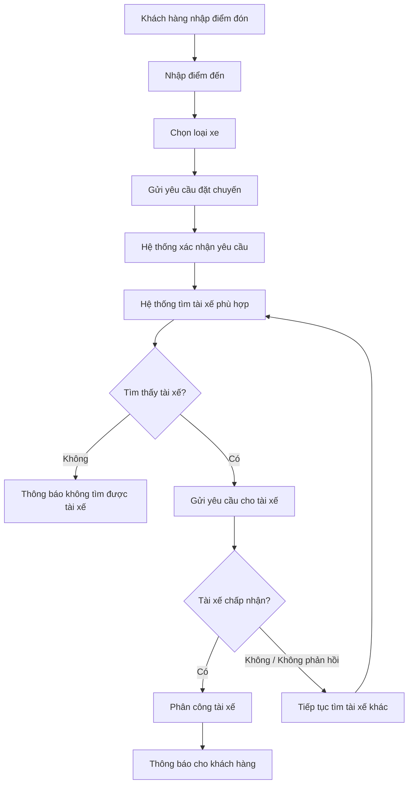

---

## 6.2. BP02 – Quy trình thực hiện chuyến đi

### Mô tả

1. Tài xế chấp nhận chuyến.
2. Hệ thống thông báo thông tin tài xế cho khách hàng.
3. Tài xế di chuyển đến điểm đón.
4. Tài xế cập nhật trạng thái đã đến điểm đón.
5. Hệ thống thông báo cho khách hàng.
6. Tài xế đón khách và cập nhật trạng thái đã đón khách.
7. Tài xế bắt đầu thực hiện chuyến đi.
8. Tài xế cập nhật trạng thái đang di chuyển.
9. Tài xế đến điểm đến.
10. Tài xế cập nhật trạng thái hoàn thành chuyến.
11. Hệ thống ghi nhận chuyến đi đã hoàn thành.

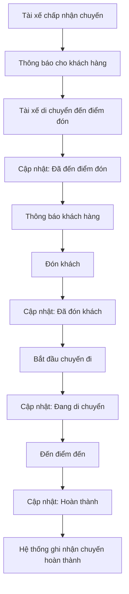

---

## 6.3. BP03 – Quy trình tính cước và thanh toán

### Mô tả

1. Chuyến đi được hoàn thành.
2. Hệ thống tính số tiền khách hàng phải trả.
3. Hệ thống hiển thị số tiền cho khách hàng.
4. Khách hàng lựa chọn phương thức thanh toán.
5. Nếu thanh toán bằng tiền mặt, hệ thống ghi nhận phương thức thanh toán.
6. Nếu thanh toán điện tử, hệ thống gửi yêu cầu đến nhà cung cấp thanh toán.
7. Nhà cung cấp thanh toán xử lý giao dịch.
8. Nếu thanh toán thành công, hệ thống ghi nhận kết quả.
9. Nếu thanh toán thất bại, hệ thống thông báo cho khách hàng và cho phép xử lý lại theo chính sách của doanh nghiệp.

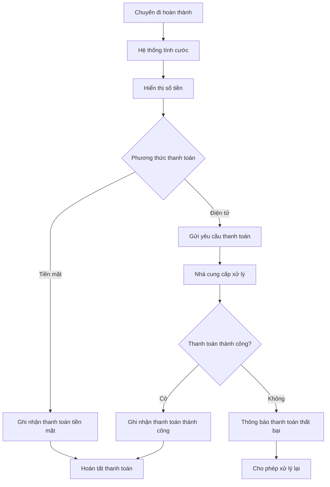

---

## 6.4. BP04 – Quy trình đánh giá sau chuyến đi

### Mô tả

1. Chuyến đi đã hoàn thành.
2. Hệ thống cho phép khách hàng đánh giá tài xế.
3. Khách hàng nhập đánh giá.
4. Khách hàng gửi đánh giá.
5. Hệ thống lưu đánh giá của chuyến đi.

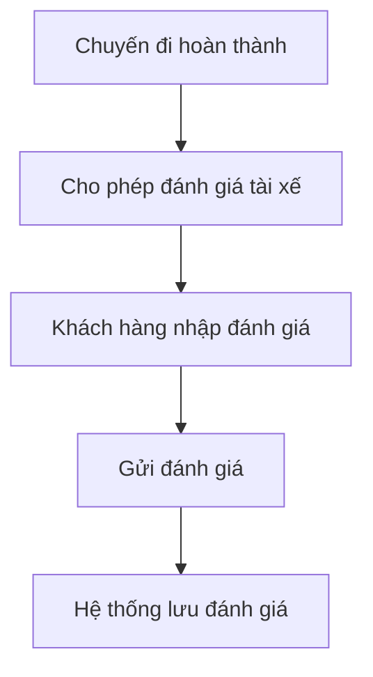

---

## 6.5. BP05 – Quy trình quản lý và theo dõi vận hành

### Mô tả

1. Nhân viên vận hành đăng nhập hệ thống quản trị.
2. Nhân viên xem danh sách các chuyến đi.
3. Nhân viên theo dõi trạng thái chuyến và tài xế.
4. Nếu chuyến hoạt động bình thường, hệ thống tiếp tục ghi nhận trạng thái.
5. Nếu chuyến gặp sự cố, nhân viên kiểm tra thông tin.
6. Nhân viên thực hiện xử lý theo quyền được cấp.
7. Hệ thống lưu lại thao tác quan trọng.

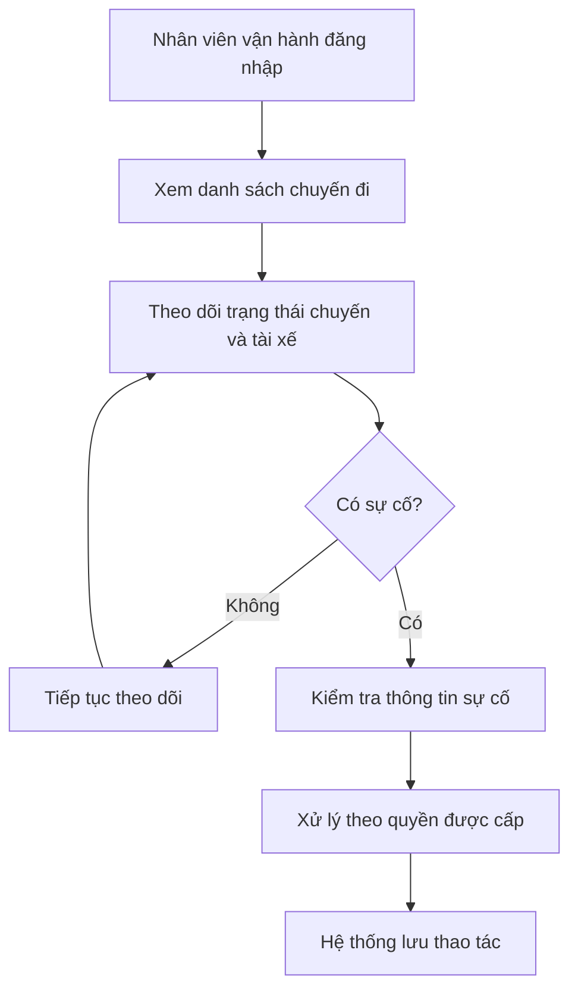

---

## 6.6. Business Process tổng quát

Quy trình nghiệp vụ chính của CAB System:

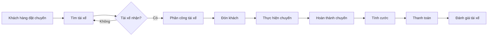

## 6.7. Kết luận

Các Business Process chính của CAB System gồm:

- **BP01:** Đặt chuyến và tìm tài xế.
- **BP02:** Thực hiện chuyến đi.
- **BP03:** Tính cước và thanh toán.
- **BP04:** Đánh giá sau chuyến đi.
- **BP05:** Quản lý và theo dõi vận hành.

Các quy trình trên bao phủ luồng nghiệp vụ cốt lõi của phiên bản MVB từ khi khách hàng tạo yêu cầu đặt xe đến khi chuyến đi được hoàn thành, thanh toán và đánh giá.

# Bước 7: Xác định Functional Requirement

Functional Requirement (FR) mô tả các chức năng cụ thể mà CAB System phải thực hiện để đáp ứng các Business Requirement và Business Process đã xác định.

## 7.1. Quản lý khách hàng

| Mã FR | Tên Functional Requirement | Diễn giải |
|---|---|---|
| FR01 | Đăng ký tài khoản | Hệ thống cho phép khách hàng đăng ký tài khoản. |
| FR02 | Đăng nhập | Hệ thống cho phép khách hàng đăng nhập để sử dụng các chức năng yêu cầu tài khoản. |
| FR03 | Cập nhật thông tin cá nhân | Hệ thống cho phép khách hàng cập nhật thông tin cá nhân. |
| FR04 | Xem lịch sử chuyến đi | Hệ thống cho phép khách hàng xem các chuyến đi đã thực hiện. |

---

## 7.2. Quản lý tài xế

| Mã FR | Tên Functional Requirement | Diễn giải |
|---|---|---|
| FR05 | Tạo tài khoản tài xế | Hệ thống cho phép tài xế đăng ký hoặc nhân viên vận hành tạo tài khoản tài xế. |
| FR06 | Cập nhật hồ sơ tài xế | Hệ thống cho phép tài xế cập nhật thông tin hồ sơ. |
| FR07 | Cập nhật thông tin phương tiện | Hệ thống cho phép cập nhật thông tin phương tiện của tài xế. |
| FR08 | Cập nhật trạng thái hoạt động | Hệ thống cho phép tài xế chuyển sang trạng thái sẵn sàng hoặc không sẵn sàng nhận chuyến. |
| FR09 | Cập nhật vị trí tài xế | Hệ thống ghi nhận vị trí tài xế để hỗ trợ quá trình tìm tài xế phù hợp. |

---

## 7.3. Đặt chuyến

| Mã FR | Tên Functional Requirement | Diễn giải |
|---|---|---|
| FR10 | Nhập điểm đón | Hệ thống cho phép khách hàng nhập điểm đón. |
| FR11 | Nhập điểm đến | Hệ thống cho phép khách hàng nhập điểm đến. |
| FR12 | Chọn loại xe | Hệ thống cho phép khách hàng lựa chọn loại xe phù hợp. |
| FR13 | Gửi yêu cầu đặt chuyến | Hệ thống cho phép khách hàng gửi yêu cầu đặt chuyến sau khi cung cấp đầy đủ thông tin cần thiết. |
| FR14 | Xác nhận yêu cầu đặt chuyến | Hệ thống tiếp nhận yêu cầu và thông báo cho khách hàng rằng yêu cầu đã được tiếp nhận. |

---

## 7.4. Tìm và phân công tài xế

| Mã FR | Tên Functional Requirement | Diễn giải |
|---|---|---|
| FR15 | Xác định vị trí điểm đón | Hệ thống sử dụng vị trí điểm đón của khách hàng làm cơ sở tìm tài xế. |
| FR16 | Tìm tài xế gần điểm đón | Hệ thống tìm các tài xế trong khu vực phù hợp với điểm đón của khách hàng. |
| FR17 | Lọc tài xế sẵn sàng | Hệ thống chỉ lựa chọn các tài xế đang ở trạng thái sẵn sàng nhận chuyến. |
| FR18 | Lọc theo loại xe | Hệ thống lựa chọn tài xế có phương tiện phù hợp với loại xe khách hàng đã chọn. |
| FR19 | Ưu tiên tài xế phù hợp | Hệ thống ưu tiên tài xế phù hợp và gần khách hàng dựa trên các tiêu chí vận hành đã được xác định. |
| FR20 | Gửi yêu cầu chuyến cho tài xế | Hệ thống gửi thông báo yêu cầu nhận chuyến đến tài xế được lựa chọn. |
| FR21 | Chấp nhận chuyến | Hệ thống cho phép tài xế chấp nhận yêu cầu chuyến. |
| FR22 | Từ chối chuyến | Hệ thống cho phép tài xế từ chối yêu cầu chuyến. |
| FR23 | Xử lý tài xế không phản hồi | Khi tài xế không phản hồi trong thời gian quy định, hệ thống tiếp tục tìm tài xế khác. |
| FR24 | Tìm tài xế khác | Khi tài xế từ chối hoặc không phản hồi, hệ thống tự động tìm tài xế khác mà không yêu cầu khách hàng đặt lại chuyến. |
| FR25 | Thông báo không tìm được tài xế | Nếu không tìm được tài xế phù hợp, hệ thống thông báo rõ ràng cho khách hàng. |

---

## 7.5. Thực hiện và theo dõi chuyến đi

| Mã FR | Tên Functional Requirement | Diễn giải |
|---|---|---|
| FR26 | Thông báo tài xế nhận chuyến | Hệ thống thông báo cho khách hàng khi có tài xế chấp nhận chuyến. |
| FR27 | Hiển thị thông tin tài xế | Hệ thống cho phép khách hàng xem thông tin tài xế đã nhận chuyến. |
| FR28 | Hiển thị thời gian dự kiến đến | Hệ thống hiển thị thời gian dự kiến tài xế đến điểm đón. |
| FR29 | Cập nhật trạng thái đã đến | Tài xế có thể cập nhật trạng thái đã đến điểm đón. |
| FR30 | Cập nhật trạng thái đã đón khách | Tài xế có thể cập nhật trạng thái đã đón khách. |
| FR31 | Cập nhật trạng thái đang di chuyển | Tài xế có thể cập nhật trạng thái đang thực hiện chuyến. |
| FR32 | Hoàn thành chuyến | Tài xế có thể cập nhật trạng thái hoàn thành khi chuyến đi kết thúc. |
| FR33 | Theo dõi trạng thái chuyến | Hệ thống cho phép khách hàng theo dõi trạng thái hiện tại của chuyến đi. |

---

## 7.6. Tính cước và thanh toán

| Mã FR | Tên Functional Requirement | Diễn giải |
|---|---|---|
| FR34 | Tính cước chuyến đi | Sau khi chuyến hoàn thành, hệ thống tính số tiền khách hàng phải trả dựa trên loại dịch vụ và thông tin chuyến đi. |
| FR35 | Hiển thị số tiền | Hệ thống hiển thị số tiền khách hàng phải thanh toán. |
| FR36 | Chọn phương thức thanh toán | Hệ thống cho phép khách hàng lựa chọn tiền mặt hoặc thanh toán điện tử. |
| FR37 | Ghi nhận thanh toán tiền mặt | Hệ thống ghi nhận chuyến đi sử dụng phương thức thanh toán bằng tiền mặt. |
| FR38 | Thanh toán điện tử | Hệ thống gửi yêu cầu thanh toán đến nhà cung cấp thanh toán bên ngoài. |
| FR39 | Ghi nhận kết quả thanh toán | Hệ thống ghi nhận kết quả của giao dịch thanh toán. |
| FR40 | Xử lý thanh toán thất bại | Khi thanh toán điện tử thất bại, hệ thống thông báo cho khách hàng và cho phép xử lý lại theo chính sách doanh nghiệp. |

---

## 7.7. Thông báo

| Mã FR | Tên Functional Requirement | Diễn giải |
|---|---|---|
| FR41 | Thông báo tiếp nhận đặt xe | Hệ thống thông báo cho khách hàng khi yêu cầu đặt xe được tiếp nhận. |
| FR42 | Thông báo tài xế nhận chuyến | Hệ thống thông báo cho khách hàng khi có tài xế nhận chuyến. |
| FR43 | Thông báo tài xế đến | Hệ thống thông báo cho khách hàng khi tài xế đến điểm đón. |
| FR44 | Thông báo hoàn thành chuyến | Hệ thống thông báo khi chuyến đi hoàn thành. |
| FR45 | Thông báo kết quả thanh toán | Hệ thống thông báo kết quả thanh toán cho khách hàng. |
| FR46 | Thông báo chuyến mới cho tài xế | Hệ thống thông báo cho tài xế khi có yêu cầu chuyến mới phù hợp. |

---

## 7.8. Đánh giá tài xế

| Mã FR | Tên Functional Requirement | Diễn giải |
|---|---|---|
| FR47 | Gửi đánh giá tài xế | Hệ thống cho phép khách hàng đánh giá tài xế sau khi chuyến đi hoàn thành. |
| FR48 | Lưu đánh giá | Hệ thống lưu đánh giá của khách hàng gắn với chuyến đi và tài xế tương ứng. |

---

## 7.9. Quản lý vận hành

| Mã FR | Tên Functional Requirement | Diễn giải |
|---|---|---|
| FR49 | Quản lý khách hàng | Nhân viên vận hành có thể xem và quản lý thông tin khách hàng. |
| FR50 | Quản lý tài xế | Nhân viên vận hành có thể xem và quản lý thông tin tài xế. |
| FR51 | Quản lý phương tiện | Nhân viên vận hành có thể xem và quản lý thông tin phương tiện. |
| FR52 | Quản lý chuyến đi | Nhân viên vận hành có thể tra cứu và theo dõi các chuyến đi. |
| FR53 | Theo dõi trạng thái tài xế | Nhân viên vận hành có thể kiểm tra trạng thái hoạt động của tài xế. |
| FR54 | Hỗ trợ xử lý chuyến lỗi | Nhân viên vận hành có thể kiểm tra và hỗ trợ xử lý các chuyến gặp sự cố. |
| FR55 | Tra cứu lịch sử giao dịch | Nhân viên vận hành có thể tra cứu lịch sử giao dịch của hệ thống. |
| FR56 | Kiểm soát quyền quản trị | Hệ thống giới hạn các thao tác quản trị nhạy cảm dựa trên quyền của nhân viên. |

---

## 7.10. Báo cáo

| Mã FR | Tên Functional Requirement | Diễn giải |
|---|---|---|
| FR57 | Báo cáo số lượng chuyến | Hệ thống thống kê số lượng chuyến đi. |
| FR58 | Báo cáo doanh thu | Hệ thống thống kê doanh thu từ các chuyến đi. |
| FR59 | Báo cáo tỷ lệ hoàn thành và hủy | Hệ thống thống kê tỷ lệ chuyến hoàn thành và tỷ lệ chuyến bị hủy. |
| FR60 | Báo cáo hiệu quả tài xế | Hệ thống cung cấp thông tin phục vụ đánh giá hiệu quả hoạt động của tài xế. |

---

## 7.11. Các Functional Requirement cần xác nhận thêm

Một số yêu cầu chưa đủ thông tin để xác định chi tiết và cần BA xác nhận lại với khách hàng:

- Bán kính tìm kiếm tài xế là bao nhiêu.
- Thời gian tài xế được phép phản hồi yêu cầu chuyến.
- Các tiêu chí và thứ tự ưu tiên khi lựa chọn tài xế.
- Có sử dụng đánh giá (rating) của tài xế làm tiêu chí tìm tài xế hay không.
- Công thức tính cước cụ thể.
- Quy tắc xử lý khi khách hàng hoặc tài xế mất kết nối.
- Chính sách hủy chuyến.
- Quy tắc xử lý và thử lại khi thanh toán thất bại.

# Bước 8: Xác định Business Rules và Exception

Business Rules xác định các quy tắc nghiệp vụ mà CAB System phải tuân theo.  
Exception xác định các tình huống ngoại lệ có thể xảy ra và cách hệ thống xử lý.

## 8.1. Business Rules

| Mã | Business Rule | Diễn giải |
|---|---|---|
| BRU01 | Tài xế phải ở trạng thái sẵn sàng | Chỉ tài xế đang ở trạng thái sẵn sàng nhận chuyến mới được đưa vào danh sách tìm kiếm và phân công. |
| BRU02 | Tài xế phải có loại xe phù hợp | Tài xế được đề xuất phải có phương tiện phù hợp với loại xe khách hàng lựa chọn. |
| BRU03 | Ưu tiên tài xế phù hợp và gần khách hàng | Hệ thống ưu tiên các tài xế phù hợp và có vị trí gần điểm đón của khách hàng. |
| BRU04 | Tài xế phải phản hồi trong thời gian quy định | Tài xế chỉ được chấp nhận chuyến trong khoảng thời gian phản hồi do doanh nghiệp quy định. |
| BRU05 | Tự động tìm tài xế khác | Nếu tài xế từ chối hoặc không phản hồi đúng thời hạn, hệ thống phải tiếp tục tìm tài xế khác mà khách hàng không cần tạo lại yêu cầu. |
| BRU06 | Một chuyến chỉ được phân công cho một tài xế | Khi một tài xế đã chấp nhận và được xác nhận nhận chuyến, hệ thống không được tiếp tục phân công chuyến đó cho tài xế khác. |
| BRU07 | Chuyến đi phải theo đúng thứ tự trạng thái | Trạng thái chuyến được cập nhật theo quá trình: tài xế nhận chuyến → đến điểm đón → đón khách → đang di chuyển → hoàn thành. |
| BRU08 | Chỉ tính cước khi chuyến hoàn thành | Hệ thống thực hiện tính số tiền phải trả sau khi chuyến đi được xác nhận hoàn thành. |
| BRU09 | Hỗ trợ hai hình thức thanh toán | Khách hàng có thể thanh toán bằng tiền mặt hoặc thanh toán điện tử. |
| BRU10 | Không lưu thông tin thanh toán nhạy cảm | Thông tin nhạy cảm của thẻ hoặc tài khoản thanh toán không được lưu trực tiếp trong CAB System. |
| BRU11 | Chỉ đánh giá sau khi hoàn thành chuyến | Khách hàng chỉ được đánh giá tài xế đối với chuyến đi đã hoàn thành. |
| BRU12 | Người dùng phải được xác thực | Khách hàng và tài xế phải được xác thực trước khi sử dụng các chức năng yêu cầu tài khoản. |
| BRU13 | Chức năng quản trị phải được phân quyền | Nhân viên chỉ được thực hiện các chức năng quản trị phù hợp với quyền được cấp. |
| BRU14 | Các thao tác quan trọng phải được lưu vết | Hệ thống phải ghi nhận các thao tác quan trọng để phục vụ kiểm tra và xử lý sự cố. |

---

## 8.2. Exception và cách xử lý

| Mã | Exception | Cách xử lý |
|---|---|---|
| EX01 | Không tìm thấy tài xế phù hợp | Hệ thống tiếp tục tìm kiếm theo quy tắc đã xác định. Nếu vẫn không tìm được tài xế, hệ thống kết thúc quá trình tìm kiếm và thông báo rõ ràng cho khách hàng. |
| EX02 | Tài xế từ chối chuyến | Hệ thống loại tài xế đó khỏi lần phân công hiện tại và tiếp tục tìm tài xế phù hợp khác. |
| EX03 | Tài xế không phản hồi đúng thời hạn | Yêu cầu gửi cho tài xế hết hiệu lực và hệ thống tự động chuyển sang tìm tài xế khác. |
| EX04 | Tài xế phản hồi sau khi yêu cầu đã hết hạn | Hệ thống không cho phép tài xế nhận yêu cầu đã hết hiệu lực và chuyến tiếp tục được xử lý với tài xế khác. |
| EX05 | Không còn tài xế để tiếp tục tìm | Hệ thống dừng quá trình tìm tài xế và thông báo cho khách hàng rằng hiện không tìm được tài xế phù hợp. |
| EX06 | Thanh toán điện tử thất bại | Hệ thống thông báo kết quả thất bại và cho phép xử lý lại theo chính sách của doanh nghiệp. |
| EX07 | Nhà cung cấp thanh toán gặp lỗi | Hệ thống ghi nhận giao dịch chưa thành công, thông báo cho khách hàng và không để lỗi thanh toán làm dừng toàn bộ hệ thống đặt xe. |
| EX08 | Gửi thông báo thất bại | Hệ thống ghi nhận lỗi thông báo nhưng không làm gián đoạn quá trình xử lý chuyến đi. |
| EX09 | Khách hàng hoặc tài xế mất kết nối | Hệ thống xử lý theo chính sách mất kết nối của doanh nghiệp và đồng bộ lại trạng thái khi kết nối được khôi phục. |
| EX10 | Khách hàng hoặc tài xế hủy chuyến | Hệ thống xử lý việc hủy và cập nhật trạng thái chuyến theo chính sách hủy chuyến của doanh nghiệp. |
| EX11 | Người dùng chưa xác thực | Hệ thống từ chối chức năng yêu cầu tài khoản và yêu cầu người dùng xác thực. |
| EX12 | Nhân viên không có quyền thực hiện thao tác | Hệ thống từ chối thao tác quản trị và không thực hiện thay đổi dữ liệu. |

---

## 8.3. Luồng ngoại lệ quan trọng – Tìm tài xế

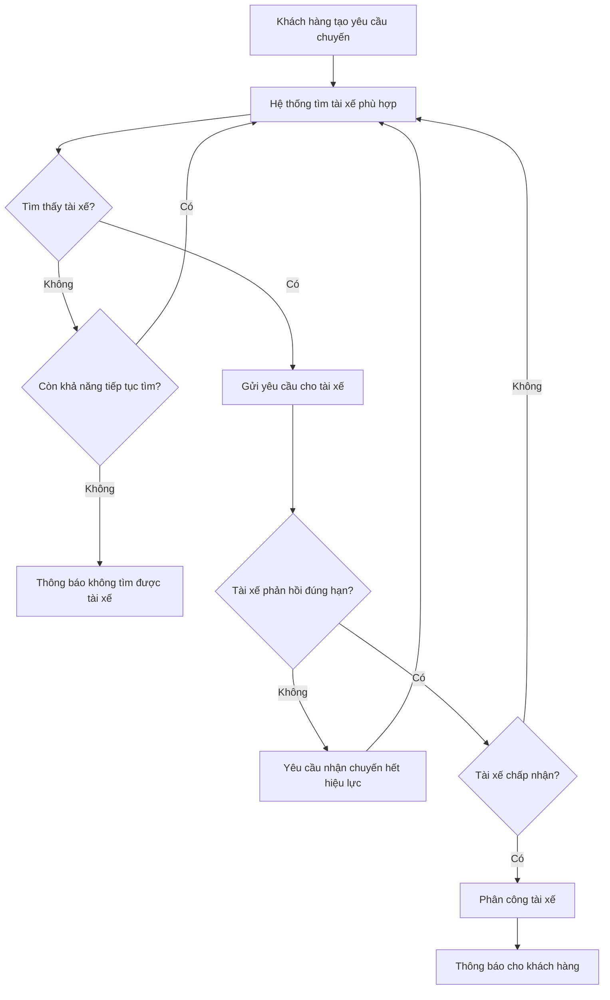

---

## 8.4. Các Business Rules cần xác nhận với khách hàng

Một số Business Rules chưa thể xác định giá trị cụ thể vì khách hàng chưa cung cấp đầy đủ thông tin:

| Mã | Nội dung cần xác nhận |
|---|---|
| Q01 | Bán kính tìm kiếm tài xế ban đầu là bao nhiêu? |
| Q02 | Hệ thống có mở rộng bán kính khi không tìm được tài xế hay không? |
| Q03 | Tài xế có bao nhiêu thời gian để chấp nhận hoặc từ chối chuyến? |
| Q04 | Hệ thống tìm tài xế trong tổng thời gian tối đa bao lâu trước khi thông báo thất bại? |
| Q05 | Tiêu chí và thứ tự ưu tiên tài xế cụ thể là gì? |
| Q06 | Rating của tài xế có được sử dụng làm tiêu chí ưu tiên hay không? |
| Q07 | Công thức tính cước cụ thể như thế nào? |
| Q08 | Khách hàng và tài xế được phép hủy chuyến trong trường hợp nào? |
| Q09 | Có áp dụng phí hoặc hình thức xử lý khi hủy chuyến hay không? |
| Q10 | Thanh toán thất bại được phép thử lại bao nhiêu lần? |
| Q11 | Xử lý chuyến đang thực hiện như thế nào khi khách hàng hoặc tài xế mất kết nối? |

---

## 8.5. Kết luận

Business Rules và Exception giúp xác định rõ cách CAB System phải xử lý trong cả trường hợp bình thường và trường hợp xảy ra ngoại lệ.

Các quy tắc và ngoại lệ quan trọng nhất của phiên bản MVB tập trung vào:

- Điều kiện lựa chọn và phân công tài xế.
- Thời hạn phản hồi yêu cầu chuyến.
- Xử lý tài xế từ chối hoặc không phản hồi.
- Xử lý khi không tìm được tài xế.
- Thứ tự trạng thái chuyến đi.
- Tính cước và thanh toán.
- Xử lý thanh toán thất bại.
- Xử lý lỗi thông báo.
- Xác thực và phân quyền.
- Xử lý hủy chuyến và mất kết nối.

Các nội dung chưa được khách hàng xác định cụ thể phải được BA xác nhận trước khi chuyển thành yêu cầu chi tiết và Acceptance Criteria.

# Bước 9: Data Modelling

Data Modelling giúp xác định các thực thể dữ liệu chính, thuộc tính quan trọng và mối quan hệ giữa các thực thể trong CAB System.

## 9.1. Xác định các thực thể chính

| Thực thể | Mô tả |
|---|---|
| **Customer** | Lưu thông tin khách hàng sử dụng hệ thống đặt xe. |
| **Driver** | Lưu thông tin tài xế tham gia nhận và thực hiện chuyến. |
| **Vehicle** | Lưu thông tin phương tiện của tài xế. |
| **Ride** | Lưu thông tin yêu cầu đặt chuyến và quá trình thực hiện chuyến đi. |
| **RideAssignment** | Lưu thông tin việc hệ thống gửi yêu cầu chuyến cho tài xế và kết quả phản hồi. |
| **Payment** | Lưu thông tin thanh toán của chuyến đi. |
| **Rating** | Lưu đánh giá của khách hàng dành cho tài xế sau chuyến đi. |
| **Notification** | Lưu các thông báo được gửi đến khách hàng hoặc tài xế. |
| **OperationStaff** | Lưu thông tin nhân viên vận hành hệ thống. |

---

## 9.2. Thuộc tính chính của các thực thể

### Customer

- customer_id
- full_name
- phone
- email
- password
- status

### Driver

- driver_id
- full_name
- phone
- email
- password
- activity_status
- current_location

### Vehicle

- vehicle_id
- driver_id
- vehicle_type
- license_plate
- model
- status

### Ride

- ride_id
- customer_id
- driver_id
- pickup_location
- destination
- vehicle_type
- ride_status
- created_at
- completed_at
- fare_amount

### RideAssignment

- assignment_id
- ride_id
- driver_id
- sent_at
- response_at
- response_status

### Payment

- payment_id
- ride_id
- payment_method
- amount
- payment_status
- transaction_time

### Rating

- rating_id
- ride_id
- customer_id
- driver_id
- score
- comment
- created_at

### Notification

- notification_id
- receiver_id
- receiver_type
- ride_id
- message
- notification_status
- created_at

### OperationStaff

- staff_id
- full_name
- username
- password
- role
- status

---

## 9.3. Mối quan hệ giữa các thực thể

- Một **Customer** có thể tạo nhiều **Ride**.
- Một **Driver** có thể thực hiện nhiều **Ride**.
- Một **Driver** có thể có một hoặc nhiều **Vehicle**.
- Một **Ride** có thể được gửi đến nhiều **Driver** trong quá trình tìm tài xế, được lưu thông qua **RideAssignment**.
- Một **Ride** có thể có một **Payment**.
- Một **Ride** có thể có một **Rating** sau khi hoàn thành.
- Một **Ride** có thể phát sinh nhiều **Notification**.
- **OperationStaff** quản lý và theo dõi các dữ liệu liên quan đến khách hàng, tài xế, phương tiện và chuyến đi.

---

## 9.4. ERD của CAB System

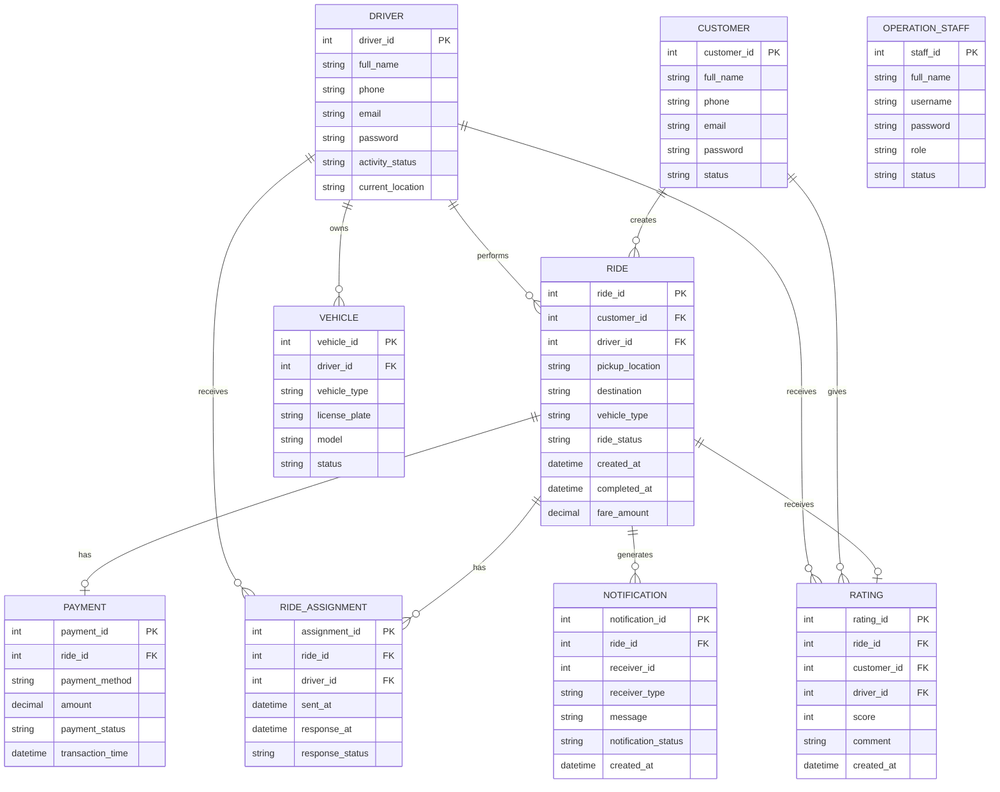

---

## 9.5. Giải thích một số thực thể quan trọng

### Ride

`Ride` là thực thể trung tâm của hệ thống, lưu toàn bộ thông tin của một chuyến đi từ khi khách hàng tạo yêu cầu cho đến khi chuyến hoàn thành.

### RideAssignment

`RideAssignment` rất quan trọng vì một chuyến có thể được hệ thống gửi đến nhiều tài xế khác nhau.

Ví dụ:

- Tài xế A nhận yêu cầu nhưng từ chối.
- Hệ thống chuyển sang tài xế B.
- Tài xế B không phản hồi.
- Hệ thống tiếp tục gửi cho tài xế C.
- Tài xế C chấp nhận chuyến.

Các lần gửi và phản hồi này được lưu trong `RideAssignment`.

### Payment

`Payment` dùng để lưu kết quả thanh toán của chuyến đi, bao gồm:

- Tiền mặt.
- Thanh toán điện tử.
- Thành công.
- Thất bại.

Hệ thống không lưu trực tiếp thông tin nhạy cảm của thẻ hoặc tài khoản thanh toán.

### Rating

`Rating` chỉ được tạo sau khi chuyến đi hoàn thành và dùng để lưu đánh giá của khách hàng dành cho tài xế.

---

## 9.6. Phạm vi Data Model của MVB

Data Model của phiên bản MVB tập trung vào các dữ liệu cần thiết cho quy trình:

**Customer → Ride → RideAssignment → Driver → Vehicle → Payment → Rating**

Ngoài ra có:

- Notification để hỗ trợ gửi thông báo.
- OperationStaff để phục vụ quản lý và vận hành hệ thống.

Các thực thể nâng cao như Promotion, Voucher, Loyalty, Wallet hoặc Dynamic Pricing chưa cần đưa vào Data Model của phiên bản MVB.

# Bước 10: Xác định Non-Functional Requirement

Non-Functional Requirement (NFR) mô tả các yêu cầu về chất lượng và các ràng buộc mà CAB System cần đáp ứng.

Trong phiên bản MVB, NFR tập trung vào những yêu cầu cần thiết và có căn cứ từ yêu cầu khách hàng, không đặt ra các tiêu chuẩn kỹ thuật quá cao hoặc chưa được xác nhận.

## 10.1. Danh sách Non-Functional Requirement

| Mã NFR | Nhóm | Yêu cầu |
|---|---|---|
| **NFR01** | Performance | Hệ thống phải duy trì khả năng xử lý các chức năng chính như đặt chuyến, tìm tài xế và cập nhật trạng thái khi nhu cầu sử dụng tăng cao. |
| **NFR02** | Scalability | Hệ thống phải có khả năng mở rộng khi số lượng khách hàng, tài xế và yêu cầu đặt chuyến tăng. |
| **NFR03** | Availability | Lỗi tại chức năng thanh toán hoặc thông báo không được làm toàn bộ chức năng đặt xe ngừng hoạt động. |
| **NFR04** | Reliability | Các trạng thái quan trọng của chuyến đi và giao dịch phải được ghi nhận nhất quán, hạn chế mất hoặc sai lệch dữ liệu khi xảy ra lỗi. |
| **NFR05** | Security | Khách hàng và tài xế phải được xác thực trước khi sử dụng các chức năng yêu cầu tài khoản. |
| **NFR06** | Authorization | Các chức năng quản trị phải được kiểm soát quyền truy cập; nhân viên không được thực hiện thao tác ngoài quyền được cấp. |
| **NFR07** | Data Protection | Thông tin cá nhân, phương tiện, vị trí và dữ liệu giao dịch phải được bảo vệ khỏi truy cập trái phép. |
| **NFR08** | Payment Security | CAB System không được lưu trực tiếp thông tin nhạy cảm của thẻ hoặc tài khoản thanh toán điện tử. |
| **NFR09** | Auditability | Các thao tác quan trọng của hệ thống và quản trị phải được lưu vết để phục vụ kiểm tra và xử lý sự cố. |
| **NFR10** | Maintainability | Các chức năng mới phải có thể được triển khai với mức ảnh hưởng hạn chế đến các chức năng đang hoạt động. |
| **NFR11** | Extensibility | Hệ thống phải hỗ trợ khả năng bổ sung loại dịch vụ, phương thức thanh toán và kênh thông báo mới trong tương lai. |
| **NFR12** | Usability | Các chức năng chính như đặt xe, nhận chuyến, theo dõi chuyến và thanh toán phải có luồng sử dụng rõ ràng, dễ hiểu đối với người dùng. |

---

## 10.2. Mức độ ưu tiên NFR cho MVB

| Mức độ | NFR |
|---|---|
| **Must Have** | Security, Authorization, Data Protection, Payment Security, Reliability |
| **Should Have** | Performance, Availability, Auditability |
| **Could Have / Chuẩn bị cho tương lai** | Scalability, Maintainability, Extensibility, Usability nâng cao |

---

## 10.3. Các NFR cần xác nhận thêm với khách hàng

Một số NFR đã được khách hàng đề cập nhưng chưa có tiêu chí đo lường cụ thể:

- Số lượng người dùng đồng thời hệ thống cần hỗ trợ.
- Số lượng yêu cầu đặt chuyến hệ thống cần xử lý trong thời điểm cao điểm.
- Thời gian phản hồi chấp nhận được đối với các chức năng chính.
- Mức độ sẵn sàng (Availability) mong muốn của hệ thống.
- Thời gian hệ thống có thể chấp nhận gián đoạn khi xảy ra sự cố.
- Thời gian lưu trữ dữ liệu chuyến đi, vị trí, giao dịch và Audit Log.
- Yêu cầu cụ thể về sao lưu và phục hồi dữ liệu.

Các giá trị này cần được BA xác nhận với khách hàng trước khi chuyển thành tiêu chí đo lường cụ thể.

---

## 10.4. Những ràng buộc chưa nên tự đặt cho MVB

Ở giai đoạn MVB, không tự đặt các yêu cầu kỹ thuật khi khách hàng chưa xác nhận, ví dụ:

- Thời gian phản hồi phải dưới `1 ms`.
- Hệ thống phải hỗ trợ hàng triệu request mỗi giây.
- Availability phải đạt `99.999%`.
- Bắt buộc sử dụng kiến trúc Microservices.
- Bắt buộc sử dụng một ngôn ngữ hoặc framework cụ thể.
- Bắt buộc triển khai trên một Cloud Provider cụ thể.
- Bắt buộc sử dụng một công nghệ Database cụ thể.

Đây là các quyết định hoặc tiêu chí kỹ thuật cần được xác định dựa trên nhu cầu thực tế, kiến trúc hệ thống và sự thống nhất với các bên liên quan.

---

## 10.5. Kết luận

Các NFR quan trọng của CAB System MVB tập trung vào:

**Performance → Reliability → Availability → Security → Data Protection → Auditability → Scalability → Maintainability → Extensibility**

Ở giai đoạn MVB, mục tiêu là xây dựng một hệ thống **đủ ổn định, an toàn và có khả năng phát triển**, thay vì đặt ra các tiêu chuẩn kỹ thuật quá cao chưa có căn cứ từ yêu cầu khách hàng.

# Bước 11: Xác định và xây dựng Use Case

Use Case mô tả các chức năng mà Actor thực hiện hoặc tương tác với CAB System.

## 11.1. Xác định Actor

| Actor | Vai trò |
|---|---|
| **Customer** | Đăng ký, đặt xe, theo dõi chuyến, thanh toán, xem lịch sử và đánh giá tài xế. |
| **Driver** | Quản lý thông tin, bật trạng thái sẵn sàng, nhận chuyến và thực hiện chuyến đi. |
| **Operation Staff** | Quản lý khách hàng, tài xế, phương tiện, chuyến đi và giao dịch. |
| **Management** | Theo dõi báo cáo hoạt động của hệ thống. |
| **Payment Provider** | Xử lý thanh toán điện tử. |
| **Notification Provider** | Hỗ trợ gửi thông báo cho khách hàng và tài xế. |

---

## 11.2. Danh sách Use Case

### Customer

| Mã UC | Tên Use Case |
|---|---|
| **UC01** | Đăng ký tài khoản |
| **UC02** | Đăng nhập |
| **UC03** | Cập nhật thông tin cá nhân |
| **UC04** | Đặt chuyến |
| **UC05** | Tìm và phân công tài xế |
| **UC06** | Theo dõi chuyến đi |
| **UC07** | Xem lịch sử chuyến đi |
| **UC08** | Thanh toán |
| **UC09** | Đánh giá tài xế |

### Driver

| Mã UC | Tên Use Case |
|---|---|
| **UC10** | Cập nhật hồ sơ và phương tiện |
| **UC11** | Cập nhật trạng thái hoạt động |
| **UC12** | Phản hồi yêu cầu chuyến |
| **UC13** | Cập nhật trạng thái chuyến đi |

### Operation Staff

| Mã UC | Tên Use Case |
|---|---|
| **UC14** | Quản lý khách hàng |
| **UC15** | Quản lý tài xế |
| **UC16** | Quản lý phương tiện |
| **UC17** | Theo dõi và xử lý chuyến đi |
| **UC18** | Tra cứu giao dịch |
| **UC19** | Phân quyền quản trị |

### Management

| Mã UC | Tên Use Case |
|---|---|
| **UC20** | Xem báo cáo hoạt động |

### Use Case hỗ trợ

| Mã UC | Tên Use Case |
|---|---|
| **UC21** | Gửi thông báo |

---

# 11.3. Use Case Diagram tổng quát

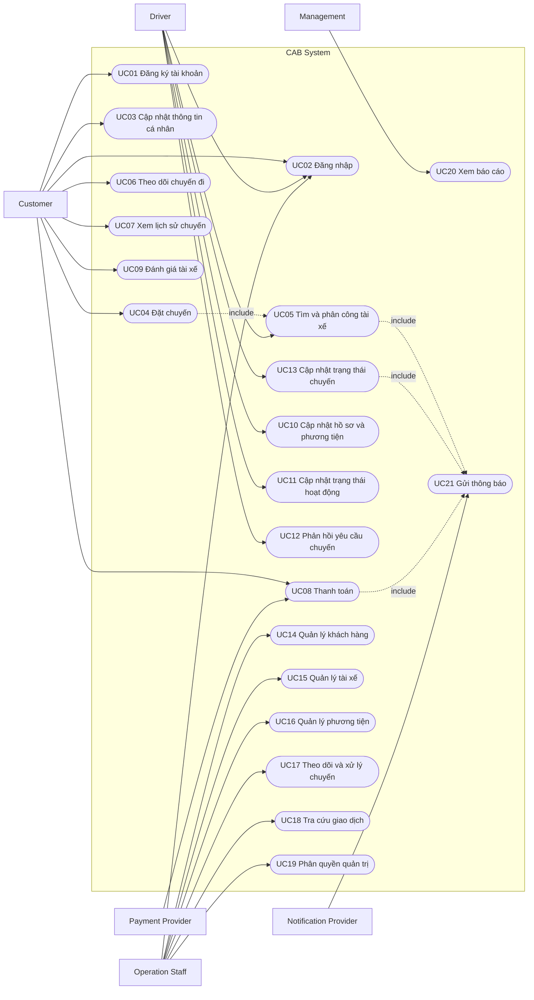

---

# Bước 12: Đặc tả Use Case

## UC01 – Đăng ký tài khoản

| Thuộc tính | Nội dung |
|---|---|
| **Tên Use Case** | Đăng ký tài khoản |
| **Actor chính** | Customer |
| **Mục tiêu** | Tạo tài khoản khách hàng để sử dụng CAB System. |
| **Pre-Condition** | Khách hàng chưa có tài khoản tương ứng. |
| **Post-Condition** | Tài khoản khách hàng được tạo và lưu trong hệ thống. |
| **Basic Flow** | 1. Khách hàng chọn đăng ký. 2. Hệ thống hiển thị thông tin cần nhập. 3. Khách hàng nhập thông tin. 4. Khách hàng gửi yêu cầu đăng ký. 5. Hệ thống kiểm tra thông tin. 6. Hệ thống tạo tài khoản. 7. Hệ thống thông báo đăng ký thành công. |
| **Alternate Flow** | Thông tin không hợp lệ → hệ thống thông báo và yêu cầu khách hàng chỉnh sửa. |
| **Exception** | Thông tin tài khoản đã tồn tại → hệ thống từ chối tạo tài khoản mới. |

---

## UC02 – Đăng nhập

| Thuộc tính | Nội dung |
|---|---|
| **Tên Use Case** | Đăng nhập |
| **Actor chính** | Customer, Driver, Operation Staff |
| **Mục tiêu** | Xác thực người dùng trước khi sử dụng các chức năng yêu cầu tài khoản. |
| **Pre-Condition** | Người dùng đã có tài khoản hợp lệ. |
| **Post-Condition** | Người dùng được xác thực và truy cập chức năng phù hợp với quyền của mình. |
| **Basic Flow** | 1. Người dùng nhập thông tin đăng nhập. 2. Hệ thống kiểm tra thông tin. 3. Hệ thống xác thực người dùng. 4. Hệ thống cho phép truy cập. |
| **Alternate Flow** | Thông tin đăng nhập không chính xác → hệ thống thông báo và cho phép nhập lại. |
| **Exception** | Tài khoản không hợp lệ hoặc không được phép sử dụng → hệ thống từ chối đăng nhập. |

---

## UC03 – Cập nhật thông tin cá nhân

| Thuộc tính | Nội dung |
|---|---|
| **Tên Use Case** | Cập nhật thông tin cá nhân |
| **Actor chính** | Customer |
| **Mục tiêu** | Cập nhật thông tin cá nhân của khách hàng. |
| **Pre-Condition** | Khách hàng đã đăng nhập. |
| **Post-Condition** | Thông tin mới được lưu vào hệ thống. |
| **Basic Flow** | 1. Khách hàng mở hồ sơ. 2. Hệ thống hiển thị thông tin hiện tại. 3. Khách hàng chỉnh sửa. 4. Khách hàng lưu thay đổi. 5. Hệ thống kiểm tra và cập nhật dữ liệu. |
| **Alternate Flow** | Thông tin không hợp lệ → hệ thống yêu cầu chỉnh sửa. |
| **Exception** | Không thể lưu dữ liệu → hệ thống thông báo cập nhật thất bại. |

---

## UC04 – Đặt chuyến

| Thuộc tính | Nội dung |
|---|---|
| **Tên Use Case** | Đặt chuyến |
| **Actor chính** | Customer |
| **Mục tiêu** | Tạo yêu cầu chuyến đi mới. |
| **Pre-Condition** | Khách hàng đã đăng nhập. |
| **Post-Condition** | Yêu cầu chuyến được tạo và chuyển sang quá trình tìm tài xế. |
| **Basic Flow** | 1. Khách hàng chọn đặt chuyến. 2. Khách hàng nhập điểm đón. 3. Khách hàng nhập điểm đến. 4. Khách hàng chọn loại xe. 5. Khách hàng gửi yêu cầu. 6. Hệ thống kiểm tra thông tin. 7. Hệ thống tạo chuyến. 8. Hệ thống xác nhận đã tiếp nhận yêu cầu. 9. Hệ thống thực hiện UC05 – Tìm và phân công tài xế. |
| **Alternate Flow** | Thông tin chuyến chưa đầy đủ hoặc không hợp lệ → hệ thống yêu cầu khách hàng chỉnh sửa. |
| **Exception** | Không thể tạo chuyến → hệ thống thông báo cho khách hàng. |

---

## UC05 – Tìm và phân công tài xế

| Thuộc tính | Nội dung |
|---|---|
| **Tên Use Case** | Tìm và phân công tài xế |
| **Actor liên quan** | Customer, Driver |
| **Mục tiêu** | Tự động tìm và phân công tài xế phù hợp cho chuyến đi. |
| **Pre-Condition** | Yêu cầu chuyến đã được tạo. |
| **Post-Condition** | Tài xế được phân công hoặc khách hàng được thông báo không tìm được tài xế. |
| **Basic Flow** | 1. Hệ thống xác định điểm đón. 2. Hệ thống tìm tài xế trong khu vực phù hợp. 3. Hệ thống lọc tài xế đang sẵn sàng. 4. Hệ thống lọc theo loại phương tiện. 5. Hệ thống ưu tiên tài xế phù hợp và gần khách hàng. 6. Hệ thống gửi yêu cầu chuyến cho tài xế. 7. Tài xế chấp nhận. 8. Hệ thống phân công tài xế cho chuyến. 9. Hệ thống thông báo cho khách hàng. |
| **Alternate Flow** | Tài xế từ chối → hệ thống tiếp tục tìm tài xế khác. |
| **Exception** | Tài xế không phản hồi đúng hạn → yêu cầu hết hiệu lực và chuyển sang tài xế khác. Không tìm được tài xế → hệ thống thông báo cho khách hàng. |

---

## UC06 – Theo dõi chuyến đi

| Thuộc tính | Nội dung |
|---|---|
| **Tên Use Case** | Theo dõi chuyến đi |
| **Actor chính** | Customer |
| **Mục tiêu** | Theo dõi thông tin và trạng thái hiện tại của chuyến. |
| **Pre-Condition** | Khách hàng có chuyến đang được xử lý hoặc đang thực hiện. |
| **Post-Condition** | Khách hàng xem được trạng thái mới nhất của chuyến. |
| **Basic Flow** | 1. Khách hàng mở chuyến hiện tại. 2. Hệ thống hiển thị tài xế nhận chuyến. 3. Hệ thống hiển thị thời gian dự kiến đến. 4. Hệ thống hiển thị trạng thái hiện tại của chuyến. |
| **Alternate Flow** | Trạng thái chuyến thay đổi → hệ thống cập nhật thông tin hiển thị. |
| **Exception** | Chưa có tài xế → hệ thống hiển thị trạng thái đang tìm tài xế. |

---

## UC07 – Xem lịch sử chuyến đi

| Thuộc tính | Nội dung |
|---|---|
| **Tên Use Case** | Xem lịch sử chuyến đi |
| **Actor chính** | Customer |
| **Pre-Condition** | Khách hàng đã đăng nhập. |
| **Post-Condition** | Danh sách lịch sử chuyến được hiển thị. |
| **Basic Flow** | 1. Khách hàng chọn lịch sử chuyến. 2. Hệ thống tìm các chuyến của khách hàng. 3. Hệ thống hiển thị danh sách. 4. Khách hàng chọn chuyến để xem chi tiết. |
| **Alternate Flow** | Không có chuyến → hệ thống hiển thị danh sách trống. |
| **Exception** | Không lấy được dữ liệu → hệ thống thông báo lỗi. |

---

## UC08 – Thanh toán

| Thuộc tính | Nội dung |
|---|---|
| **Tên Use Case** | Thanh toán |
| **Actor chính** | Customer |
| **Actor phụ** | Payment Provider |
| **Pre-Condition** | Chuyến đi đã hoàn thành và số tiền phải trả đã được xác định. |
| **Post-Condition** | Kết quả thanh toán được ghi nhận. |
| **Basic Flow** | 1. Hệ thống hiển thị số tiền. 2. Khách hàng chọn phương thức thanh toán. 3. Nếu thanh toán điện tử, hệ thống gửi yêu cầu đến Payment Provider. 4. Payment Provider xử lý giao dịch. 5. Hệ thống nhận kết quả. 6. Hệ thống ghi nhận thanh toán. 7. Hệ thống thông báo kết quả cho khách hàng. |
| **Alternate Flow** | Khách hàng chọn tiền mặt → hệ thống ghi nhận phương thức thanh toán tiền mặt. |
| **Exception** | Thanh toán điện tử thất bại → hệ thống thông báo và cho phép xử lý lại theo chính sách doanh nghiệp. |

---

## UC09 – Đánh giá tài xế

| Thuộc tính | Nội dung |
|---|---|
| **Tên Use Case** | Đánh giá tài xế |
| **Actor chính** | Customer |
| **Pre-Condition** | Chuyến đi đã hoàn thành. |
| **Post-Condition** | Đánh giá được lưu cho tài xế và chuyến tương ứng. |
| **Basic Flow** | 1. Khách hàng chọn đánh giá. 2. Hệ thống hiển thị chức năng đánh giá. 3. Khách hàng nhập đánh giá. 4. Khách hàng gửi đánh giá. 5. Hệ thống lưu đánh giá. |
| **Alternate Flow** | Khách hàng không muốn đánh giá → kết thúc Use Case. |
| **Exception** | Chuyến chưa hoàn thành → hệ thống không cho phép đánh giá. |

---

## UC10 – Cập nhật hồ sơ và phương tiện

| Thuộc tính | Nội dung |
|---|---|
| **Tên Use Case** | Cập nhật hồ sơ và phương tiện |
| **Actor chính** | Driver |
| **Pre-Condition** | Tài xế đã đăng nhập. |
| **Post-Condition** | Hồ sơ hoặc thông tin phương tiện được cập nhật. |
| **Basic Flow** | 1. Tài xế mở hồ sơ. 2. Hệ thống hiển thị thông tin hiện tại. 3. Tài xế chỉnh sửa thông tin. 4. Tài xế lưu thay đổi. 5. Hệ thống kiểm tra và lưu dữ liệu. |
| **Alternate Flow** | Thông tin không hợp lệ → hệ thống yêu cầu chỉnh sửa. |
| **Exception** | Không lưu được dữ liệu → hệ thống thông báo lỗi. |

---

## UC11 – Cập nhật trạng thái hoạt động

| Thuộc tính | Nội dung |
|---|---|
| **Tên Use Case** | Cập nhật trạng thái hoạt động |
| **Actor chính** | Driver |
| **Pre-Condition** | Tài xế đã đăng nhập. |
| **Post-Condition** | Trạng thái hoạt động mới của tài xế được ghi nhận. |
| **Basic Flow** | 1. Tài xế chọn trạng thái hoạt động. 2. Tài xế chuyển sang sẵn sàng hoặc không sẵn sàng. 3. Hệ thống cập nhật trạng thái. |
| **Alternate Flow** | Không có. |
| **Exception** | Không thể cập nhật trạng thái → hệ thống thông báo lỗi. |

---

## UC12 – Phản hồi yêu cầu chuyến

| Thuộc tính | Nội dung |
|---|---|
| **Tên Use Case** | Phản hồi yêu cầu chuyến |
| **Actor chính** | Driver |
| **Pre-Condition** | Tài xế đang sẵn sàng và nhận được yêu cầu chuyến hợp lệ. |
| **Post-Condition** | Yêu cầu được chấp nhận hoặc từ chối. |
| **Basic Flow** | 1. Hệ thống gửi yêu cầu chuyến. 2. Tài xế xem thông tin chuyến. 3. Tài xế chọn chấp nhận. 4. Hệ thống kiểm tra yêu cầu còn hiệu lực. 5. Hệ thống xác nhận tài xế nhận chuyến. |
| **Alternate Flow** | Tài xế chọn từ chối → hệ thống ghi nhận và tìm tài xế khác. |
| **Exception** | Tài xế phản hồi quá thời hạn → hệ thống từ chối yêu cầu nhận chuyến và chuyển sang tài xế khác. |

---

## UC13 – Cập nhật trạng thái chuyến đi

| Thuộc tính | Nội dung |
|---|---|
| **Tên Use Case** | Cập nhật trạng thái chuyến đi |
| **Actor chính** | Driver |
| **Pre-Condition** | Tài xế đã được phân công chuyến. |
| **Post-Condition** | Trạng thái mới của chuyến được lưu và khách hàng được cập nhật thông tin. |
| **Basic Flow** | 1. Tài xế mở chuyến hiện tại. 2. Tài xế cập nhật đã đến điểm đón. 3. Hệ thống lưu trạng thái. 4. Tài xế cập nhật đã đón khách. 5. Tài xế cập nhật đang di chuyển. 6. Khi đến điểm đến, tài xế chọn hoàn thành. 7. Hệ thống lưu trạng thái hoàn thành. |
| **Alternate Flow** | Hệ thống gửi thông báo tương ứng khi trạng thái thay đổi. |
| **Exception** | Trạng thái cập nhật không đúng thứ tự → hệ thống từ chối cập nhật. |

---

## UC14 – Quản lý khách hàng

| Thuộc tính | Nội dung |
|---|---|
| **Tên Use Case** | Quản lý khách hàng |
| **Actor chính** | Operation Staff |
| **Pre-Condition** | Nhân viên đã đăng nhập và có quyền phù hợp. |
| **Post-Condition** | Thông tin khách hàng được xem hoặc cập nhật theo quyền. |
| **Basic Flow** | 1. Nhân viên chọn quản lý khách hàng. 2. Hệ thống hiển thị danh sách. 3. Nhân viên tìm và chọn khách hàng. 4. Hệ thống hiển thị chi tiết. 5. Nhân viên thực hiện thao tác được phép. |
| **Alternate Flow** | Không tìm thấy khách hàng → hệ thống thông báo. |
| **Exception** | Nhân viên không có quyền → hệ thống từ chối thao tác. |

---

## UC15 – Quản lý tài xế

| Thuộc tính | Nội dung |
|---|---|
| **Tên Use Case** | Quản lý tài xế |
| **Actor chính** | Operation Staff |
| **Pre-Condition** | Nhân viên đã đăng nhập và có quyền phù hợp. |
| **Post-Condition** | Dữ liệu tài xế được quản lý theo quyền. |
| **Basic Flow** | 1. Nhân viên mở chức năng quản lý tài xế. 2. Hệ thống hiển thị danh sách. 3. Nhân viên chọn tài xế. 4. Hệ thống hiển thị hồ sơ. 5. Nhân viên thực hiện thao tác quản lý được phép. 6. Hệ thống lưu thay đổi. |
| **Alternate Flow** | Nhân viên có thể tạo tài khoản tài xế mới. |
| **Exception** | Không có quyền thực hiện thao tác → hệ thống từ chối. |

---

## UC16 – Quản lý phương tiện

| Thuộc tính | Nội dung |
|---|---|
| **Tên Use Case** | Quản lý phương tiện |
| **Actor chính** | Operation Staff |
| **Pre-Condition** | Nhân viên đã đăng nhập và có quyền. |
| **Post-Condition** | Thông tin phương tiện được cập nhật. |
| **Basic Flow** | 1. Nhân viên chọn quản lý phương tiện. 2. Hệ thống hiển thị danh sách. 3. Nhân viên chọn phương tiện. 4. Nhân viên xem hoặc cập nhật thông tin. 5. Hệ thống lưu dữ liệu. |
| **Alternate Flow** | Không tìm thấy phương tiện → hệ thống thông báo. |
| **Exception** | Nhân viên không đủ quyền → hệ thống từ chối thao tác. |

---

## UC17 – Theo dõi và xử lý chuyến đi

| Thuộc tính | Nội dung |
|---|---|
| **Tên Use Case** | Theo dõi và xử lý chuyến đi |
| **Actor chính** | Operation Staff |
| **Pre-Condition** | Nhân viên đã đăng nhập. |
| **Post-Condition** | Chuyến được theo dõi hoặc sự cố được xử lý theo quyền của nhân viên. |
| **Basic Flow** | 1. Nhân viên mở danh sách chuyến. 2. Hệ thống hiển thị các chuyến và trạng thái. 3. Nhân viên chọn chuyến. 4. Hệ thống hiển thị chi tiết chuyến và tài xế. 5. Nhân viên theo dõi hoặc thực hiện xử lý được phép. 6. Hệ thống lưu thao tác quan trọng. |
| **Alternate Flow** | Chuyến hoạt động bình thường → nhân viên tiếp tục theo dõi. |
| **Exception** | Nhân viên không có quyền xử lý → hệ thống chỉ cho phép xem thông tin. |

---

## UC18 – Tra cứu giao dịch

| Thuộc tính | Nội dung |
|---|---|
| **Tên Use Case** | Tra cứu giao dịch |
| **Actor chính** | Operation Staff |
| **Pre-Condition** | Nhân viên đã đăng nhập và có quyền. |
| **Post-Condition** | Thông tin giao dịch phù hợp được hiển thị. |
| **Basic Flow** | 1. Nhân viên chọn tra cứu giao dịch. 2. Nhân viên nhập điều kiện tìm kiếm. 3. Hệ thống tìm giao dịch. 4. Hệ thống hiển thị kết quả. 5. Nhân viên xem chi tiết giao dịch. |
| **Alternate Flow** | Không tìm thấy giao dịch → hệ thống thông báo không có kết quả. |
| **Exception** | Không thể truy xuất dữ liệu → hệ thống thông báo lỗi. |

---

## UC19 – Phân quyền quản trị

| Thuộc tính | Nội dung |
|---|---|
| **Tên Use Case** | Phân quyền quản trị |
| **Actor chính** | Operation Staff có quyền quản trị |
| **Pre-Condition** | Người thực hiện đã đăng nhập và có quyền phân quyền. |
| **Post-Condition** | Quyền truy cập được cập nhật và lưu vết. |
| **Basic Flow** | 1. Người quản trị chọn nhân viên. 2. Hệ thống hiển thị quyền hiện tại. 3. Người quản trị thay đổi quyền. 4. Hệ thống kiểm tra quyền của người thực hiện. 5. Hệ thống lưu thay đổi. 6. Hệ thống ghi Audit Log. |
| **Alternate Flow** | Người quản trị hủy thay đổi → dữ liệu giữ nguyên. |
| **Exception** | Người thực hiện không có quyền phân quyền → hệ thống từ chối. |

---

## UC20 – Xem báo cáo hoạt động

| Thuộc tính | Nội dung |
|---|---|
| **Tên Use Case** | Xem báo cáo hoạt động |
| **Actor chính** | Management |
| **Pre-Condition** | Người dùng có quyền xem báo cáo. |
| **Post-Condition** | Báo cáo được hiển thị. |
| **Basic Flow** | 1. Người dùng chọn báo cáo. 2. Chọn khoảng thời gian hoặc tiêu chí. 3. Hệ thống tổng hợp dữ liệu. 4. Hệ thống hiển thị báo cáo số lượng chuyến, doanh thu, tỷ lệ hoàn thành, tỷ lệ hủy và hiệu quả tài xế. |
| **Alternate Flow** | Không có dữ liệu trong khoảng thời gian → hệ thống hiển thị báo cáo không có dữ liệu. |
| **Exception** | Không thể tổng hợp dữ liệu → hệ thống thông báo lỗi. |

---

## UC21 – Gửi thông báo

| Thuộc tính | Nội dung |
|---|---|
| **Tên Use Case** | Gửi thông báo |
| **Actor phụ** | Notification Provider |
| **Mục tiêu** | Thông báo các sự kiện quan trọng liên quan đến chuyến đi và thanh toán. |
| **Pre-Condition** | Có một sự kiện cần gửi thông báo. |
| **Post-Condition** | Thông báo được gửi hoặc lỗi gửi được ghi nhận. |
| **Basic Flow** | 1. Hệ thống phát sinh sự kiện cần thông báo. 2. Hệ thống tạo nội dung thông báo. 3. Hệ thống gửi yêu cầu đến kênh thông báo. 4. Notification Provider xử lý yêu cầu. 5. Hệ thống ghi nhận kết quả gửi. |
| **Alternate Flow** | Có thể sử dụng kênh thông báo khác khi được hỗ trợ trong tương lai. |
| **Exception** | Gửi thông báo thất bại → hệ thống ghi nhận lỗi nhưng không làm gián đoạn quá trình đặt hoặc thực hiện chuyến. |

---

# 12.1. Quan hệ giữa Business Requirement và Use Case

| Business Requirement | Use Case liên quan |
|---|---|
| BR01 – Quản lý khách hàng | UC01, UC02, UC03, UC07 |
| BR02 – Quản lý tài xế | UC10, UC11, UC15, UC16 |
| BR03 – Đặt chuyến | UC04 |
| BR04 – Tìm và phân công tài xế | UC05 |
| BR05 – Xử lý yêu cầu nhận chuyến | UC05, UC12 |
| BR06 – Quản lý chuyến đi | UC13 |
| BR07 – Theo dõi chuyến đi | UC06 |
| BR08 – Tính cước | UC08 |
| BR09 – Thanh toán | UC08 |
| BR10 – Thông báo | UC21 |
| BR11 – Lịch sử chuyến đi | UC07, UC18 |
| BR12 – Đánh giá tài xế | UC09 |
| BR13 – Quản lý vận hành | UC14, UC15, UC16, UC17, UC18 |
| BR14 – Phân quyền quản trị | UC19 |
| BR15 – Báo cáo hoạt động | UC20 |

# Bước 13: Xác định Acceptance Criteria

Acceptance Criteria (AC) là tập hợp các **điều kiện và quy tắc cụ thể mà một chức năng phải đáp ứng** để được xem là hoàn thành và có thể nghiệm thu.

Acceptance Criteria giúp:

- BA xác định rõ yêu cầu cần đạt.
- Developer biết khi nào chức năng được xem là hoàn thành.
- Tester có cơ sở xây dựng Test Case.
- Khách hàng có cơ sở kiểm tra và nghiệm thu sản phẩm.

**Quy ước ký hiệu:**
- `ACxx`: Acceptance Criteria.
- Mỗi AC phải có điều kiện rõ ràng và có thể kiểm tra được.

---

## 13.1. UC01 – Đăng ký tài khoản

| Mã AC | Tiêu chí chấp nhận |
|---|---|
| AC01 | Khách hàng phải nhập đầy đủ các thông tin bắt buộc trước khi gửi yêu cầu đăng ký. |
| AC02 | Hệ thống phải kiểm tra tính hợp lệ của thông tin đăng ký trước khi tạo tài khoản. |
| AC03 | Hệ thống không được tạo tài khoản mới nếu thông tin tài khoản đã tồn tại. |
| AC04 | Khi đăng ký thành công, tài khoản khách hàng phải được lưu và hệ thống phải thông báo kết quả. |

---

## 13.2. UC02 – Đăng nhập

| Mã AC | Tiêu chí chấp nhận |
|---|---|
| AC05 | Người dùng chỉ được đăng nhập khi cung cấp thông tin xác thực hợp lệ. |
| AC06 | Khi thông tin đăng nhập không đúng, hệ thống phải từ chối đăng nhập và thông báo cho người dùng. |
| AC07 | Sau khi đăng nhập thành công, người dùng chỉ được truy cập các chức năng phù hợp với vai trò và quyền của mình. |

---

## 13.3. UC03 – Cập nhật thông tin cá nhân

| Mã AC | Tiêu chí chấp nhận |
|---|---|
| AC08 | Khách hàng phải đăng nhập trước khi cập nhật thông tin cá nhân. |
| AC09 | Hệ thống phải kiểm tra thông tin mới trước khi lưu. |
| AC10 | Khi cập nhật thành công, hệ thống phải lưu và hiển thị thông tin mới nhất. |

---

## 13.4. UC04 – Đặt chuyến

| Mã AC | Tiêu chí chấp nhận |
|---|---|
| AC11 | Khách hàng phải cung cấp điểm đón, điểm đến và loại xe trước khi gửi yêu cầu đặt chuyến. |
| AC12 | Hệ thống phải tạo chuyến khi thông tin đặt xe hợp lệ. |
| AC13 | Sau khi tạo chuyến, hệ thống phải thông báo rằng yêu cầu đã được tiếp nhận. |
| AC14 | Sau khi chuyến được tạo, hệ thống phải bắt đầu quá trình tìm tài xế mà khách hàng không cần thực hiện thêm thao tác đặt xe. |

---

## 13.5. UC05 – Tìm và phân công tài xế

| Mã AC | Tiêu chí chấp nhận |
|---|---|
| AC15 | Hệ thống chỉ được xét các tài xế đang ở trạng thái sẵn sàng nhận chuyến. |
| AC16 | Tài xế được lựa chọn phải có phương tiện phù hợp với loại xe khách hàng yêu cầu. |
| AC17 | Hệ thống phải sử dụng vị trí của tài xế và điểm đón để tìm tài xế phù hợp. |
| AC18 | Hệ thống phải ưu tiên tài xế phù hợp và gần khách hàng theo quy tắc nghiệp vụ đã xác định. |
| AC19 | Khi tài xế chấp nhận chuyến đúng thời hạn, hệ thống phải phân công chuyến cho tài xế đó. |
| AC20 | Một chuyến chỉ được phân công chính thức cho một tài xế tại một thời điểm. |
| AC21 | Nếu tài xế từ chối hoặc không phản hồi đúng hạn, hệ thống phải tiếp tục tìm tài xế khác. |
| AC22 | Khách hàng không phải tạo lại yêu cầu khi hệ thống chuyển sang tìm tài xế khác. |
| AC23 | Nếu không tìm được tài xế phù hợp, hệ thống phải thông báo rõ ràng cho khách hàng. |

---

## 13.6. UC06 – Theo dõi chuyến đi

| Mã AC | Tiêu chí chấp nhận |
|---|---|
| AC24 | Khách hàng phải xem được trạng thái đang tìm tài xế khi chưa có tài xế nhận chuyến. |
| AC25 | Khi có tài xế nhận chuyến, hệ thống phải hiển thị thông tin tài xế cho khách hàng. |
| AC26 | Hệ thống phải hiển thị thời gian dự kiến tài xế đến điểm đón khi có thông tin cần thiết. |
| AC27 | Khi trạng thái chuyến thay đổi, khách hàng phải xem được trạng thái mới của chuyến. |

---

## 13.7. UC07 – Xem lịch sử chuyến đi

| Mã AC | Tiêu chí chấp nhận |
|---|---|
| AC28 | Khách hàng chỉ được xem lịch sử chuyến của chính tài khoản mình. |
| AC29 | Hệ thống phải hiển thị các chuyến đi đã được lưu của khách hàng. |
| AC30 | Khách hàng phải có thể chọn một chuyến để xem thông tin chi tiết. |

---

## 13.8. UC08 – Thanh toán

| Mã AC | Tiêu chí chấp nhận |
|---|---|
| AC31 | Hệ thống chỉ thực hiện tính và thanh toán cước sau khi chuyến đi hoàn thành. |
| AC32 | Hệ thống phải hiển thị số tiền cần thanh toán cho khách hàng. |
| AC33 | Khách hàng phải có thể lựa chọn thanh toán bằng tiền mặt hoặc thanh toán điện tử. |
| AC34 | Với thanh toán điện tử, CAB System phải gửi yêu cầu đến Payment Provider. |
| AC35 | CAB System không được trực tiếp lưu thông tin nhạy cảm của thẻ hoặc tài khoản thanh toán. |
| AC36 | Hệ thống phải ghi nhận kết quả thanh toán. |
| AC37 | Khi thanh toán điện tử thất bại, hệ thống phải thông báo cho khách hàng và cho phép xử lý lại theo chính sách doanh nghiệp. |

---

## 13.9. UC09 – Đánh giá tài xế

| Mã AC | Tiêu chí chấp nhận |
|---|---|
| AC38 | Khách hàng chỉ được đánh giá tài xế sau khi chuyến đi đã hoàn thành. |
| AC39 | Đánh giá phải được gắn với đúng chuyến đi và tài xế tương ứng. |
| AC40 | Khi khách hàng gửi đánh giá hợp lệ, hệ thống phải lưu đánh giá thành công. |

---

## 13.10. UC10 – Cập nhật hồ sơ và phương tiện tài xế

| Mã AC | Tiêu chí chấp nhận |
|---|---|
| AC41 | Tài xế phải đăng nhập trước khi cập nhật hồ sơ hoặc phương tiện. |
| AC42 | Hệ thống phải hiển thị thông tin hiện tại của tài xế và phương tiện. |
| AC43 | Hệ thống phải kiểm tra thông tin cập nhật trước khi lưu. |
| AC44 | Khi cập nhật thành công, thông tin mới phải được lưu trong hệ thống. |

---

## 13.11. UC11 – Cập nhật trạng thái hoạt động

| Mã AC | Tiêu chí chấp nhận |
|---|---|
| AC45 | Tài xế phải có thể chuyển trạng thái giữa sẵn sàng và không sẵn sàng nhận chuyến. |
| AC46 | Trạng thái mới phải được hệ thống ghi nhận. |
| AC47 | Tài xế ở trạng thái không sẵn sàng không được đưa vào danh sách tài xế để phân công chuyến. |

---

## 13.12. UC12 – Phản hồi yêu cầu chuyến

| Mã AC | Tiêu chí chấp nhận |
|---|---|
| AC48 | Tài xế phải nhận được thông tin của yêu cầu chuyến được gửi đến mình. |
| AC49 | Tài xế phải có thể chọn chấp nhận hoặc từ chối chuyến. |
| AC50 | Tài xế chỉ được chấp nhận yêu cầu khi yêu cầu đó còn hiệu lực. |
| AC51 | Nếu tài xế từ chối, hệ thống phải tiếp tục tìm tài xế khác. |
| AC52 | Nếu tài xế không phản hồi đúng thời hạn, yêu cầu gửi cho tài xế đó phải hết hiệu lực. |
| AC53 | Tài xế không được chấp nhận chuyến sau khi yêu cầu nhận chuyến đã hết hiệu lực. |

---

## 13.13. UC13 – Cập nhật trạng thái chuyến đi

| Mã AC | Tiêu chí chấp nhận |
|---|---|
| AC54 | Chỉ tài xế được phân công chuyến mới được cập nhật trạng thái của chuyến đó. |
| AC55 | Hệ thống phải hỗ trợ các trạng thái chính: đến điểm đón, đã đón khách, đang di chuyển và hoàn thành. |
| AC56 | Các trạng thái chuyến phải được cập nhật theo đúng thứ tự nghiệp vụ. |
| AC57 | Hệ thống phải từ chối cập nhật trạng thái không hợp lệ. |
| AC58 | Khi trạng thái chuyến thay đổi, hệ thống phải lưu trạng thái mới. |

---

## 13.14. UC14 – Quản lý khách hàng

| Mã AC | Tiêu chí chấp nhận |
|---|---|
| AC59 | Operation Staff phải đăng nhập trước khi truy cập chức năng quản lý khách hàng. |
| AC60 | Hệ thống phải cho phép nhân viên có quyền tìm kiếm và xem thông tin khách hàng. |
| AC61 | Nhân viên chỉ được thực hiện các thao tác phù hợp với quyền được cấp. |

---

## 13.15. UC15 – Quản lý tài xế

| Mã AC | Tiêu chí chấp nhận |
|---|---|
| AC62 | Operation Staff có quyền phải xem được danh sách và thông tin tài xế. |
| AC63 | Hệ thống phải hỗ trợ tạo tài khoản tài xế bởi nhân viên vận hành khi được phép. |
| AC64 | Mọi thay đổi thông tin tài xế phải được kiểm tra trước khi lưu. |
| AC65 | Nhân viên không có quyền không được thực hiện thao tác nhạy cảm đối với tài xế. |

---

## 13.16. UC16 – Quản lý phương tiện

| Mã AC | Tiêu chí chấp nhận |
|---|---|
| AC66 | Hệ thống phải cho phép nhân viên có quyền xem thông tin phương tiện. |
| AC67 | Nhân viên có quyền phải có thể cập nhật thông tin phương tiện. |
| AC68 | Thông tin phương tiện sau khi cập nhật phải được lưu và liên kết đúng với tài xế. |

---

## 13.17. UC17 – Theo dõi và xử lý chuyến đi

| Mã AC | Tiêu chí chấp nhận |
|---|---|
| AC69 | Operation Staff phải xem được các chuyến đang hoạt động và trạng thái hiện tại. |
| AC70 | Nhân viên phải xem được thông tin tài xế liên quan đến chuyến cần hỗ trợ. |
| AC71 | Nhân viên chỉ được thực hiện các thao tác xử lý nằm trong quyền được cấp. |
| AC72 | Các thao tác quản trị quan trọng đối với chuyến phải được ghi nhận để phục vụ kiểm tra. |

---

## 13.18. UC18 – Tra cứu giao dịch

| Mã AC | Tiêu chí chấp nhận |
|---|---|
| AC73 | Nhân viên có quyền phải có thể nhập điều kiện để tìm kiếm giao dịch. |
| AC74 | Hệ thống phải hiển thị các giao dịch phù hợp với điều kiện tìm kiếm. |
| AC75 | Nhân viên phải có thể xem thông tin chi tiết của giao dịch được chọn. |
| AC76 | Nếu không có dữ liệu phù hợp, hệ thống phải thông báo không tìm thấy kết quả. |

---

## 13.19. UC19 – Phân quyền quản trị

| Mã AC | Tiêu chí chấp nhận |
|---|---|
| AC77 | Chỉ người có quyền phân quyền mới được thay đổi quyền của nhân viên khác. |
| AC78 | Hệ thống phải hiển thị quyền hiện tại trước khi thực hiện thay đổi. |
| AC79 | Sau khi thay đổi thành công, quyền mới phải được lưu và áp dụng. |
| AC80 | Các thay đổi quyền quan trọng phải được lưu vết. |
| AC81 | Người không có quyền phải bị từ chối khi cố thực hiện chức năng phân quyền. |

---

## 13.20. UC20 – Xem báo cáo hoạt động

| Mã AC | Tiêu chí chấp nhận |
|---|---|
| AC82 | Người dùng có quyền xem báo cáo phải truy cập được chức năng báo cáo. |
| AC83 | Hệ thống phải cung cấp số lượng chuyến đi. |
| AC84 | Hệ thống phải cung cấp thông tin doanh thu. |
| AC85 | Hệ thống phải cung cấp tỷ lệ hoàn thành và tỷ lệ hủy chuyến. |
| AC86 | Hệ thống phải cung cấp thông tin phục vụ đánh giá hiệu quả tài xế. |
| AC87 | Nếu không có dữ liệu phù hợp, hệ thống phải hiển thị trạng thái không có dữ liệu thay vì báo cáo sai. |

---

## 13.21. UC21 – Gửi thông báo

| Mã AC | Tiêu chí chấp nhận |
|---|---|
| AC88 | Khách hàng phải được thông báo khi yêu cầu đặt chuyến được tiếp nhận. |
| AC89 | Khách hàng phải được thông báo khi tài xế chấp nhận chuyến. |
| AC90 | Khách hàng phải được thông báo khi tài xế đến điểm đón. |
| AC91 | Khách hàng phải được thông báo khi chuyến hoàn thành. |
| AC92 | Khách hàng phải được thông báo kết quả thanh toán. |
| AC93 | Tài xế phải nhận được thông báo khi có yêu cầu chuyến mới phù hợp. |
| AC94 | Nếu việc gửi thông báo thất bại, hệ thống phải ghi nhận lỗi nhưng không được làm gián đoạn quá trình đặt hoặc thực hiện chuyến. |

---

## 13.22. Các Acceptance Criteria chưa thể xác định giá trị cụ thể

Một số tiêu chí cần khách hàng xác nhận trước khi có thể chuyển thành Acceptance Criteria định lượng:

| Mã | Nội dung cần xác nhận |
|---|---|
| Q01 | Thời gian tối đa tài xế được phép phản hồi yêu cầu nhận chuyến. |
| Q02 | Tổng thời gian tối đa hệ thống tìm tài xế cho khách hàng. |
| Q03 | Bán kính tìm kiếm tài xế. |
| Q04 | Tiêu chí và thứ tự ưu tiên tài xế. |
| Q05 | Rating có được dùng để ưu tiên tài xế hay không. |
| Q06 | Công thức tính cước cụ thể. |
| Q07 | Chính sách hủy chuyến. |
| Q08 | Cách xử lý khi khách hàng hoặc tài xế mất kết nối. |
| Q09 | Quy tắc thử lại khi thanh toán thất bại. |

Không nên tự đưa các giá trị như `30 giây`, `5 km`, `3 lần thử lại` vào Acceptance Criteria khi khách hàng chưa xác nhận.

---

## 13.23. Quan hệ giữa Use Case và Acceptance Criteria

Acceptance Criteria được xây dựng trực tiếp từ:

**Use Case + Functional Requirement + Business Rule + Exception**

Ví dụ:

### UC05 – Tìm và phân công tài xế

- `FR17`: Lọc tài xế sẵn sàng  
  → `AC15`: Chỉ tài xế sẵn sàng mới được xét.

- `FR18`: Lọc theo loại xe  
  → `AC16`: Phương tiện phải phù hợp với loại xe khách hàng chọn.

- `BRU04`: Tài xế phải phản hồi trong thời gian quy định  
  → `AC50`, `AC52`, `AC53`.

- `EX02`: Tài xế từ chối  
  → `AC21`: Hệ thống phải tìm tài xế khác.

- `EX03`: Tài xế không phản hồi  
  → `AC52`: Yêu cầu phải hết hiệu lực.

- `EX05`: Không còn tài xế phù hợp  
  → `AC23`: Hệ thống phải thông báo cho khách hàng.

---

## 13.24. Kết luận

CAB System hiện có **94 Acceptance Criteria** cho 21 Use Case.

Acceptance Criteria giúp xác định rõ:

**Yêu cầu nào được xem là hoàn thành → hệ thống phải đáp ứng điều kiện gì → Tester kiểm tra điều gì → khách hàng dựa vào đâu để nghiệm thu.**

Chuỗi truy vết yêu cầu của dự án:

**Business Problem  
→ Business Goal  
→ Business Requirement  
→ Business Process  
→ Functional Requirement  
→ Business Rule / Exception  
→ Use Case  
→ Use Case Specification  
→ Acceptance Criteria**
